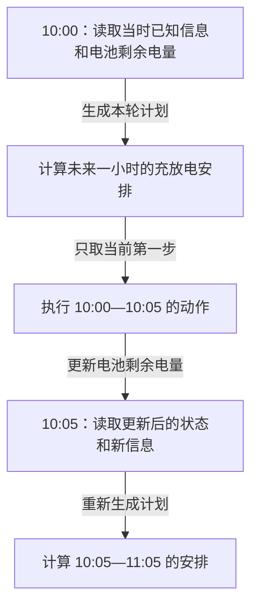

# 技术方案写作详细规范

本规范用于创建、重写和审查本仓库中的技术方案。它规定叙述方式和阅读体验；项目事实、研究范围与工程硬约束仍以仓库根目录 `AGENTS.md` 和 `docs/` 下当前有效协议为准。

## 1. 文档目标与默认读者

技术方案首先用于帮助人理解设计，其次才用于指导编码实现。

文档优先回答：

1. 为什么要做？
2. 当前存在什么问题？
3. 准备怎么解决？
4. 为什么选择这种方案？
5. 系统实际运行时会发生什么？
6. 最后才是如何编码实现。

不要把技术方案写成代码清单、接口清单、Schema 清单或待办事项列表。

除非用户明确指定其他读者，默认读者只具备刚入职校招生的技术水平。他们了解基础软件概念，但不了解本项目，也不了解 NSW 电力市场、储能业务、研究协议或当前实现。

因此，文档需要从业务背景和项目语境讲起。不得假设读者天然知道业务流程、市场机制、项目中的类名、模块名、变量名、缩写或内部术语。基础软件概念可以直接使用；如果本项目赋予它不同含义，仍须在第一次出现时解释。

## 2. 先讲问题，再讲抽象

禁止直接从类、接口、Schema 或模块名称开始描述方案。

不推荐：

> 新增 `DispatchContext`，其中包含 `ForecastBundle`、`ConstraintSet` 和 `ObjectiveConfig`。

推荐：

> 一次滚动优化需要同时获得三类信息：未来价格路径、当前电池与站点约束，以及本次优化的目标和风险配置。
>
> 如果这些信息持续作为分散参数传递，随着模型复杂度增加，接口和实验复现都会越来越困难。
>
> 因此，将一次优化所需的完整输入封装成一个“排程上下文”，代码中命名为 `DispatchContext`。

所有技术抽象遵循：

`现实问题 → 设计需求 → 抽象概念 → 技术命名`

不要采用：

`技术命名 → 解释它是什么`

## 3. 第一次出现的概念与技术命名

对理解设计所必需、且目标读者不熟悉的项目概念，在首次使用处解释含义与作用。上下游关系影响理解时，再说明它依赖哪些输入、事实或前置步骤，以及谁会使用它或受到影响。基础软件概念无需重新定义；本项目赋予其不同含义时，解释该差异。

概念说明应在第一次使用的上下文中完成，不要把一组尚未使用的名词集中堆在术语表里。英文名称、缩写或代码命名不直观时，再补充名称来源或语义；名称解释不能代替概念含义与作用的说明。

例如：

> 澳大利亚能源市场运营机构（Australian Energy Market Operator，AEMO）会持续发布未来短期市场状态预测，其中 P5MIN 是面向未来若干个 5 分钟区间的预测产品。
>
> 同一目标区间可能出现在多个 P5MIN 发布批次中。历史回测若直接采用最后一次预测，就可能使用决策时点之后才发布的信息。因此需要保留并选择当时真实可见的“预测版本”。
>
> 它的上游是 AEMO 发布的各批次 P5MIN 原始记录，以及记录对应的发布时间和可见时间。下游是概率预测样本、滚动储能决策和回测公平性检查。
>
> 代码中将这个概念命名为 `ForecastVintage`。`Vintage` 在这里表示同一预测目标在不同发布时间形成的历史版本。

完整解释一次后，后文可以直接使用该名称，无需重复定义。若上下游关系在不同场景中发生变化，需要在对应场景重新说明变化。

### 把概念解释到可以使用

关键难点可以按“白话含义 → 为什么需要 → 小例子 → 易错边界”展开，写成自然段即可，不必为每个术语套四个标题。解释中若又出现陌生概念，先补足读者需要的前置知识，或换一种说法。给出中文译名和英文全称只是命名，不能算解释完成。

例如，“预测版本”可以进一步解释为：

> 我们对同一段未来时间的判断，会随着新信息到来而改变。每次留下的判断，就是一个预测版本。保留旧版本，是为了检查过去做决定时真正知道什么。
>
> 假设两条预测都针对 10:10 结束的五分钟区间，一条在 09:59 已经可见，另一条在 10:04 才可见。回放 10:00 的决定时，只能使用前一条；后一条即使更准确，当时也还看不到。
>
> 这里的时间只是教学假设，均为 AEST（UTC+10）；10:10 表示区间结束时间（interval-ending）。记录上的名义运行时间，不等于我们已经能获取它的时间。

对容易误解的概率概念，要把含义与检验方法连起来。例如：

> P90 是模型给出的一个价格界限，意图让实际价格约有 90% 的机会不超过它。要检查这一判断是否可靠，需要查看大量历史预测中，实际价格落在界限以下的比例，并按预测步长和价格状态分别检查。
>
> P90 不是最高可能价格，实际价格仍可能更高。P10 到 P90 对应名义上的 80% 预测区间，实际覆盖比例要通过未参与训练和调参的数据检验，不能把它写成“保证有 80% 的结果落在里面”。

类比只用于建立直觉。例如可借“不同时间收到的天气预报”解释预测版本，但不能据此推导电价的分布或市场发布规则。注明类比能解释什么，回到本项目的准确含义。与主线无关的概念直接省略，不为解释名词再扩写一套教材。

## 4. 推荐叙述顺序

### 4.1 背景

从不了解本项目和业务的读者视角说明当前业务或研究场景：参与者是谁、系统在处理什么现实问题、当前方案如何工作、为什么现在需要调整。不要在背景章节介绍具体代码实现。

### 4.2 当前问题

使用具体场景，不使用“扩展性较差”“能力不足”一类无法验证的泛泛表述。

不推荐：

> 当前数据链路容易产生未来信息泄漏。

推荐：

> 当前样本表只保留每个目标区间最后一次 P5MIN 预测。回测 10:00 的决策时，这个字段可能来自 10:00 之后发布的 run，因此模型看到了当时尚不可用的信息。

### 4.3 设计目标

区分：

- 本次必须解决的能力；
- 本次明确不处理的内容；
- 尚未定义、需要通过配置或实验确认的参数。

这能防止方案范围在写作过程中不断扩大，也能避免假设被误写成结论。

### 4.4 核心设计思路

先用自然语言概括准备如何解决问题，再进入代码。通常聚焦 3～7 个真正影响方案的核心决策。

每个决策按以下逻辑说明：

1. 问题：为什么需要这个设计；
2. 方案：准备怎么解决；
3. 原因：为什么选择这种方式；
4. 结果：设计完成后系统或研究流程会发生什么变化。

## 5. 完整运行示例

涉及流程、算法、数据处理、Agent、任务调度、接口调用或滚动决策的方案，应至少给出一个具体案例。案例必须与本项目当前契约一致，不得用“未来 24 小时固定排程”代替第一阶段 5 分钟滚动决策。

例如，假设系统需要在市场时点 10:00 AEST 为 NSW1 储能生成本轮动作：

1. 以 10:00 为决策时点，明确目标区间为 10:05 至 11:00 的 12 个 interval-ending 区间；
2. 读取 `available_time <= 10:00` 的最新数据，不使用之后到达的数据；
3. 为每个目标区间选择当时可见的 P5MIN forecast vintage；
4. 结合近期实际价格、市场特征和数据质量标记，生成 P10、P50、P90 及事件概率；
5. 如策略需要联合路径，将边际分布转换为保持时间依赖的价格情景；
6. 结合当前 SOC、功率、效率、备用、站点边界、费用和退化配置，求解未来 60 分钟的滚动优化；
7. 只执行第一个 5 分钟动作，其余步骤在下一决策时点重新计算；
8. 用实际 NSW1 RRP 和显式费用回放该区间，更新 SOC 与 NMI 边界能量；
9. 保存预测、决策、结算和 manifest，使结果可追溯。

如果引入新模块，应指出它在上述哪一步发挥作用。读者看完示例仍不知道系统如何运行，说明方案仍然过于抽象。

上述列表是作者需要覆盖的运行骨架，不宜在首次介绍系统时整段搬给读者。先说明“收集当时已知信息、预测未来价格、决定当前动作、记录执行结果”这条主线，再在对应环节解释分位数、电池剩余电量、费用等概念。

复杂步骤按需要使用下表拆开，不必每步都制表：

| 读者的问题 | 需要说明的内容 |
| --- | --- |
| 开始时知道什么？ | 输入内容、来源和当前状态 |
| 这一步具体做什么？ | 动作、判断条件及原因 |
| 做完后变成什么？ | 输出内容、状态变化和下一步用途 |
| 条件不满足怎么办？ | 停止、跳过或已定义的降级行为 |

沿用同一组时间、对象和数值贯穿示例。正常流程之后，针对最易误解的规则补一个反例，例如“10:04 才可见的预测为什么不能用于 10:00 的决定”。涉及循环时，明确重复的触发时点、保留的状态和重新计算的内容；不要只写“持续迭代”或“动态更新”。

## 6. 模块设计

介绍模块时，不允许只列名称。

不推荐：

```text
VintageSelector
ProbabilisticForecaster
ScenarioGenerator
RollingOptimizer
```

推荐先说明现实职责：

> 历史回测需要在每个决策时点找到当时真实可见的 P5MIN 版本。因此增加一个“预测版本选择模块”。它只负责按 issue time、available time 和 target time 选择记录，不负责填补缺失预测或训练模型。代码中将其命名为 `VintageSelector`。

每个重要模块至少说明：

- 它负责什么；
- 它不负责什么；
- 输入是什么；
- 输出是什么；
- 为什么需要独立成为模块；
- 与上下游模块是什么关系。

## 7. 数据流优先于代码结构

复杂系统先描述数据从哪里来、经过什么处理、最后到哪里去，再映射到代码。

业务数据流示例：

```text
AEMO 原始数据
    ↓
按决策时点构造 forecast vintage
    ↓
NSW1 十二步概率预测
    ↓
联合价格路径或分布摘要
    ↓
储能滚动决策
    ↓
NMI 边界能量与费用核算
    ↓
相对基线的样本外增量净收益
```

之后再给出模块映射。不要让读者从类之间的调用关系反推研究闭环。

### 根据理解难点配图

配图用于减少读者在脑中拼接关系的负担。遇到下列难点时，优先用对应表达；不设每篇图数要求，也不为简单段落强行配图。

| 读者卡在哪里 | 优先表达 |
| --- | --- |
| 什么先发生，做决定时能看到什么 | 时间线，明确决策时点与可见时点 |
| 数据从哪里来，经过什么处理 | 流程图，箭头标出传递的数据 |
| 谁先调用谁，什么时候返回 | 时序图，标清参与者和交互内容 |
| 条件变化后走哪条分支 | 分支流程图或状态图，标清条件 |
| 两种方案或几个概念有何区别 | 对照表，保持比较维度一致 |
| 同一组候选怎样连成不同路径 | 候选列、排名与连线，标明哪些量保持不变 |
| 信息变化后动作何时可以分叉 | 并列结构图，区分价格路径、观测与动作节点 |
| 能量从哪里来、到哪里去、在哪里结算 | 能量流与计量边界图，标出方向、单位及守恒关系 |
| 训练、测试和滚动更新分别改变什么 | 时间分段与冻结／更新对照，说明跨界样本资格 |
| 数值随时间或参数如何变化 | 有坐标、单位和数据来源的曲线图 |

简单流程、时序和状态关系优先用 Mermaid；需要精确控制时间区间、列对齐、路径连线、并列结构或能量／计量边界时，优先考虑 SVG，不只在 Mermaid 不可用时才选 SVG。研究数据图使用绘图库，保留数据来源与生成代码，不手工绘制实验结果。交付格式不支持 Mermaid 时，改用可渲染的 SVG、PNG 或简洁文本图，并保留可编辑源文件。无需为配图引入网页应用或图片生成工具。

一张图聚焦一个问题，复杂流程拆成总览与局部图。节点尽量使用“筛选当时可见的预测”等具体中文动作；箭头区分数据传递、时间先后或条件分支，不用同一种未说明的连线混指多种关系。不要只画一组模块方框，也不要只靠颜色表达区别。

例如，下面的图只回答“为什么每次算一小时，却只执行五分钟”。它省略预测内部过程，专门突出本轮执行范围和下轮重新计算的关系：



图中时间均为 AEST（UTC+10），区间按结束时间标记（interval-ending）：10:00—10:05 的动作归入 10:05 区间。本轮后续动作仍是计划；到了 10:05，使用更新后的信息和状态重新计算。这个示意仅解释执行顺序，不表示任何充放电数值或收益结果。

图前说明它回答什么问题，图后指出应读出的关键关系。配图不能替代对设计原因和适用条件的文字说明。

### 重写时保留与更新原图

重写前盘点图片引用、内嵌图与 Mermaid，并检查实际图示内容，不能只凭文件名判断。逐一确定保留、修改、替换或删除及其对应章节；无需额外建立清单文件。章节重组或正文缩短本身不是删图理由；图已过时、重复或随范围变化失去用途时可删除，并在交付中简要说明。

修改共享图片前搜索其引用位置，确认其他使用处仍然适用。如果案例、章节编号或技术含义只适用于新文档，为新文档使用独立资产。资源检查仍遵守历史归档访问边界。移动或改名后同步相对路径、图号、替代文字和正文引用；共享图内尽量不写文档专属章节号。

### 图文同步与简化边界

优先沿用正文已解释的时间、数值和对象，让读者能追踪同一个例子。教学示意明确标注假设；只画部分预测步、非等比例时间轴或省略其他工况时，说明简化范围。金额、概率、功率与电量保留单位和方向，节点与箭头说明代表数据、观测、动作还是现金流。

简化不能改变技术含义。例如，单个场景的规划价值不能标成完整风险优化目标，场景树动作分叉不能暗示提前知道完整未来路径，减少进口不能同时算作出口收入。正文中的公式、信息约束、策略定位或结算规则改变时，同步复核相关图与读图说明；教学数字与价格路径不得被表述为实验结果。

沿用现有有效样式；已有图能解释同一问题时优先复用或调整，不重复配图，不因偏好 SVG 就转换所有 Mermaid。SVG 使用可编辑文本和清晰分组，提供 `viewBox`、标题与描述，避免难以维护的单行源码。图邻近相关章节放置，图号按出现顺序维护；不要只靠颜色区分关键信息。

### 配图验收

新增或修改配图后，检查引用目标存在、图号与正文对应、SVG 等源格式语法合法，并实际渲染查看。按预期阅读尺寸检查文字溢出、裁切、标签重叠、箭头遮挡及缩放后的可读性；声明支持明暗主题时，检查两种背景的对比度。修正排版后重新查看受影响的图，语法检查不能替代视觉检查。

复算图中的简单数值关系，核对时间、单位、边界及箭头方向。渲染工具不可用时，完成可做的静态检查，明确说明未验证的视觉部分，不宣称已完成渲染验收。

## 8. Schema 使用规范

Schema 用于说明数据结构，不能代替设计说明。展示 Schema 前先回答：

- 这个数据代表什么；
- 谁产生它；
- 谁消费它；
- 为什么需要这些字段；
- 关键字段的时间语义、单位和缺失规则是什么。

Schema 后解释非显而易见字段。禁止连续展示大量 Schema 而没有自然语言说明。

如果完整结构对理解主线并不重要，只展示关键字段，其余放入附录或实现文档。

## 9. 伪代码使用规范

伪代码只用于复杂算法、状态机、不易用自然语言讲清楚的逻辑，或必须明确判断顺序的流程。

简单逻辑直接用自然语言说明。例如：

> 当关键输入缺失或时间可见性检查失败时，本轮预测快速失败，不使用最新值或零值进行静默填补。

伪代码出现前必须先解释算法思路，顺序为：

`算法思想 → 示例 → 伪代码`

不要直接展示实现级代码，也不要让伪代码暗示尚未确认的默认参数。

## 10. 变量、公式和单位

公式出现前先定义变量。重要变量说明：

- 英文缩写和中文含义；
- 单位；
- 正负方向；
- 数据来源；
- 时间索引或适用区间。

例如：

| 变量 | 含义 | 单位 | 正方向 | 来源 |
| --- | --- | --- | --- | --- |
| `p_grid` | NMI 并网点功率 | kW | 必须由方案明确 | 电表或仿真 |
| `p_load` | 站点负荷 | kW | 必须由方案明确 | 合成站点或数据 |
| `e_soc` | 电池可用能量 | kWh | 增加表示充电 | 状态演化 |

不要在未定义符号方向时直接写功率平衡公式。本项目尤其要显式检查 A$/MWh 与 A$/kWh、MW 与 kW、MWh 与 kWh，以及 5 分钟功率到电量的换算。

先用一句话说明公式在回答什么问题。关键公式给出带单位的代入过程，再说明结果的实际含义。例如：

> 要算某五分钟区间内传递了多少电能，需要把该侧的平均功率乘以持续时间。假设电池交流侧平均充电功率为 6 kW，持续时间为 5/60 小时，则交流侧输入电能为 6 × 5/60 = 0.5 kWh。这里仅演示功率到电量的换算；电池内部增加的能量还需要按已定义的效率和损耗模型计算。

解释复杂目标函数时，先分别说明每一项在奖励什么或惩罚什么，再讲这些项如何共同影响决定。不要只罗列符号，或把简化示例中的效率、费用当成正式模型默认值。

## 11. 缩写规范

缩写第一次出现时写出英文全称、缩写和中文含义，例如：

- Regional Reference Price（RRP，区域参考价格）；
- State of Charge（SOC，荷电状态）；
- Point in Time（PIT，时点可见性语义）；
- Network Metering Identifier（NMI，电力计量点标识）。

项目内部自定义缩写必须解释。不要假定读者仅凭缩写就理解其数据来源或业务语义。

## 12. 技术决策必须说明为什么

方案不能只写“使用某数据库”“使用异步任务”“使用某模型”。先说明约束，再说明选择。

例如：

> 同一目标区间存在多个 P5MIN 预测版本，而回测必须还原决策时点的信息集。因此标准化层采用保留全部 vintage 的长表，而不是只保留每个目标区间最后一条记录。

存在明显且现实可行的替代方案时，说明：

- 选择方案及原因；
- 未选择方案及暂不采用的原因；
- 重新考虑该方案需要满足的条件。

不要为了显得专业而罗列大量与当前决策无关的技术选型。

## 13. 控制代码细节密度

技术方案不是代码 Review。除非细节直接决定设计正确性，否则主文档不要大量包含：

- 完整类或接口定义；
- 完整 Pydantic Model、SQL、API Schema 或配置文件；
- 大段伪代码；
- 文件树、import 路径或函数参数细节。

这些内容放入“实现细节”或附录。主文档应保持设计逻辑清晰。

## 14. 实施计划放在最后

需要指导 Codex 实施时，可在文档最后增加实施计划。每一步说明目标、涉及文件、主要修改、验证方法和完成条件。

示例：

### Step 1：建立时点可见的 P5MIN 标准表

涉及文件：列出经仓库检查确认的真实文件，不得臆造路径。

主要修改：

- 保留同一目标区间的全部 forecast vintage；
- 显式保存 issue time、available time 和 target interval end；
- 对 `available_time > decision_time` 的记录快速失败。

验证：

- 覆盖 12 个 horizon 对齐；
- 证明回测样本没有未来信息；
- 验证重复运行的 manifest 和产物身份。

实施计划不能代替前面的设计说明。

## 15. 默认文档结构

以下结构是可裁剪的默认值，不是强制模板：

```text
# 技术方案名称

## 0. 执行摘要
## 1. 背景
## 2. 当前存在的问题
## 3. 设计目标
### 3.1 本次解决
### 3.2 本次不解决
## 4. 核心设计思路
## 5. 一个完整运行示例
## 6. 整体流程与数据流
## 7. 模块设计
## 8. 数据模型
## 9. 关键算法或规则
## 10. 异常、边界场景与降级
## 11. 技术选型与取舍
## 12. 对现有系统的影响
## 13. 实施步骤
## 14. 测试与验收标准
## 15. 风险、未决项与结论边界
```

必要时增加 Schema、接口定义、配置或伪代码附录。小型方案可合并章节，避免空标题和重复叙述。局部修订只补足相关上下文，不强制重写整篇文档。

## 16. 写作风格与名词堆砌

使用清晰、自然、直接的中文，优先短句和具体动作。

每段围绕一个主要问题，句子说清“谁对什么做了什么、为什么、产生什么结果”。如果一句话同时包含前提、多个动作和例外，拆成有因果连接的句子或步骤。正文保留理解和判断方案所必需的细节，推导与实现细节后置；通俗化不能删掉影响结论的条件、单位和不确定性。

不推荐：

> 基于策略域抽象构建统一能力编排机制。

推荐：

> 不同策略目前分别调用设备控制接口。本次增加统一的策略执行入口，让所有策略通过同一套约束检查后再生成动作。

避免连续堆叠 `Context`、`Resolver`、`Provider`、`Factory`、`Adapter`、`Manager`、`Handler`、`Registry`、`Coordinator`、`Orchestrator` 等名称。如果确实需要这些抽象，逐个解释职责和存在原因。

禁止用一句充满技术名词的话代替设计逻辑，例如：

> 新增 `StrategyExecutionContext`、`ResourceResolver` 和 `DispatchCoordinator` 实现统一资源能力编排。

## 17. 项目方案的额外检查

根据方案主题，确认是否明确说明：

- 区域、价格版本、数据区间、时区和 interval-ending 口径；
- issue time、available time、target time、horizon 与信息集；
- P5MIN vintage 的选择规则；
- 数据源、包版本、manifest、缺失与可见性代理；
- 模型、分位数、校准、基线和滚动切分；
- 储能、站点、费用、退化、风险与期末 SOC；
- 预测、事件和运营结果的验收方式；
- 相对 P5MIN 的改善或退化；
- 未验证的数据、费用、站点、执行与商业风险。

重点排查 NSW1 与其他区域混用、forecast vintage 丢失、未来信息泄漏、时间语义冒充、单位错误、分位数交叉、极端价格被隐藏、SOC 或 NMI 能量不守恒、费用默认为零、重复计收，以及把完美预知或合成收益表述成可部署策略或真实项目收益。

## 18. 写完后的读者视角检查

### 概念检查

- 是否有突然出现但没有解释的业务、市场或技术概念？
- 理解设计所必需、且目标读者不熟悉的项目概念，是否在首次使用处解释含义与作用，并在影响理解时展开上下游关系？
- 是否有突然出现但没有解释的英文名称？
- 是否有突然出现的变量或缩写？
- 名称能否对应到现实问题和设计需求？

### 读者检查

- 文档是否假设读者已经理解本项目或 NSW 电力市场？
- 只有刚入职校招生技术水平的读者，能否理解问题背景和完整运行流程？
- 是否需要查阅代码或其他文档，才能知道核心概念是什么？

### 逻辑检查

- 是否先解释为什么，再解释怎么做？
- 每个新模块是否说明存在原因？
- 读者能否复述系统实际运行流程？

### 细节检查

- 是否出现不必要的大段 Schema、接口或伪代码？
- 是否过早进入具体实现？
- 是否用文件修改清单代替了设计说明？

### 证据检查

- 事实、推断、假设和建议是否清楚区分？
- 可变化事实是否有一手来源和核验日期？
- 未确认的字段、费用和参数是否被显式标记？

### 阅读体验检查

选出最难的概念和最复杂的一段流程，实际尝试用日常语言复述：概念解决什么问题，例子每一步知道什么、做什么、得到什么，换一个条件后会怎样。若只能重复原文术语，或中间需要自行补出因果关系，应重写对应段落。

检查图表是否回答明确问题，能否与文字示例逐步对应。检查通俗解释是否误把预测当保证、把假设当事实，或省略关键状态、时间、单位和费用。检查结果应说明实际发现与修订；作者自检不能冒充真实读者测试。

按第 7 节复核旧图处置、共享引用、图文语义、图号路径及渲染验收；说明尚未完成的验证，不以源文件可解析代替视觉通过。

如果读者需要通过阅读代码才能理解方案，则技术方案本身不合格。

## 19. 最重要的原则

不要要求读者理解代码之后再理解设计。

正确顺序是：

```text
理解业务或研究问题
    ↓
理解设计思想和取舍
    ↓
理解系统运行流程
    ↓
理解技术抽象
    ↓
最后理解代码实现
```

技术方案的价值，是让读者在阅读代码之前，已经知道代码为什么会设计成这样。
