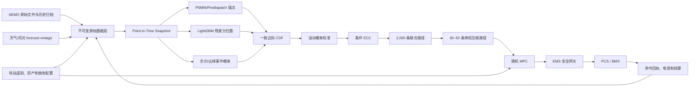
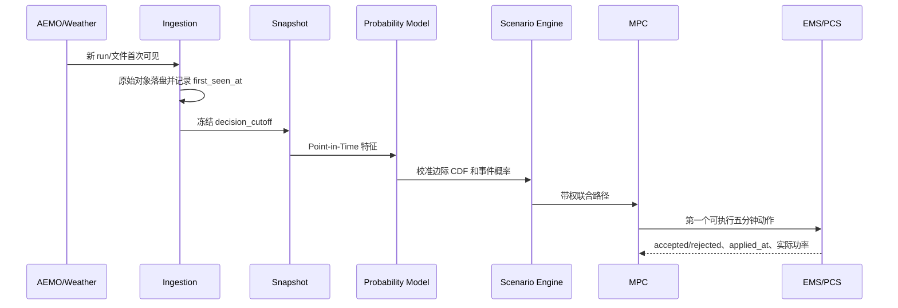
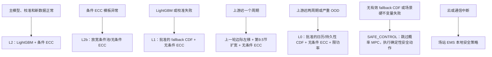
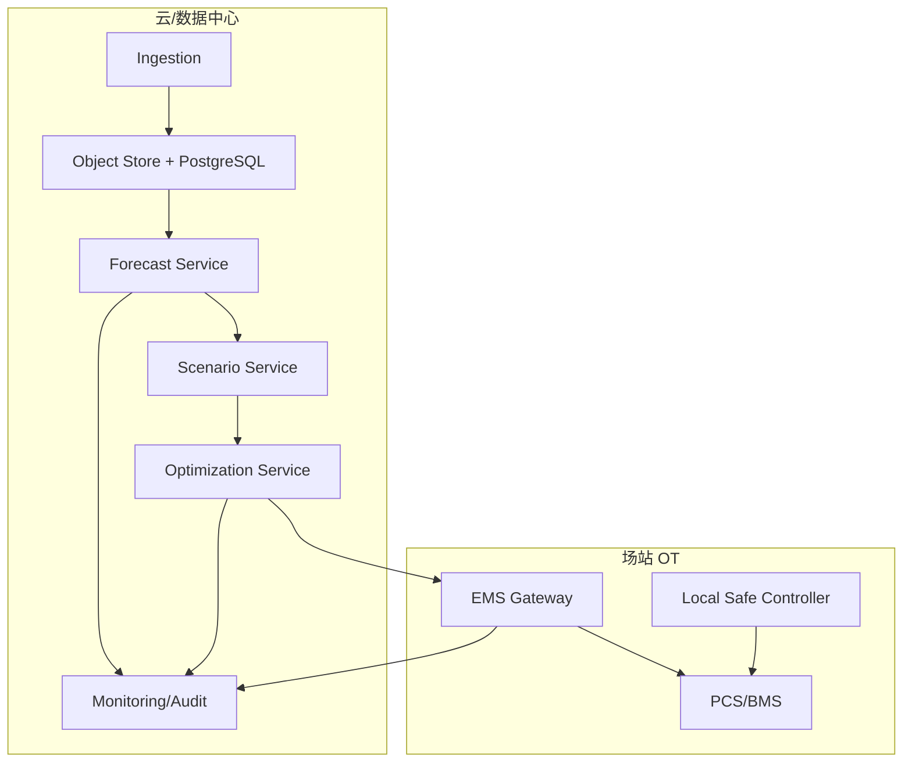

# NSW1 生产首版：残差概率预测、联合场景生成与储能滚动优化技术方案

> **推荐技术路线：AEMO P5MIN/Predispatch 锚点 + LightGBM 残差分位数与事件概率 + 滚动概率校准 + 基于历史 PIT 秩的条件 ECC。条件 ECC 是首版生产主方案；分块 t-Copula 仅作旁路挑战方案。**

| 文档项 | 内容 |
|---|---|
| 文档版本 | v1.0 |
| 编制日期 | 2026-08-18 |
| 适用市场 | 澳大利亚 National Electricity Market（NEM） |
| 重点区域 | NSW1；模型内部联合使用 NSW1、QLD1、VIC1、SA1、TAS1 |
| 目标资产 | 具有五分钟控制能力、收入或成本与现货价格相关的非调度储能/VPP |
| 预测对象 | 五区域未来 24 小时五分钟 Regional Reference Price（RRP）条件联合分布 |
| 决策对象 | 充电、等待、放电及可选容量预留 |
| 首版生产定位 | 可解释、可回放、可降级的生产基线和主方案 |
| 后续挑战方案 | 分块 t-Copula、Graph Temporal Spike-Copula Flow、扩散场景模型 |
| 文档性质 | 技术设计和建设建议，不构成法律、注册、交易或财务意见 |

> [!IMPORTANT]
> 立项前必须由 NEM 注册、零售结算、计量、并网和场站控制专业人员确认资产身份、FRMP/零售商关系、连接点、结算暴露、并网协议以及是否属于 non-scheduled。若资产应注册为 scheduled bidirectional unit，本方案需要增加报价、dispatch target、conformance 和 bidding governance 模块。

---

## 目录

1. [执行摘要](#1-执行摘要)
2. [概念与术语说明](#2-概念与术语说明)
3. [业务目标、范围与成功标准](#3-业务目标范围与成功标准)
4. [设计原则与技术选型](#4-设计原则与技术选型)
5. [总体架构](#5-总体架构)
6. [数据与 Point-in-Time 体系](#6-数据与-point-in-time-体系)
7. [特征工程](#7-特征工程)
8. [AEMO 锚点与 LightGBM 残差概率模型](#8-aemo-锚点与-lightgbm-残差概率模型)
9. [概率分布构造与校准](#9-概率分布构造与校准)
10. [联合场景生成：条件 ECC 作为首版生产主方案](#10-联合场景生成条件-ecc-作为首版生产主方案)
11. [场景压缩与随机滚动优化](#11-场景压缩与随机滚动优化)
12. [训练、验证与模型发布](#12-训练验证与模型发布)
13. [在线五分钟运行链路](#13-在线五分钟运行链路)
14. [接口与数据契约](#14-接口与数据契约)
15. [历史回放与评价体系](#15-历史回放与评价体系)
16. [上线门槛与分阶段控制](#16-上线门槛与分阶段控制)
17. [监控、MLOps、降级与安全](#17-监控mlops降级与安全)
18. [工程技术栈与部署](#18-工程技术栈与部署)
19. [实施路线图、团队与交付物](#19-实施路线图团队与交付物)
20. [主要风险与应对](#20-主要风险与应对)
21. [向 Graph Temporal Spike-Copula Flow 演进的条件](#21-向-graph-temporal-spike-copula-flow-演进的条件)
22. [附录](#22-附录)

---

## 1. 执行摘要

> **入门导读：这套系统靠什么赚钱？** 澳洲电力市场每五分钟形成一个现货价格。价格平时平缓，但供过于求时（例如中午光伏大发）可能跌成**负数**——用电反而能收钱；供不应求时可能冲到数千澳元/MWh 以上，形成**尖峰**。储能电池的生意就是“低买高卖”：低价或负价时充电，高价或尖峰时放电。难点在于未来价格不确定，因此本系统每五分钟重新回答一次“未来 24 小时价格的各种可能走势及概率”，再据此决定**当前这五分钟**充、放还是等待。全文主线是：预测不确定性（第 8–10 章）→ 把不确定性变成决策（第 11 章）→ 安全执行与审计（第 13、17 章）。专业术语在第 2 章集中解释。

### 1.1 建设目标

本项目建设一个每五分钟闭环运行的概率决策系统，而不是只回答“未来某个时刻价格是多少”的点预测系统。每轮系统应完成：

1. 冻结当时真实可见的 AEMO、天气、风光、市场状态和场站数据；
2. 以最新 P5MIN/Predispatch 为预测锚点；
3. 预测锚点误差的条件分位数及负价、尖峰事件概率；
4. 校准各区域、各提前量的边际概率分布；
5. 生成保留时间和跨区域依赖的五区域完整价格路径；
6. 将当前配置的 2,000 条原始路径压缩为 30–50 条带权路径；
7. 在 SOC、功率、效率、退化、并网和风险约束下求解随机 MPC；
8. 只执行第一个可执行五分钟动作，下一轮用新信息重新计算。

### 1.2 首版生产推荐

首版生产主路线为：

> **AEMO 预测锚点 + LightGBM 残差分位数模型 + LightGBM 事件概率模型 + 边际概率校准 + 条件 ECC 联合场景。**

其中，第 8 章仍以残差建模各个单点边际；第 10 章在边际校准完成后，以历史 PIT 的秩恢复时间和跨区域依赖。两者职责不同。

同时保留：

- **分块 t-Copula**：仅作联合场景旁路挑战方案，未晋升前不进入默认生产降级链；
- **AEMO + 无条件历史残差**：模型故障时的可解释降级；
- **日历/持久性概率模型**：关键上游缺失时的安全降级；
- **Graph Temporal Spike-Copula Flow**：数据和基线证据充分后的研究 challenger。

选择这一路线的原因不是模型简单，而是首版同时需要满足概率质量、可解释性、五分钟时限、历史可回放、异常可定位和自动降级。LightGBM 与 ECC 将边际预测、概率校准和联合依赖拆开，使每个问题都能独立验证。

### 1.3 每轮输出

| 输出 | 用途 |
|---|---|
| P01/P05/P10/P25/P50/P75/P90/P95/P99 | UI、风险解释、边际概率检查 |
| $P(RRP<0)$ | 负价充电机会及风险 |
| $P(RRP>300/1000/5000)$ | 高价和极端事件概率 |
| 2,000 条五区域联合路径 | 联合概率评价和场景分析 |
| 30–50 条带权压缩路径 | 随机 MPC |
| 尖峰开始、峰值、持续时间分布 | SOC 保留和释放判断 |
| 数据 freshness、完整率和 OOD 标志 | 降级与限功率 |
| 模型、校准、模板库和特征版本 | 审计与复现 |

### 1.4 核心成功标准

项目必须同时证明：

- **边际概率正确**：CRPS/WIS、覆盖率、PIT、Brier Score 优于强基线；
- **联合路径正确**：Energy Score、Variogram Score、ramp、尖峰持续时间和跨区共同尖峰率合理；
- **业务有价值**：在真实信息时序、延迟、效率、费用、退化和并网限制下，滚动净收益的统计置信区间优于 AEMO 点预测策略和固定规则策略；
- **控制安全**：任何模型输出均不能绕过 EMS/BMS 硬边界。

---

## 2. 概念与术语说明

本节先定义后文使用的市场、数据、概率和控制概念。

### 2.1 NEM 市场与价格概念

#### NEM

National Electricity Market，覆盖澳大利亚东部和南部主要电力区域。本文使用五个区域：NSW1、QLD1、VIC1、SA1、TAS1。

#### RRP

Regional Reference Price，区域参考价格。本文预测和结算回放的目标价格为每个五分钟区间的 RRP，而不是机组节点价格或未经结算处理的诊断价格。

#### 五分钟调度与五分钟结算

NEM 已实现五分钟调度和五分钟结算对齐，一天有 288 个五分钟区间。时间戳通常使用 interval ending，例如 16:05 表示 16:00–16:05。时间处理必须显式使用 NEM 市场时区和 interval-ending 规则。[AEMO Five Minute Settlement](https://www.aemo.com.au/initiatives/major-programs/past-major-programs/five-minute-settlement)

#### P5MIN

Five-Minute Predispatch。AEMO 约每五分钟运行一次，提供未来约一小时、共十二个五分钟调度周期的价格和系统状态预测。不同运行时刻对同一目标区间会产生多个版本，因此训练必须保留 `RUN_DATETIME`。[AEMO P5MIN Data Model](https://visualisations.aemo.com.au/aemo/nemweb/mmsdatamodelreport/electricity/mms%20data%20model%20report_files/MMS_240.htm)

#### Predispatch

AEMO 的较长时域预调度结果，粒度通常比 P5MIN 粗，适合为 1–24 小时提供趋势锚点。它是预测输入和基线，不是真实未来价格。

#### 联络线、约束和 headroom

- **联络线**：连接不同 NEM 区域的输电通道；
- **flow**：当前或预测潮流；
- **limit**：可传输边界；
- **headroom**：距离边界的剩余空间；
- **约束**：影响调度可行域和区域价格分离的网络或系统条件。

这些变量用于识别价格传播、区域分离和尖峰风险，但模型不能假定公开数据能够恢复所有机组私有报价信息。

#### Market Price Cap、Floor、APC 和 suspension

- **Market Price Cap/Floor**：正常市场价格上限和下限；
- **APC**：Administered Price Cap，累计价格触发后的受管制价格状态；
- **market suspension**：市场暂停状态。

这些参数会随规则和财年变化，必须由生效日期驱动的规则引擎提供，不能写死在模型代码中。

#### FRMP 和 FCAS

- **FRMP**：Financially Responsible Market Participant，对每个连接点的电表结算负财务责任的市场主体（通常是零售商）。本系统不直接参与市场结算，收益最终通过与 FRMP/零售商的商业关系实现。
- **FCAS**：Frequency Control Ancillary Services，调频辅助服务市场。首版只做能量套利，不做 FCAS 联合竞价（见 3.2 节范围）。

### 2.2 数据时序与防穿越概念

#### Forecast vintage

同一个目标时刻的预测会被连续修订，每次发布的版本就是一个 forecast vintage。训练时必须使用决策时刻已经发布的版本，不能使用后来更准确的修订版。

#### Point-in-Time 数据集

按历史决策时刻重建“当时能看到什么”的数据集。它不是把所有表按目标时间直接连接，而是要求源运行时间和系统首次看到时间均不晚于决策截止时间。

#### decision cutoff

本轮预测允许使用信息的最后时刻。所有输入必须满足：

```math
t^{source}_{run}\le t_{cutoff},\qquad
t^{first\ seen}\le t_{cutoff}.
```

#### first_seen_at

本系统第一次实际取得某份文件或记录的时间。源系统的 `LASTCHANGED` 不等于本系统当时已经取得数据，因此两者必须分别保存。

#### 数据穿越

训练或回测使用了真实决策时尚不可见的信息。数据穿越会使离线表现虚高，是本项目最重要的数据风险之一。

### 2.3 概率预测概念

#### 点预测、分位数和概率分布

- **点预测**：给出一个数，例如 P50 或期望值；
- **分位数**：P90 表示结果有约 90% 概率不超过该值；
- **概率分布**：描述所有可能价格及其概率；
- **联合分布**：除各时刻分布外，还描述不同时间、不同区域之间如何共同变化。

储能决策需要联合分布，因为 SOC 会把不同时刻的决策连接起来。

#### 预测锚点和残差

预测锚点是 AEMO 对目标价格的当时预测。残差定义为：

```math
E_{r,t,h}=Y_{r,t+h}-A_{r,t,h},
```

其中 $Y$ 为实际 RRP，$A$ 为 AEMO 锚点。首版模型主要学习 $E$ 的条件分布，再与 $A$ 相加得到最终价格分布。

#### Quantile regression

分位数回归直接预测条件分位数。LightGBM 的 quantile objective 使用 pinball loss：

```math
L_{\alpha}(y,\hat y)=
\begin{cases}
\alpha(y-\hat y),&y\ge\hat y,\\
(1-\alpha)(\hat y-y),&y<\hat y.
\end{cases}
```

直观地说，这个损失对“预测偏低”和“预测偏高”施加不对称惩罚：预测 P90 时，低估的代价是高估的 9 倍，模型于是被迫给出“只有约 10% 概率被实际值超过”的数。不同 $alpha$ 分别训练，可得到 P01–P99。分位数模型不要求价格服从 Gaussian 分布，适合负价、偏态和厚尾数据。

#### 分位数交叉

独立训练的 P90 可能小于 P50。生产输出必须通过 monotone rearrangement 或 isotonic projection 保证：

```math
Q_{0.01}\le Q_{0.05}\le\cdots\le Q_{0.99}.
```

#### 概率校准

如果模型给出的 90% 区间长期只覆盖 70% 的实际结果，模型就是过度自信。校准使用独立时间窗口修正覆盖率、分位数位置和事件概率。

#### 层级收缩

小样本分组（如某区域某季节的尖峰时段）数据太少、单独估计不可靠时，部分采用上一层大组的结论：本组数据越少，听大组的越多；本组数据足够多，就主要信自己。收缩层级通常为：细分组 → region → lead bucket → 全局。第 9 章的滚动校准和尾部样本池使用这一机制。

#### 概率积分变换（PIT）

概率积分变换（Probability Integral Transform，PIT）是把实际值代入**当时预测的**累积分布：

```math
U=F(Y).
```

可以把 $U$ 直接理解成“实际结果落在当时预测分布的第几百分位”。例如 $U=0.93$ 表示实际价格大约落在当时预测的 P93；它描述概率位置，不是说该价格有 93% 的发生概率。

若连续分布已校准，大量 PIT 应近似均匀分布。PIT 直方图呈 U 形通常表示区间过窄，集中在中间通常表示区间过宽，明显偏向一侧表示系统性高估或低估。本文还把历史 PIT 路径作为第 10 章联合秩模板。

#### CRPS、WIS 和 pinball loss

- **pinball loss**：评价单个分位数；
- **CRPS**：评价完整一维概率分布；
- **WIS**：用多个预测区间近似评价概率分布。

三者都是越低越好。MAE 只能评价点预测，不能评价概率是否可靠。

#### Brier Score

用于评价二元事件概率，例如 $P(RRP>1000)$：

```math
BS=(\hat p-\mathbf{1}_{event})^2.
```

越低越好。必须同时查看 reliability diagram，避免模型只是重复历史平均频率。

#### Aleatoric、epistemic 和 OOD uncertainty

- **Aleatoric uncertainty**：市场本身的不可消除随机性；
- **Epistemic uncertainty**：模型、参数和有限样本带来的不确定性；
- **OOD**：当前输入落在历史训练分布之外，例如新制度、新联络线状态或异常价格机制。

#### LightGBM

LightGBM 是一种梯度提升决策树模型：用大量简单的决策树逐棵叠加，每棵新树专门修正前面模型留下的误差。本文选它是因为训练快、天然容忍缺失值、能直接输出分位数，且树的分裂规则可审计，适合五分钟生产节奏。

#### 其他统计名词

- **GPD**（广义帕累托分布）：专门拟合“超过某阈值的极端值有多大”的分布，用于尖峰严重程度建模；
- **MAD**：中位数绝对偏差，一种对异常值不敏感的波动度量；
- **NLL**：负对数似然，概率模型常见的训练损失，越低越好；但它只是统计指标，不代表业务价值。

### 2.4 联合场景概念

#### 场景路径

一条场景路径是五区域未来 288 个五分钟价格的一个可能实现：

```math
\mathbf{Y}^{(s)}\in\mathbb{R}^{5\times288}.
```

多条带概率或权重的路径共同近似未来联合分布。

#### Copula（依赖结构）

Copula 把“每个变量自己的分布”与“变量之间如何共同变化”分开。本文不要求读者先掌握 Copula 数学；只需知道它描述不同时间、不同区域何时一起高、一起低或共同进入尾部。

#### t-Copula

使用多元 Student-t 潜变量构造的 Copula。与 Gaussian Copula 相比，t-Copula 能表达更强的联合尾部，但仍主要描述椭圆型依赖（即联合形状大致规则对称；数学细节，初次阅读可跳过）。

#### 集合 Copula 耦合（ECC）

集合 Copula 耦合（Ensemble Copula Coupling，ECC）先从校准后的各边际分布取样，再按照已有联合样本的秩结构重排。它不改变每个位置有哪些价格，只改变这些价格怎样被配成完整路径。

#### Schaake 重排

Schaake 重排（Schaake shuffle）与 ECC 的操作相近，但秩模板来自历史轨迹。本文的“条件 ECC”使用与当前市场状态相似的历史 PIT 路径，因此严格术语上更接近条件 Schaake 重排。项目名称仍沿用“条件 ECC”，第 10.1 节会再次说明这一命名边界。（这一命名辨析不影响理解和使用，初次阅读可跳过。）

#### 尾部依赖

两个区域在极端价格时共同发生尖峰的概率关系。普通相关系数主要描述中心区域线性关系，不能充分描述联合尖峰。

#### Energy Score 和 Variogram Score

- **Energy Score（ES）**：评价多变量场景整体距离和离散程度；
- **Variogram Score（VS）**：更关注变量之间的差分和依赖结构。

两者越低越好。ES 对相关结构错误有时不够敏感，因此必须同时使用 VS、ramp、持续时间和共同尖峰率。

#### 场景压缩

从当前配置的 2,000 条路径选出 30–50 条代表性路径并重新赋权。目标是减少优化计算量，同时保留中心、负价、尖峰、持续时间和首动作影响。

### 2.5 储能优化与控制概念

#### SOC、SOH、效率和退化

- **SOC**：State of Charge，当前可用能量占额定容量比例；
- **SOH**：State of Health，电池健康状态；
- **效率**：充电、放电和辅助系统损耗；
- **退化成本**：循环、温度、C-rate 和 DoD 对寿命的经济影响。

#### MPC

Model Predictive Control。每轮预测未来并求解完整时域策略，但只执行第一步；下一轮利用新数据重新求解。

#### 随机 MPC

使用多条价格场景而非单一路径的 MPC。它能够在当前收益和保留 SOC 等待未来尖峰之间权衡。

#### Non-anticipativity

不同场景在信息尚未分叉前必须执行相同动作。否则优化器会假装提前知道未来属于哪条场景，产生完美预知收益。

#### CVaR

Conditional Value at Risk，用于惩罚最差一部分结果。相较只优化期望收益，CVaR 能限制低概率但损失较大的策略。

#### Champion、challenger、shadow 和降级

- **Champion**：当前批准用于生产决策的模型；
- **Challenger**：在相同数据和回测条件下与 champion 比较但不直接控制；
- **Shadow**：在线实时运行并记录建议，但不下发设备；
- **降级**：数据或模型异常时切换到更保守、可解释的策略。

#### EMS、BMS、PCS 和 ramp

- **EMS**：Energy Management System，场站能量管理系统，是云端指令进入设备的网关；
- **BMS**：Battery Management System，电池管理系统，掌管电池安全硬边界；
- **PCS**：Power Conversion System，储能变流器，执行实际充放电功率；
- **ramp（爬坡）**：价格或功率在相邻区间的变化量，用于衡量价格跳变的剧烈程度。

### 2.6 工程与运行术语

- **幂等（idempotent）**：同一条命令重复到达不会被执行第二次，靠幂等键识别；
- **TTL**：Time To Live，命令有效期；过期命令设备必须拒绝执行；
- **embargo（隔离带）**：相邻训练/验证/测试时间段之间留出的空隙，防止重叠窗口造成信息泄漏；
- **holdout（封存集）**：训练和调参全程不许碰的最终考试数据；
- **canary（金丝雀发布）**：新模型先在小范围、低功率下试运行，确认无恙再推广；
- **warm start（热启动）**：优化求解器以上一轮的解作为起点，加速本轮求解；
- **watchdog（看门狗）**：监控系统是否卡死的机制，卡死时自动复位；
- **kill switch（急停开关）**：人工一键切断自动控制的最高优先级手段；
- **RTO / RPO**：故障恢复时间目标 / 可容忍的数据丢失时间点；
- **PSI / KS**：两种分布漂移统计量，用于监控线上数据是否偏离训练分布。

---

## 3. 业务目标、范围与成功标准

### 3.1 业务目标

系统需支持：

- 捕获负价充电和高价放电机会；
- 在潜在尖峰前保留 SOC；
- 避免基于不可靠远期预测过早充满或放空；
- 将概率预测转换为扣除效率、退化、费用和损耗后的真实边际现金流；
- 在五分钟节奏内给出可执行动作；
- 允许每个决策周期完整回放和审计。

### 3.2 适用范围

包含：

- 五区域 RRP 概率预测；
- AEMO 预测残差建模；
- 负价和尖峰事件概率；
- 联合价格路径和场景压缩；
- SOC 场景树随机 MPC；
- EMS 安全接口、运行监控和历史回放。

首版不包含：

- 自动生成 scheduled unit 市场报价；
- 绕过零售商、FRMP、AEMO 或现场 EMS 的直接交易/控制；
- 精确预测 market suspension 等历史极少、机制主导的事件；
- 大规模组合自身对区域价格的内生冲击模型；
- FCAS、能量和网络服务的完整联合竞价。

### 3.3 非功能目标

| 类别 | 目标 |
|---|---|
| 可回放 | 任一决策可重建输入、预测、路径、优化和命令 |
| 可解释 | 能区分锚点、残差修正、事件概率和联合模板贡献 |
| 可降级 | 主模型、校准器或上游故障均有明确替代路径 |
| 时效 | 在现场验证的五分钟控制预算内完成 |
| 安全 | 经济优化不能突破 BMS/EMS/PCS/并网硬边界 |
| 可演进 | Graph/Flow 可作为独立 challenger 接入，不重写数据和回测基础设施 |

### 3.4 成功标准

必须以“概率质量 + 路径质量 + 业务收益 + 运行安全”四类证据共同验收，详细门槛见第 16 节。

---

## 4. 设计原则与技术选型

### 4.1 设计原则

1. **AEMO 锚定**：利用 AEMO 调度预测中的结构信息，模型学习条件误差而非重复构建完整市场求解器。
2. **边际与依赖分离**：LightGBM 负责每个变量的边际概率，条件 ECC 负责生产联合结构；其他方法只作独立 challenger。
3. **长尾单独审计**：普通区间分位数与负价/尖峰概率分别评价，再统一成一致 CDF。
4. **严格 Point-in-Time**：没有可证明的历史可见性，就不允许进入生产回测证据。
5. **多尺度时域**：近端五分钟、远端三十分钟骨架，避免制造虚假的 24 小时五分钟精度。
6. **先强基线后复杂模型**：任何复杂模型必须在相同数据、延迟和优化条件下证明增量价值。
7. **只执行第一步**：所有收益测算遵守滚动决策和 non-anticipativity。
8. **安全优先**：模型和云端优化器永远不能成为设备硬保护的一部分。

### 4.2 首版组件选择

| 组件 | 首版选择 | 选择原因 |
|---|---|---|
| 价格锚点 | P5MIN + Predispatch | 已包含 AEMO 调度和网络求解信息；便于降级 |
| 边际概率 | LightGBM quantile | 数据效率高、缺失容忍、CPU 快、易审计 |
| 事件概率 | LightGBM binary/ordinal | 负价和多级尖峰可独立校准和监控 |
| 近期适应 | 多训练窗口 ensemble | 平衡长窗口稳定性与短窗口制度适应 |
| 边际校准 | monotone projection + rolling quantile mapping/conformal adjustment | 消除交叉并修正覆盖率 |
| 联合场景 | 基于历史 PIT 秩的条件 ECC | 非参数、保留历史误差的秩依赖、无需估计 1,440 维密度 |
| 联合 challenger | 分块低秩 t-Copula | 能表达联合尾部且实现相对简单 |
| 尾部严重程度 | 条件历史 episode bootstrap | 首版比稀样本复杂 GPD 更稳健 |
| 场景压缩 | 尾部分层的 k-medoids/forward selection | 控制 MPC 规模并保留极端路径 |
| 决策 | 场景树随机 MPC + CVaR | 显式处理 SOC 机会成本和下行风险 |

### 4.3 为什么不把 Graph Temporal Spike-Copula Flow 作为首版

该架构的各组成模块有研究基础，但五区域 × 288 步、图编码、条件尖峰混合边际和 48 块 Flow 的整体组合缺乏 NEM 生产验证。首版若端到端使用，边际误差、PIT、Flow、图依赖或尾部头任一环节异常都可能污染完整路径，定位和降级成本较高。

条件 Normalizing Flow 在一般多变量时序中表现良好，但现有公开实验的结构和预测长度与本文 1,440 维路径并不等价。[Multivariate Probabilistic Time Series Forecasting via Conditioned Normalizing Flows](https://arxiv.org/html/2002.06103v3)

### 4.4 模型分层

| 层级 | 模型 | 生产角色 |
|---|---|---|
| L0 | 日历/持久性 + 无条件历史分布 | 最低安全基线 |
| L1 | AEMO + 无条件分区域/提前量残差 | 主模型失败时降级 |
| L2 | AEMO + LightGBM 残差概率 + PIT 条件 ECC | 首版生产主方案 |
| L3 | L2 + 分块 t-Copula shadow | 联合 challenger，不进入默认生产链 |
| L4 | Graph Temporal Spike-Copula Flow | 研究 challenger |

---

## 5. 总体架构

### 5.1 端到端逻辑架构



### 5.2 服务边界

| 服务 | 输入 | 输出 | 不负责 |
|---|---|---|---|
| Ingestion | AEMO/天气/场站原始数据 | 不可变对象与版本记录 | 事后覆盖旧版本 |
| Snapshot Builder | 原始版本和 cutoff | 当时可见的特征快照 | 使用 cutoff 后数据 |
| Anchor Builder | P5MIN/Predispatch | 每区域/提前量锚点 | 预测残差分布 |
| Marginal Model | 快照、锚点 | 残差分位数、事件概率 | 联合路径 |
| Calibration | 原始概率输出 | 一致、校准后的 CDF | 生成设备动作 |
| Scenario Engine | CDF、模板库 | 联合路径和权重 | 修改边际概率 |
| Scenario Reducer | 原始路径 | 少量带权路径 | 删除全部小概率尾部 |
| Optimizer | 场景、SOC、合同和约束 | 当前最优动作 | 绕过现场安全 |
| EMS Gateway | 策略动作和安全状态 | 可执行命令与 ACK | 修改市场概率 |
| Replay/Settlement | 历史事件和实际计量 | PnL、归因和审计 | 用未来数据美化结果 |

### 5.3 决策时序



---

## 6. 数据与 Point-in-Time 体系

### 6.1 主要数据源

下表“主要来源/表”一列均为 AEMO 官方数据库表名，将其理解为各类数据文件的代号即可，无需记忆。

| 类别 | 主要来源/表 | 用途与注意事项 |
|---|---|---|
| 实际价格 | DISPATCHPRICE | RRP 目标、PRICE_STATUS、APC、intervention、修订版本 |
| 区域状态 | DISPATCHREGIONSUM | 需求、供给、净交换、可用容量 |
| 短期预测 | P5MIN_REGIONSOLUTION | 0–1h 锚点；保留所有 RUN_DATETIME |
| 联络线实际 | DISPATCHINTERCONNECTORRES | flow、limit、loss、marginal value |
| 联络线预测 | P5MIN_INTERCONNECTORSOLN | 未来 flow、正反向 limit、headroom |
| 约束预测 | P5MIN_CONSTRAINTSOLUTION | RHS、marginal value、violation |
| 中期预测 | Predispatch | 1–24h 价格和系统趋势锚点 |
| 需求 | Operational Demand/Forecast | 当前和未来供需条件 |
| 风光 | UIGF、屋顶光伏、天气 forecast vintage | 只使用当时发布的预测版本 |
| 规则状态 | cap/floor/APC、notice、suspension | 按生效时间配置 |
| 场站 | SOC、SOH、功率、温度、告警、动态边界 | 优化和安全，不直接泄漏未来状态 |
| 商务 | 合同、费用、损耗、零售和聚合规则 | 由独立 settlement engine 版本化处理 |

### 6.2 不可变原始层

每个下载对象至少保存：

```text
raw_id
source_name
dataset_name
source_uri
source_run_at
source_last_modified_at
first_seen_at
ingested_at
sha256
parser_version
storage_uri
parse_status
entitlement_profile
```

同名文件后续变化时新增版本，不覆盖旧对象。原始对象层是回放和审计的最终事实源。

### 6.3 Snapshot 选择规则

每条记录进入预测快照前必须满足：

```math
t^{source}_{run}\le t_{cutoff},\qquad
t^{first\ seen}\le t_{cutoff},
```

并且该记录在 cutoff 时仍有效。对于同一业务键的多个版本，选择 cutoff 前最后可见版本。

快照元数据：

```text
snapshot_id
decision_cutoff_at
first_target_interval_end
feature_version
source_manifest_hash
completeness_ratio
max_staleness_seconds
quality_flags
created_at
```

### 6.4 训练样本主键

```text
sample_id
decision_cutoff_at
region_id
target_interval_end
lead_steps
anchor_source
anchor_run_at
feature_version
availability_quality
target_rrp_version
```

同一 `decision_cutoff_at` 将生成五区域 × 多提前量的多行样本。数据切分必须按时间块和 cutoff 切分，不能把同一决策窗口的相邻行随机分到训练集和测试集。

### 6.5 数据量要求

| 用途 | 建议历史 |
|---|---:|
| 主体残差分位数 | 24–36 个月完整五分钟数据 |
| 短窗口适应模型 | 60–90 天 |
| 中窗口模型 | 12 个月 |
| 事件/尾部 | 全部可比 post-5MS 历史，五区域共享 |
| 完整 forecast vintage 微调 | 最好至少 18–24 个月 |
| 边际滚动校准 | 最近 60–90 天 |
| ECC 模板库 | 12–24 个月，近期加权 |
| 独立时间外评估 | 至少 6–9 个月 |
| 极端 holdout | 完整季度或年度，不参与调参 |

24 个月约有 21 万个五分钟 cutoff，36 个月约 31.5 万个。但滚动路径高度重叠，极端事件更应按独立 episode 数量而不是五分钟行数判断信息量。

### 6.6 数据质量规则

必须检测：

- 主键重复、缺时段和 interval-ending 错位；
- NEM 时区和日光节约时间处理错误；
- 同一 target 使用了 cutoff 后 forecast vintage；
- 价格、需求、flow、limit 的非法范围；
- P5MIN 连续 run revision 异常；
- 当前有效约束或规则状态缺失；
- 天气 forecast 被事后实况替代；
- reconstructed 数据未标记；
- 权限 profile 与生产可用数据不一致。

每个特征同时生成：

```text
value
age_seconds
missing_flag
fallback_flag
reconstructed_flag
source_run_at
```

### 6.7 历史数据不完整时的策略

若实际 RRP 历史较长但完整 forecast vintage 较短：

1. 使用长历史训练无锚点或简化锚点的基础残差/尾部统计；
2. 使用完整 vintage 窗口训练正式锚点修正模型；
3. 缺失时保留 source quality mask；
4. 生产收益结论只能基于完整 Point-in-Time 窗口；
5. 不得把后来版本回填成当时预测。

---

## 7. 特征工程

### 7.1 特征分组

#### 价格和误差历史

- 最近 5、10、15、30、60 分钟 RRP；
- 昨日和上周同一时刻价格；
- 五分钟、十五分钟和一小时 ramp；
- 当前/上一轮 P5MIN 锚点；
- 连续 P5MIN run revision；
- 历史 P5MIN 与实际 RRP 残差；
- rolling median、MAD、分位数和尖峰计数。

#### 供需和稀缺条件

- 区域需求及 forecast；
- available generation、reserve proxy；
- semi-scheduled availability/UIGF；
- 屋顶光伏和天气 forecast；
- 净进口、净出口和跨区域价差。

#### 联络线和约束

- flow、正反向 limit、headroom；
- loss factor、marginal value；
- binding/near-binding constraint 数量；
- violation 和约束集合变化；
- NSW1–QLD1、NSW1–VIC1 直接边和间接区域状态。

#### 时间和制度

- 五分钟 slot、小时、星期、月份、季节；
- 工作日、周末和公共假期；
- cap/floor/APC 状态；
- intervention、suspension、价格非 firm 状态；
- 规则和市场版本标识。

#### 数据质量

- 各源 age_seconds；
- missing/fallback/reconstructed；
- snapshot completeness；
- 上一轮模型是否降级；
- 数据源 entitlement profile。

上述特征中几个未解释的术语：**semi-scheduled** 指接受 AEMO 半调度的风光电站；**binding / near-binding** 指输电约束已经顶到或接近传输上限，是区域价格分离和尖峰的前兆；**intervention** 指 AEMO 为保系统安全介入市场运行的状态。

### 7.2 未来已知和历史观测边界

未来特征只允许使用 cutoff 时已经发布的 forecast，例如未来天气 forecast、P5MIN、Predispatch。未来实际需求、实际天气、最终约束和最终修订价格均不得进入特征。举例：预测明天 14:00 的价格时，可以使用今天早上发布的明天天气预报，但绝不能使用明天的实际天气——真实决策的那一刻还看不到它。

### 7.3 特征变换

- LightGBM 通常不需要标准化；
- 极端连续变量可使用 signed-log 或 `asinh` 变换；
- 环形时间可同时编码 `sin/cos`，也保留离散 slot；
- 类别变量使用 LightGBM categorical 或稳定整数编码；
- 所有 rolling 特征的计算窗口只包含 cutoff 之前的数据（窗口含起点和终点），绝不包含目标区间本身；
- 标准化统计、缺失填充值和类别字典只在训练窗口拟合。

### 7.4 特征版本

特征版本必须包含：

```text
feature_set_name
semantic_version
source_schema_versions
lookback_definitions
availability_rules
transform_parameters
code_commit
created_at
```

---

## 8. AEMO 锚点与 LightGBM 残差概率模型

### 8.1 总体分解

对于区域 $r$、决策时刻 $t$、提前量 $h$：

```math
Y_{r,t+h}=A_{r,t,h}+E_{r,t,h}.
```

- $A$：当时可见的 AEMO 锚点；
- $E$：模型预测的残差随机变量；
- $Y$：最终 RRP。

直觉上，这相当于 AEMO 先给价格写了个“初稿”，模型不从头预测价格，只学习“初稿通常错多少、往哪个方向错”——把预测难题缩小成修正题。

模型学习：

```math
Q_{E}(\alpha\mid X_{t,r,h}),\qquad
\alpha\in\{0.01,0.025,0.05,0.10,0.25,0.50,0.75,0.90,0.95,0.975,0.99\}.
```

最终价格分位数为：

```math
Q_Y(\alpha)=A+Q_E(\alpha).
```

### 8.2 锚点构造

| 时域 | 锚点构造 |
|---|---|
| 0–1h | 最新、有效且 cutoff 前可见的 P5MIN RRP |
| 1–6h | Predispatch 价格 + 最近 P5MIN/Predispatch 重叠区偏差修正 |
| 6–24h | Predispatch 30 分钟骨架；缺口使用相邻 run 和日内趋势插值 |

锚点记录必须包含：

```text
anchor_value
anchor_source
anchor_run_at
anchor_age_seconds
anchor_revision_no
anchor_fallback_level
```

若锚点缺失：

1. 使用上一轮同目标的最新 vintage；
2. 再退化到日历/相似日点预测；
3. 同时扩大残差分布并设置降级标志；
4. 超过陈旧度门槛后限制或停止经济动作。

### 8.3 多尺度模型

首版训练三个 horizon family：

| Family | 预测粒度 | 主要信息 | 输出用途 |
|---|---|---|---|
| H1 | 0–1h，五分钟 | P5MIN、当前状态、revision、约束 | 当前动作和近端机会 |
| H2 | 1–6h，三十分钟趋势 + 五分钟形状 | Predispatch、需求、风光、天气 | 日内 SOC 机会成本 |
| H3 | 6–24h，三十分钟骨架 | Predispatch、日历、季节、昨日/上周 | terminal value 和远期风险 |

H2/H3 使用三十分钟趋势构造各五分钟目标的边际位置和宽度；这里的“五分钟形状”只表示边际时间轮廓，不在第 8 章生成随机联合路径。时间连续性和跨区域依赖统一由第 10 章条件 ECC 恢复。API 必须标明远期五分钟边际是用于优化的多尺度分解，不表示与近端 P5MIN 同等精度。

### 8.4 跨区域共享

每个 horizon family、每个分位数训练一套五区域共享 LightGBM：

```text
输入：region_id + lead_steps + 时间/市场/网络/质量特征
输出：一个条件残差分位数
```

三个 family × 十一个分位数 = 33 个基础模型。跨区域共享能够提高稀有状态样本效率，同时通过 region_id、联络线和区域特征保留差异。

若消融表明 SA1/TAS1 对 NSW1 主体模型产生负迁移（即并入差异过大的区域数据反而拖累主体模型精度），可改为：

- NSW1/QLD1/VIC1 共享主体模型；
- SA1/TAS1 单独或低权重辅助；
- 所有区域仍参与联合路径模板。

### 8.5 多训练窗口 ensemble

对每个分位数模型训练：

| 成员 | 数据窗口 | 作用 |
|---|---:|---|
| Short | 60–90 天 | 快速适应近期价格水平和制度状态 |
| Medium | 12 个月 | 覆盖完整季节，作为主要成员 |
| Long | 24–36 个月 | 提高稳定性和稀少状态覆盖 |

组合分位数：

```math
\widehat Q_{r,b,\alpha}
=\sum_{m\in\{S,M,L\}}w_{r,b,\alpha,m}\widehat Q^{(m)}_{r,b,\alpha},
\qquad \sum_m w_m=1,\quad w_m\ge0.
```

权重按区域、提前量桶和分位数，在独立滚动校准集上根据 WIS/pinball loss 估计并平滑。短窗口不得因偶然尖峰获得长期过高权重。

NEM 实证研究显示较长训练窗口平均更稳，但结构变化初期短窗口可能更快适应，因此多窗口组合优于固定选择单一长度。[A probabilistic forecast methodology for volatile electricity prices in the Australian NEM](https://arxiv.org/html/2311.07289v2)

### 8.6 负价和尖峰事件模型

训练以下事件概率：

```math
p_- = P(Y<0),
```

```math
p_{300}=P(Y>300),\quad
p_{1000}=P(Y>1000),\quad
p_{5000}=P(Y>5000).
```

建议实现：

- 五区域共享 LightGBM binary 模型；
- 按 H1/H2/H3 分 family；
- 使用全部可比历史，近期样本加权；
- 稀有事件 mini-batch 可过采样，但训练损失和校准时恢复真实发生率；
- 事件概率单独做 isotonic/beta calibration；
- 投影后满足 $p_{5000}\le p_{1000}\le p_{300}$；
- 同时保证 $p_-+p_{300}\le1$。

事件模型负责概率和告警；极端严重程度首版从条件历史 episode 库采样，不让少量极端值主导主体分位数模型。

本节术语说明：**isotonic/beta calibration** 是把模型原始概率修正到与实际发生频率一致的保序/参数化校准方法；**过采样后恢复真实发生率**指训练时多喂稀有事件样本让模型“看得见”，但评估和校准时还原真实占比，避免虚报概率；**simplex 约束**指几个互斥或嵌套事件的概率合计不得超过 1；**episode** 指一次独立的极端事件过程（例如一场持续两小时的尖峰），比按五分钟行数更能代表真实的独立样本量。

### 8.7 LightGBM 起始参数

以下仅作为滚动验证的搜索起点：

| 参数 | 起始范围 |
|---|---:|
| `num_leaves` | 31–127 |
| `max_depth` | 6–12 或 -1 |
| `learning_rate` | 0.02–0.08 |
| `min_data_in_leaf` | 200–2,000 |
| `feature_fraction` | 0.7–1.0 |
| `bagging_fraction` | 0.7–1.0 |
| `lambda_l1/l2` | 0–20 |
| `n_estimators` | early stopping 决定 |
| recency half-life | 6–18 个月 |

尾部模型应使用更大的 `min_data_in_leaf` 和更强正则化。超参数不能通过 untouched holdout 调整。

### 8.8 输出质量检查

每次推理后检查：

- 所有分位数有限且在规则允许范围内；
- 分位数随 $alpha$ 单调；
- 事件概率在 $[0,1]$ 且阈值嵌套；
- P50 与锚点修正不超过配置的异常边界，超出时触发 OOD；
- 区间宽度不低于区域/提前量最小经验宽度；
- 数据降级时区间按规则扩大，而不是保持虚假精度。

---

## 9. 概率分布构造与校准

第 8 章的模型输出的是一堆"零件"：每个区域、每个提前量各有 11 个分位数（P01–P99），外加 4 个事件概率（负价、超 300、超 1000、超 5000）。这些零件分别训练、互不沟通，可能互相矛盾。本章的任务是把它们加工成一条**完整且自洽的概率曲线**，并用历史数据修正其偏差。整体流程：

```text
模型输出（分位数 + 事件概率）
  → 9.1 分位数排队：消除 P90 低于 P50 之类的自相矛盾
  → 9.2 合并：把分位数和事件概率合并成一条累积分布曲线（CDF）
  → 9.3 连线与补尾：把离散点连成连续曲线，补好两端极端行情
  → 9.4 校准：用最近历史修正曲线的系统性偏差
  → 9.5 OOD 扩宽：当前行情历史上没见过时，主动把分布放宽
  → 9.6 / 9.7 版本冻结与验收
```

本章所有操作都针对**边际分布**——即每个 $(r,h)$（区域 $r$、提前量 $h$，如 NSW1、未来第 24 个五分钟）各自的价格概率分布，暂不处理不同时刻、不同区域之间如何联动；联动由第 10 章的 PIT 秩模板恢复。

### 9.1 原始分位数单调化

每个分位数是独立训练的，互不沟通，可能出现自相矛盾的结果：例如某次输出 P50 = 120、P90 = 115——"九成概率不超过的价格"反而比"五成概率不超过的价格"还低，逻辑上不成立。

将每个区域和提前量的原始分位数通过 monotone rearrangement 或加权 isotonic regression 投影到单调序列，保证 $Q_{0.01}\le Q_{0.05}\le\cdots\le Q_{0.99}$（见 2.3 节"分位数交叉"）。

投影不是一刀切地平移所有点：权重可提高 P05/P50/P95 和业务关键尾部的稳定性，即这些业务上最要命的点尽量少动，允许不关键的点多调整。【待确认：各分位数的具体投影权重，需在回放中调优后填入配置。】

### 9.2 分位数与事件概率统一

分位数模型和事件模型可能给出不一致结果：例如分位数曲线隐含"价格不超过 300 的概率为 70%"，而事件模型给出 $p_{300}=40\%$，即"不超过 300 的概率只有 60%"。本节把两拨输出合并成一条不自相矛盾的曲线。

首版使用约束概率网格统一：

```text
价格节点：floor、模型分位数、0、300、1000、5000、cap
概率节点：对应 quantile level、p_-、1-p_300、1-p_1000、1-p_5000
```

注意概率节点里写的是 `1-p_300` 而不是 `p_300`，因为两套模型"说话的方向"不同：

- 分位数模型给的是"价格**不超过**某值的概率"（累积方向），天然就是 CDF 上的点；
- 事件模型给的是"价格**超过**某阈值的概率"（超越方向），如 $p_{300}=P(Y>300)$（定义见 8.6 节）。

要画到同一张 `(price, cumulative_probability)` 图上，必须把超越概率换算成累积概率：

```math
F(300)=1-p_{300},\qquad F(1000)=1-p_{1000},\qquad F(5000)=1-p_{5000}.
```

`p_-` 放在价格 0 处，表示"价格低于 0 的概率"，近似作为 $F(0)$（不区分 $<0$ 与 $\le0$，五分钟结算价恰好等于 0 的概率可忽略）。

举例：模型分位数给出 $(115,\ 0.50)$、$(180,\ 0.90)$，事件模型给出 $p_{300}=0.03$（即节点 $(300,\ 0.97)$），合并后的网格包含 $\ldots(115,\ 0.50),\ (180,\ 0.90),\ (300,\ 0.97)\ldots$，再统一投影。

对所有 `(price, cumulative_probability)` 节点执行加权单调投影。投影前后必须处理两个工程问题：

- **冲突仲裁**：分位数模型与事件模型对同一价格的隐含累积概率不一致时，事件阈值节点（0、300、1000、5000）使用更高权重，因为事件模型是专门针对这些阈值训练的。【待确认：权重比例，首版建议事件节点 : 分位数节点 = 2 : 1，回放可调。】
- **去重与裁剪**：模型分位数若与阈值价格重复（如某分位数恰好为 300），或超出 `[floor, cap]`，先去重、裁剪到边界内，再参与投影。

投影后得到一个满足：

- CDF 随价格非递减；
- 分位数顺序正确；
- 事件概率阈值嵌套（因 $300<1000<5000$，超越概率天然应满足 $p_{5000}\le p_{1000}\le p_{300}$，投影保证这一点不被破坏）；
- 概率范围为 $[0,1]$；
- 价格受当时规则边界约束；

的一致离散 CDF。

### 9.3 CDF 插值和尾部

9.2 得到的是一条离散曲线，只有十几个点。本节把点连成连续曲线，并补好两端之外的极端行情。

先定义 **episode**：一段连续的极端行情。以"价格高于 1000"为例：从价格冲过 1000 这条线开始，到回落到 1000 之下为止，中间不管持续多少个五分钟，都算**同一个** episode——相当于用这条线做一把剪刀，冲过线时下第一剪（开始），退回线下时下第二剪（结束），两剪之间属于同一次，下次再冲过线就是新的一次。这样计数是为了不把期间每个五分钟点都当成独立样本：极端样本本来就少，若把同一次尖峰的 20 个五分钟点当成 20 条独立证据，会严重高估自己对尾部的把握（与 6.5 节的样本量口径一致）。工程实现上通常再加一条防抖规则：退出后需持续低于阈值若干间隔才算真正结束，避免价格在阈值线附近上下抖动把一次尖峰拆成多次【待确认：防抖间隔取值；episode 的统一定义与处理见 10.8 节】。

- 中心区间（P01–P99 之间）使用单调分段线性或 PCHIP 插值（PCHIP 是一种保证连线后不产生额外起伏的光滑插值方法，不会把曲线连出虚假的新波峰或新低谷）；
- 负价侧与普通高价侧、但仍落在 P01–P99 范围内的区段，直接使用当前条件下的分位数曲线插值结果；
- P01 以下和 P99 以上使用按区域、季节和制度状态分组的历史残差 episode 池估计边际尾部严重程度；
- episode 分组用于避免把同一尖峰的五分钟点当成独立尾部证据；本章只形成各 $(r,h)$ 的边际尾部，时间持续和跨区传播统一由第 10 章 PIT 秩模板恢复；
- 历史样本不足时向五区域和更宽时段池层级回退：某区域某季节的极端 episode 太少（如不足 10 个）时，借用全部五个区域的同类数据估计，宁可粗一点也不让少量样本主导结论；
- 规则引擎负责 cap、floor、APC 和暂停状态裁剪；
- 合成极端只用于压力测试，不进入概率校准样本。

GPD/EVT 可作为后续 severity challenger；首版只有在阈值稳定性、episode 数量和时间外 CRPS（见 2.3 节）均支持时才启用。

### 9.4 滚动边际校准

校准修的是系统性偏差。如果模型说"90% 的概率价格不超过 500"，但历史上实际有 20% 的时间超过了 500，模型就是过度自信，校准要把这条线修正到名副其实的位置（见 2.3 节"概率校准"）。

按以下维度分组并层级收缩（定义见 2.3 节）：

- region；
- lead bucket：1–3、4–12、13–36、37–72、73–144、145–288；
- 日间、晚高峰、夜间；
- 普通、负价风险、尖峰风险状态。

中心分布使用最近 60–90 天；尾部和事件概率使用 12–24 个月或全部可比历史（可比历史指相同市场规则期、且无 APC 或暂停状态污染的历史）。小样本分组向 region、lead bucket 和全局校准器收缩。

首版默认方法【待确认，其余方法作为 challenger 在回放中对比】：

- 中心分布：quantile mapping；
- 事件概率：isotonic event calibration；
- 极稀事件：beta-binomial 先验收缩，先验参数按五区域长池的历史频率设定。

备选方法：conformalized quantile adjustment、beta calibration。

### 9.5 OOD 边际扩宽

OOD 指"当前输入落在历史训练分布之外"（见 2.3 节），例如新制度生效或出现前所未见的联络线状态。此时不应假装仍然自信，而应主动承认不确定性变大：以中位数为圆心，把整条分布按比例拉宽——上下两端都离中位数更远。

OOD 扩宽属于边际服务，不属于场景引擎。对已经校准的分位数函数 $Q_{r,h}(\alpha)$，以中位数 $m_{r,h}=Q_{r,h}(0.5)$ 为中心应用版本化扩宽因子：

```math
\widetilde Q_{r,h}(\alpha)
=\operatorname{clip}
\left(
m_{r,h}
+\kappa_{b,r,h}
\left[Q_{r,h}(\alpha)-m_{r,h}\right],
\operatorname{floor},
\operatorname{cap}
\right),
\qquad \kappa_{b,r,h}\ge1,
```

其中 $b$ 是 OOD 等级。`ood_level` 由监控模块（第 17 章）判定并下发，分若干档，每档对应一组扩宽因子；$\kappa_{b,r,h}$ 按区域和提前量桶在时间外回放中确定，标定原则是"宁可偏宽、不可偏窄"。负价和尖峰事件概率同时通过批准的单调保守映射调整——"批准"指经过模型治理流程评审，"保守"指只朝**上调**风险概率的方向调整（尖峰概率只能调高或不变，不能调低）——再重新执行 9.2 节的一致 CDF 投影和市场规则约束。

输出必须记录 `ood_level`、`ood_widening_version` 和扩宽因子。若扩宽后仍无法得到合法 CDF，则进入 `SAFE_CONTROL`；不得把无效边际交给场景引擎。注意：扩宽只允许发生在本章的边际分布上。第 10 章的 ECC 只按历史秩模板重排场景顺序，不负责、也不允许被用来直接放大价格路径——否则等于绕过校准和规则约束，破坏场景的概率含义。

### 9.6 校准版本和冻结

每一版校准参数都像软件版本一样登记存档，保证线上任意一次预测都能回答"用的哪版校准、什么时候拟合的"：

```text
calibration_id
model_id
region_scope
lead_bucket
regime_scope
fit_start
fit_end
method
parameters_uri
code_commit
created_at
```

校准器只在 calibration 窗口拟合；测试和 holdout 期间冻结。上线模型必须绑定唯一校准版本。

### 9.7 边际校准验收

- P10/P50/P90 等分位数经验命中率接近名义值：样本充足的分组偏差不超过 ±3 个百分点（建议阈值，回放可调）；
- 50%/80%/90%/98% 区间覆盖率和宽度合理：如 80% 区间覆盖率落在 75%–85%（建议阈值），且区间宽度相对未校准基线无异常膨胀；
- PIT 无明显 U 形、倒 U 形或偏斜（PIT 直方图的读法见 2.3 节）；
- 负价和尖峰 reliability diagram 合理；
- 校准没有通过无限放宽区间虚假改善覆盖率：覆盖率达标的同时，区间宽度不得显著宽于未校准基线；
- 校准后重新计算联合路径指标（第 10、15 章），不能假设依赖结构不受影响：校准改变了每条边际曲线，场景搭配出的联合行为也会随之改变，必须重新验证。

---

## 10. 联合场景生成：条件 ECC 作为首版生产主方案

### 10.1 本章干什么

先用一句话说清本章与第 9 章的分工：

> 第 9 章决定每个"区域 × 未来五分钟"格子里有哪些可能价格、各有多大概率；第 10 章决定这些价格应该怎样连成同一条未来路径。

为什么不能把每个格子各自随机抽一个数就连线？因为那会拼出"50 → 600 → 60"这种五分钟冒一下的机械锯齿——每个数都合法，但真实市场的尖峰有开始、持续、恢复的过程，还会跨区域蔓延。储能如果按假锯齿高频充放电，回测收益会虚高、实盘会受损。

因此，在动手之前，请先记住全章最重要的一句话：

> **本章的所有操作都不改变任何时刻的价格集合——"每个时刻可能多少钱、各有多大概率"在第 9 章已经定死。本章只决定这些价格以什么"队形"出现：是孤立冒一下，还是持续一小时，还是几个区域一起。**

本章的输入与输出：

- 输入：第 9 章给出的五区域 × 288 个提前量的校准边际 CDF、当前决策截点可见的市场状态、以及一个已经建好的历史模板库（10.4 讲它从哪来）；
- 输出：$S=2{,}000$ 条等权联合路径，每条覆盖五区域未来 288 个五分钟区间，交给第 11 章压缩为 30–50 条带权路径供随机 MPC 使用。

> **命名小知识（可跳过）**：本章沿用项目名称"条件 ECC"。严格说，经典 ECC 沿用原始集合预报成员的秩，本文用相似历史案例的秩，术语上更接近"条件 Schaake 重排"。命名差异不改变算法，但模型卡和对外材料必须说明。

---

### 10.2 一张图看懂生产线


无论中间环节怎么做，生产线末端必须守住三条不变量：

1. **边际不变**：每个格子的候选价格一个不多、一个不少，本章只改变"谁和谁排在同一条路上"；
2. **不用未来信息**：只有"当时就能算出来、且在本轮决策截点前已可用"的历史模板才能入选；
3. **概率场景与压力测试分开**：这 2,000 条是等权的概率场景，权重和为 1；业务若需要"比预测更糟"的假设，另出一包压力路径，不混进概率包（10.8 详述）。

---

### 10.3 先看一个玩具例子

正式动手前，先认识全章唯一的新概念：

> **PIT（概率积分变换）= 实际价格落在"当时预测分布"的第几百分位。** 例如当时预测的 P90 是 200，实际来了 210，PIT 就约等于 0.9。它只表达"有多意外"，不表达金额大小。

现在看全章反复使用的玩具例子：只看 NSW1 未来三个五分钟区间，只生成四条场景。第 9 章给出每个时刻的边际分布，取样后每个时刻有四个从低到高的候选价格：

| 当前候选价格（AUD/MWh） | $h=1$ | $h=2$ | $h=3$ |
|---|---:|---:|---:|
| 最低档 | 50 | 55 | 60 |
| 偏低档 | 70 | 80 | 90 |
| 偏高档 | 150 | 200 | 180 |
| 最高档 | 400 | 600 | 500 |

这张表只回答每一列有哪些可能值，还没回答横向怎么连线。假设从历史模板库中找到四条与今天相似的模板 A–D。下表每个数字是该历史时刻实际价格的 PIT，括号内是四条模板在这一列上按 PIT 从低到高的名次（秩）：

| 历史模板 | $h=1$ PIT（秩） | $h=2$ PIT（秩） | $h=3$ PIT（秩） |
|---|---:|---:|---:|
| A | 0.90（4） | 0.95（4） | 0.80（3） |
| B | 0.20（1） | 0.25（1） | 0.40（1） |
| C | 0.60（3） | 0.55（2） | 0.65（2） |
| D | 0.35（2） | 0.75（3） | 0.90（4） |

重排规则一句话：**历史模板在某格排第几名，就把今天该格的第几名候选价格分给它。**

| 输出场景 | $h=1$ | $h=2$ | $h=3$ | 继承的形状 |
|---|---:|---:|---:|---|
| A | 400 | 600 | 180 | 冲高后回落 |
| B | 50 | 55 | 60 | 持续低位 |
| C | 150 | 80 | 90 | 由偏高回到中低位 |
| D | 70 | 200 | 500 | 逐步进入尖峰 |

注意两个关键事实：

1. 每一列的四个价格在重排前后完全相同——今天每个时刻的边际分布没有被改动；
2. 横向连接方式来自一整条历史模板——价格的持续、转折和恢复不再由各时刻独立随机拼接。

也请注意秩的含义：秩不是"历史价格本身的分位数"，也不是说历史第 4 名等于今天的 P100。它只表示这条模板在**本次入选的模板集合**里相对偏低还是偏高。若有 $S$ 条模板，秩 $k$ 大致对应概率位置

```math
q_k=\frac{k-0.5}{S}.
```

这行说的是：把 $0\sim1$ 均分成 $S$ 小格，秩 $k$ 对应第 $k$ 格的中点。当前价格始终由今天的逆累积分布 $F^{-1}_{r,h}(q_k)$ 给出。最容易记住的分工是：

> **当前边际分布决定"值是多少"；历史模板的秩决定"哪些高低值属于同一条路径"。**

扩展到五区域、288 个提前量，操作完全一样，只有一条额外要求：**同一条模板必须同时提供全部 $5\times288$ 个格子的秩**。跨区域的联合尖峰（例如 NSW1 与 QLD1 一起冲高）正是靠"同一条历史模板在同一时刻给两个区域都给出高秩"恢复的；若允许不同模板拼接片段，这一机制就失效了（10.6 与 10.7 会强制执行这条约束）。

---

### 10.4 模板从哪来

#### 一条模板的一生

以某个夏日 14:00 的历史截点为例（示意）：

1. 那天 14:00，系统用**当时真实可见**的数据和模型，给出五区域未来 24 小时的预测分布；
2. 第二天，实际价格全部揭晓；
3. 把每个格子的实际价格代回**当时的**预测分布，得到一条 $5\times288$ 的"PIT 路径"——它记录的不是价格，而是"那天的现实相对当时的预测有多意外、意外的形状长什么样"；
4. 这条 PIT 路径连同它的档案通过质检后进入模板库，并记录入库时间。

这样，模板库就是一部"历史上各种意外形状"的档案库。生产时从中借阅，10.5 和 10.6 讲怎么借。

#### 为什么用 PIT，而不直接用残差金额

同一个历史结果有两种记录方式：PIT（落在当时预测的第几百分位）和残差（比当时锚点高多少澳元）。看两个例子：

- 普通日子预测中心 50，实际 200，残差只有 +150，但可能已落在 P99；
- 尖峰日子预测中心 5,000，实际 6,000，残差是 +1,000，但若当时 P90 已是 8,000，这个结果只在 P80。

按金额排序会认为后者更极端，PIT 才正确表达"前者对当时预测而言更意外"。这里其实区分了两种"极端"，全章都会用到：

- **PIT 极端**：相对当时预测非常意外——它决定路径的**形状**，是本章秩模板的语言；
- **金额极端**：价格或残差金额很大——它只作业务严重度标签，用于诊断、分层核对和回放（10.8），**不直接注入今天的价格**。今天的单点事件概率和价格幅度始终由第 9 章的当前 CDF 决定。

标准化残差（相对历史尺度偏离多少）作为独立挑战方案的模板语言，只离线评估，不与 PIT 模板混用。

#### 模板入库的三道安检

1. **当时可见，绝不事后诸葛。** 计算 PIT 所用的预测分布，必须是该历史截点当时可见的模型、校准和特征算出来的。优先使用归档的历史预测；需要离线补建时，必须用"滚动起源回放"——对每个历史截点，只用早于该截点的数据训练模型、重算当时的预测。绝不能用已经见过答案的新模型回算 PIT，否则模板本身就携带了穿越。
2. **质量合格。** 288 个目标区间都有正式发布的价格，整条路径通过数据质量检查，记录实际价格采用的发布版本。
3. **不重复计数。** 滚动截点产生的路径高度重叠：同一个市场日、同一次尖峰事件的重叠截点有入选上限（按 `template_group_id` 和 `episode_id` 限流），一个尖峰不能冒充一百条独立证据。

两个特殊情形：

- **价格正好顶在 cap/floor 上**：此时 CDF 在该点有台阶，PIT 不是一个点而是一个区间。用"随机化 PIT"规则在区间内取一个值——随机数由模板、区域、提前量和冻结种子确定并保存，相同输入可重现，规则版本化；
- **可用时间**：每条模板记录 `template_eligible_at`（完成构造与校验、可入池的时间）。只有 $t_i^{template\ eligible}\le t^{decision\ cutoff}$ 的模板才能用于该轮预测——"已经能离线算出来"不等于"那次决策时已经可用"。

#### 模型换版后，旧模板还能不能用

PIT 由历史模型和历史校准的 CDF 算出，模型迭代后必须回答旧模板的秩结构是否仍代表当前模型的误差形状。首版建议的可执行规则：

- 小版本更新（不改 CDF 语义的参数微调）：旧模板沿用；
- 大版本更新（模型结构、锚点构造或校准方法变化）：旧模板降级为只能在 C3 无条件池使用，直到新模型积累 12 个月以上的滚动起源回放 PIT；
- 判定结果与全部版本号写入模板档案，回放任何一条路径都能重建当时所用的模型、校准与 PIT 规则版本。

模板档案的关键字段（完整契约见第 14 章）：

| 分组 | 字段 |
|---|---|
| 身份 | `template_id`、`template_decision_cutoff_at`、`first_target_interval_end` |
| 内容 | `five_region_pit_path[5,288]`（生产主用）；原始残差路径、标准化残差路径（诊断与挑战方案用） |
| 可用性 | `outcome_available_at`、`template_eligible_at`、`template_group_id`、`episode_id` |
| 版本 | `forecast_cdf_version`、`pit_method_version`、`pit_source`（`ARCHIVED_AS_OF` 或 `ROLLING_ORIGIN_REPLAY`）、`context_version` |
| 质量与标签 | `source_quality`、PIT 依赖层、业务严重度层（10.6、10.8 定义） |

#### 一条模板档案长什么样（示例）

仍以本节开头那个夏日 14:00 截点为例：2024-01-15（夏季周一）14:00 AEST，当天傍晚 NSW1 出现了一次超出当时预测的持续高价。这条模板入库后的档案大致是：

| 分组 | 字段 | 示例值 |
|---|---|---|
| 身份 | `template_id` | `TPL-2024-01-15-1400` |
| | `template_decision_cutoff_at` | 2024-01-15 14:00 AEST |
| | `first_target_interval_end` | 2024-01-15 14:05 AEST（interval-ending） |
| 内容 | `five_region_pit_path[5,288]` | NSW1 行前段约 0.5–0.6，17:30 前后连续升至 0.95 以上——一条持续上尾的"意外形状" |
| 可用性 | `outcome_available_at` | 2024-01-16 14:10 AEST（288 个区间的实际价格全部正式发布） |
| | `template_eligible_at` | 2024-01-16 14:25 AEST（PIT 计算与质检完成、可入池） |
| | `template_group_id` / `episode_id` | 当日市场日 / 当次尖峰事件，当日其他重叠截点共享同一 `episode_id`，受入选上限约束 |
| 版本 | `forecast_cdf_version` | 该截点当时可见的模型与校准版本（非今天的最新版） |
| | `pit_method_version` / `pit_source` | 含随机化 PIT 规则与冻结种子 / `ARCHIVED_AS_OF`（用了归档的历史预测，无需回放补建） |
| | `context_version` | 相似度特征与尺度变换的配置版本 |
| 质量与标签 | `source_quality` | 0.98 |
| | PIT 依赖层 | `persistent-upper`（参与 10.6 生产配额） |
| | 业务严重度层 | `spike (1000,5000]`（只作诊断与回放标签） |

读这份档案时注意三件事：

1. **两个时间戳的分工**：`outcome_available_at` 回答"答案什么时候揭晓"，`template_eligible_at` 回答"什么时候才能借"——2024-01-16 14:25 之前的任何决策截点都看不到这条模板，哪怕它的历史截点在 15 日；
2. **两个标签的分工**：`persistent-upper` 说它提供什么秩形状（管生产），`spike` 只说那天金额上有多严重（管诊断），后者绝不允许反过来决定配额或注入今天的价格（10.8）；
3. **版本字段是回放钥匙**：若干年后重放这条模板，凭 `forecast_cdf_version` 与 `pit_method_version` 就能重建当时算 PIT 用的模型、校准和规则——这正是"模型换版后旧模板能否沿用"判定（本节上一小节）能落地的依据。

---

### 10.5 选哪些模板：找和今天相似的日子

"条件"二字的意思很朴素：**先看今天长什么样，再去历史里找预测起点状态相似的日子**，借用那些日子之后的意外形状。例如当前是夏季工作日 17:00，NSW1 需求高、备用偏低、P5MIN 连续上修、VIC1–NSW1 联络线余量收窄，就优先找出现过类似事前状态的历史截点。

有一条红线：**相似度只能比较"当时可见的状态"，绝不能比较历史案例后来发生的 PIT、残差或实际价格。** 看结果挑模板等于把答案泄漏进选择过程。

#### 为什么不直接挑"最像的 S 条"

先回答一个自然疑问：既然要找相似日子，为什么不按相似度排个名，直接取前 S 名？三个原因：

- **距离分数本身有噪声。** 第 37 名和第 38 名的距离差可能毫无意义，确定性取前 S 名等于假装这条分界线很精确；
- **会虚假降低多样性。** 生产每天运行 288 轮，确定性选择会让相邻轮次反复选中同一批模板，场景看起来有 S 条，实际秩形状高度雷同；
- **概率形式更诚实。** 引入可重现的随机抽样后，"相似"以概率的方式起作用：越像越常入选，但排名靠后的合格模板也有机会，长期选择结果的分布才匹配我们对相似度分数的真实信心。

所以本节的目标不是直接"选出 S 条"，而是给每条候选模板算出一个**入选概率** $\pi_i$，再用它驱动抽样。整个计算分四步，下面逐步讲，最后给一个完整数值例子。

#### 第一步：硬过滤

规则制度不兼容、数据质量不合格、模板尚不可用的案例直接排除；对时段、季节、工作日类型、市场干预状态和主要网络约束，可按时间外回放配置硬匹配或允许的相邻范围。硬规则不满足就排除，不用一个任意大的距离数值掩盖业务差异。

#### 第二步：算组内距离，再加权成总距离

只比较当前可见状态与历史截点当时可见状态，输入按业务含义分组：

| 分组 | 主要特征 |
|---|---|
| 价格与锚点 | 各区域价格水平、区域价差、P5MIN 预测修订的方向和幅度 |
| 事件风险 | 各提前量桶的负价及 `>300/1000/5000` 时间外校准概率摘要 |
| 供需与天气 | 需求、风电、光伏、备用水平代理量及其未来路径摘要 |
| 网络 | 联络线余量、潮流与限额、约束状态摘要 |
| 日历与制度 | 时段、星期、季节、价格规则、管理价格上限、干预和市场暂停状态 |
| 数据质量 | 缺失率、陈旧度、降级和重建标记 |

连续变量先用冻结版本的稳健尺度变换，避免澳元、MW 和概率因量纲不同互相支配，再取加权绝对差或欧氏距离；类别变量使用明确的不匹配成本（匹配 0、不匹配 1）。

举个组内距离的小例子，看"事件风险"组。比较的材料是：每个决策时点（今天，以及每条历史模板各自的发行时点）都有一份"未来 24 小时价格 `>1000`"的时间外校准概率。逐时刻的概率曲线有 288 个 5 分钟格，直接逐格比较会把噪声当信号，所以先按提前量（距发行时点多远）切成 6 个桶，每桶压缩成一个代表数——今天得到一根 6 维向量，每条模板也得到一根 6 维向量。红线不变：模板那根向量取自它**当时发行时**的预测摘要，不是那天后来真实发生的事。

组内距离就是两根向量逐桶相减、取绝对值、再求和：

```math
d_{\text{事件风险}}=\sum_{b=1}^{6}\bigl|\,p^{\text{今天}}_b-p^{\text{模板}}_b\,\bigr|.
```

这行说的是：6 个提前量桶逐桶算"今天和模板差多少"，不论方向，全部加起来。若今天各桶摘要全为 0（未来 24 小时任何提前量桶内几乎不可能超过 1000），模板当日也是平静日、只有一个桶的概率为 0.10：

| 提前量桶 | 1 | 2 | 3 | 4 | 5 | 6 |
|---|---:|---:|---:|---:|---:|---:|
| 今天 | 0 | 0 | 0 | 0 | 0 | 0 |
| 模板 | 0 | 0 | 0.10 | 0 | 0 | 0 |
| 绝对差 | 0 | 0 | 0.10 | 0 | 0 | 0 |

则该组距离为 0.10。这个数很小，含义是：在事件风险这一组上，今天与该模板很像——两边都是平静日。若模板当日六个桶的 `>1000` 概率是 0.3/0.5/0.7/0.6/0.2/0.1，该组距离就是 2.4，这一组会把它和今天拉得很远。记住这只是六个特征组之一的组内距离，要乘上组权重 $\omega_g$、与其它五组加总后才构成总距离 $d_i$。

各组距离加权求和为总距离：

```math
d_i=\sum_g \omega_g\,d_g(\mathbf x_t,\mathbf x_i),
```

这行说的是：模板 $i$ 和今天的总距离 = 各特征组距离的加权和，$g$ 是上表的六个特征组，$\omega_g$ 是组权重（例如业务上更在意事件风险，就给该组更大的 $\omega_g$）。

#### 第三步：距离、年龄、质量合成入选概率

```math
\pi_i\propto
\exp(-d_i/\tau)\,
\exp(-\operatorname{age}_i/\lambda)\,
q_i,
```

这行说的是：把三个因子相乘，再除以候选池中所有模板的乘积总和（归一化），得到每条模板的入选概率。三个因子各管一件事：

- $\exp(-d_i/\tau)$，**相似度因子**。$\tau$ 是"严格程度"旋钮：$\tau$ 越小，只有非常像的模板才有机会；$\tau$ 越大，远近几乎一视同仁。直觉标尺：两个候选的距离差为 2.2 时，$\tau=0.5$ 下两者的相似因子相差约 81 倍，$\tau=2.0$ 下只差约 3 倍；
- $\exp(-\operatorname{age}_i/\lambda)$，**新旧因子**。$\lambda$ 按天计，模板年龄达到 $\lambda$ 时该因子降到 $1/e\approx0.37$。市场制度会漂移，三年前的"相似"不如三个月前的"相似"可信；
- $q_i\in[0,1]$，**数据质量因子**。缺失多、重建多的模板直接打折。

$\tau$、$\lambda$、组权重 $\omega_g$、尺度变换参数和缺失惩罚都由滚动时间外验证选定，随场景引擎版本冻结，运行时不临时调整。

#### 一个完整的小例子

假设"持续上尾"这一层的配额是 2 条，硬过滤后还剩 5 条候选，取 $\tau=0.5$、$\lambda=180$ 天：

| 候选 | 总距离 $d_i$ | 年龄（天） | 质量 $q_i$ | 相似因子 | 新旧因子 | 乘积得分 | 入选概率 $\pi_i$ |
|---|---:|---:|---:|---:|---:|---:|---:|
| T1 | 0.8 | 30 | 1.0 | 0.202 | 0.846 | 0.171 | **0.668** |
| T2 | 1.0 | 200 | 0.9 | 0.135 | 0.329 | 0.040 | 0.157 |
| T3 | 1.5 | 60 | 1.0 | 0.050 | 0.717 | 0.036 | 0.140 |
| T4 | 2.2 | 20 | 0.8 | 0.012 | 0.895 | 0.009 | 0.034 |
| T5 | 3.0 | 400 | 1.0 | 0.002 | 0.108 | 0.0003 | 0.001 |

以 T1 为例手工核对一行：相似因子 $\exp(-0.8/0.5)=0.202$，新旧因子 $\exp(-30/180)=0.846$，乘上质量 1.0 得 0.171；五条候选的乘积总和为 0.256，所以 $\pi_{T1}=0.171/0.256\approx0.668$。

读法：T1 又近、又新、又干净，拿走约三分之二的入选概率；T4 虽然很新，但不够像、质量也打折，只剩 3%；T5 既不像也老，基本没戏。顺便用 T1 和 T5 验证上面的直觉标尺：两者距离差恰为 2.2，相似因子之比 $\exp(2.2/0.5)\approx81$ 倍。

#### 第四步：按 $\pi_i$ 无放回抽样

配额要 2 条，就抽 2 次；每抽中一条就把它从池子里拿走，剩余候选的概率重新归一化再抽下一次：

- 第 1 抽按上表概率进行，例如抽中 T1；
- 第 2 抽时 T1 已离场，剩余四条的得分总和为 0.085，重新归一化后 T2 约 47%、T3 约 42%、T4 约 10%、T5 不到 1%，例如抽中 T3；
- 该层最终入选 {T1, T3}。

**无放回**是关键：同一条模板不能占两个名额，否则等于复制证据、虚假抬高场景多样性。抽样由可重现种子驱动（用 `source_manifest_hash + decision_cutoff + model_version + calibration_version + scenario_engine_version` 派生），相同输入清单必然抽中相同模板，审计回放时可逐条复核。

#### $\pi_i$ 有什么用、不能怎么用

$\pi_i$ 的用途只有一个：驱动上面的抽样。它对最终联合分布的影响通过"谁入选"来体现——相似模板入选得多，今天的场景就更多继承相似日子的秩形状。

它**不能**再当作场景权重：场景生成后每条路径一律等权 $1/S$（10.7 第五步）。若把 $\pi_i$ 再乘到场景权重上，等于让某些格子的候选价格被重复计数，第 9 章校准好的边际分布就被悄悄改变了。

本节只决定"**池内选谁**"；每种形状各要几条由 10.6 的配额决定。

---

### 10.6 每种形状各要几条：配额

先点破本节的核心语义，这也是全章最容易误读的地方：

> **配额只决定"队形的比例"，不决定"风险的大小"。** 今天有多大概率出尖峰，已经写进第 9 章的边际分布，本章一个数都不会改；配额只决定这些概率质量按什么形状登场——是孤立冒一下，还是持续上尾，还是多区共振。

回到玩具例子：假如今天傍晚闷热、备用偏低，查配额表得到"持续上尾形状占两条、普通一条、下尾一条"，那么四条模板里就该有两条是持续上尾形——但每格候选价格（50/70/150/400）一个不变。

#### 形状的分类：PIT 依赖层

按整条 PIT 路径的尾部形状把模板分成互斥的六类（优先级从上到下）：

```text
mixed-tail          # 同一路径同时出现明显上尾和下尾 episode
cross-region-upper  # 同一时段多个区域共同进入上尾
persistent-upper    # 单区或多区上尾连续达到配置长度
isolated-upper      # 有上尾但未达到共同或持续标准
lower-tail          # 有下尾且不属于 mixed-tail
central             # 其余路径
```

"上尾"指 PIT 高，不等于历史价格一定超过 1,000。上尾/下尾阈值、持续长度、共同区域数都由时间外验证选择并写入 `dependence_stratum_version`，运行时不得临时改动。

#### 配额怎么定：首版用查表，不用学习模型

首版使用**分档查表**这一配置工件：把当前事件概率摘要（各提前量桶的负价、`>300/1000/5000` 概率与边际宽度）按时间外回放确定的阈值分档，每档对应一组各依赖层的目标占比 $m_k$，$\sum_k m_k=1$。档位阈值和占比随场景引擎版本冻结，调整必须重新走时间外验证。

注意一个常见错误：逐点尖峰概率不能直接相加当作"未来 24 小时至少一次尖峰"的概率——相邻时刻的事件高度相关，相加会严重高估。

学习版映射（用模型从风险摘要预测 $m_k$）只作 challenger 离线评估，按第 16 章流程晋升，晋升前不进生产链。

#### 从占比到条数：最大余数法

```math
n_k=\lfloor S\,m_k\rfloor+\text{按小数余数从大到小分配剩余名额},
\qquad \sum_k n_k=S.
```

这行说的是：先把占比乘 $S$ 取整，剩下的零头按小数部分从大到小补齐，保证总数恰好 $S$。

玩具例子：$S=4$，$m=\{$持续上尾 0.45，普通 0.30，下尾 0.25$\}$。$4\times0.45=1.8$ 先分 1 条，$4\times0.30=1.2$ 分 1 条，$4\times0.25=1.0$ 分 1 条；共分 3 条，余 1 条给小数部分最大的持续上尾（0.8），最终配额 2/1/1。

#### 层内选择与候选不足

每个依赖层内部按 10.5 的 $\pi_i$ **无放回**选出 $n_k$ 条唯一模板：$m_k$ 只决定"每层几条"，$\pi_i$ 只决定"层内选谁"。

某层候选不足时，在该层内按 C0→C3 逐级放宽（10.7 第 2 步的层级定义）；仍不足时按冻结的相邻层合并规则把缺口让给相邻层，并设置 `tail_shape_low_support=true`；最终仍凑不齐 $S$ 条唯一模板则进入 `SAFE_CONTROL`。不允许复制少量模板伪造独立证据，也不允许拼接不同模板的片段——每条模板必须带着完整的 $5\times288$ 路径进入秩计算（10.3 末已说明原因）。

---

### 10.7 正式算法（唯一权威流程）

本节是全章唯一的流程定义；10.4–10.6 都是对其中步骤的注解。记区域 $r\in\{1,\ldots,5\}$，提前量 $h\in\{1,\ldots,288\}$，场景数 $S$。

**第 0 步：定配额。** 按 10.6 查表得到各依赖层占比 $m_k$，用最大余数法转成整数配额 $n_k$。

**第 1 步：生成当前边际样本。** 对每个区域和提前量，从当前逆 CDF 取 $S$ 个分层等概率点：

```math
q_s=\frac{s-0.5}{S},
\qquad
X_{(s),r,h}=F^{-1}_{r,h}(q_s),
\qquad s=1,\ldots,S.
```

这行说的是：把 $0\sim1$ 均分 $S$ 格，取每格中点对应的当前价格，得到从低到高的有序候选 $X_{(1),r,h}\le\cdots\le X_{(S),r,h}$。也可在每格内随机取一点，但必须使用并保存固定种子。

**第 2 步：选模板。** 每个依赖层内按 C0 起步、候选不足逐级放宽到 C3 的顺序，按 $\pi_i$ 无放回选出 $n_k$ 条唯一、时间可用的完整 PIT 模板。层级含义：

| 层级 | 含义 | 放宽内容 |
|---|---|---|
| C0：最相似 | 制度、规则、时段和风险状态均相近 | 不放宽 |
| C1：一般相似 | 保留制度、规则和风险状态 | 放宽季节、星期或时段窗口 |
| C2：宽条件池 | 保留可比制度状态和距离加权 | 放宽风险状态 |
| C3：无条件池 | 只保留规则、PIT 版本和质量兼容性 | 不再要求当前状态近邻 |

发布前必须证明：应用市场日和 episode 集中度上限后，C3 池仍能提供不少于 $S$ 条唯一、合格的模板。这里明确**不采用**"先找 100–300 条、再重复抽样扩成 2,000 条"的做法：重复抽取不会把 100 条独立证据变成 2,000 条，只会制造大量相同秩模式，让优化器误以为场景多样性很高。

**第 3 步：计算模板秩。** 对每个 $(r,h)$，在入选的 $S$ 条模板间把 PIT 从低到高排序：

```math
\rho^{(i)}_{r,h}
=\operatorname{rank}
\left(u^{(i)}_{r,h};
u^{(1)}_{r,h},\ldots,u^{(S)}_{r,h}\right)
\in\{1,\ldots,S\}.
```

这行说的是：模板 $i$ 在第 $(r,h)$ 格的名次。即使模板存的是 $0\sim1$ 的 PIT，也要在入选集合内重新取秩，而不是直接算 $F^{-1}_{r,h}(u^{(i)}_{r,h})$——条件筛选后的有限模板，其 PIT 在每一维未必均匀，重新取秩才能保证当前每格的 $S$ 个候选价格恰好各用一次。PIT 并列时不加数值噪声，用维度级稳定键 `hash(template_id, region_id, lead_step, seed)` 作第二排序键，可重复且不给并列强编无依据的顺序。

**第 4 步：按秩重排。** 历史模板排第几名，就取今天该格的第几名候选价格：

```math
Y^{(i)}_{r,h}=X_{(\rho^{(i)}_{r,h}),r,h}.
```

因此对任意 $(r,h)$ 都有：

```math
\operatorname{sort}\{Y^{(i)}_{r,h}\}_{i=1}^{S}
=
\operatorname{sort}\{X_{(i),r,h}\}_{i=1}^{S}.
```

这行说的是：重排后每格的价格多重集合与重排前完全一致。**这是本算法最重要的验收条件**：只改变"谁和谁连在一条路径上"，不改变任何位置的价格集合。

**第 5 步：赋权、校验、输出。** 原始场景统一等权：

```math
w_i=\frac{1}{S},\qquad \sum_i w_i=1.
```

$\pi_i$ 已经通过"哪些模板入选"影响联合结构，不能再当作场景权重——否则每个边际就不再是第 9 章给出的等概率样本。只有第 11 章压缩后，代表路径才产生新的非等权权重。

价格上下限、APC 和市场暂停规则已由第 9 章写入 CDF，场景引擎只校验、不再次静默裁剪。越界、NaN、权重错误或边际不变性失败属于输入损坏或实现缺陷：拒绝整批、告警并进入 `SAFE_CONTROL`；模板数量或集中度不足则按规则放宽或降级。

如果只保留一行实现逻辑：

```text
当前 CDF 的有序价格样本[历史 PIT 在本次模板集中的秩] = 当前联合场景的价格
```

每条输出路径至少携带：场景标识与权重、来源模板标识与选择层级、模板距离、`template_rank_source`（生产主线固定为 `PIT`）、来源 CDF/PIT/依赖层版本、realized 场景层（10.8）、场景引擎版本、随机种子和质量标志。完整字段契约见第 14 章场景表。

---

### 10.8 尾部与压力场景

10.4 已区分两种"极端"：PIT 极端管形状（10.6 依赖层），金额极端只作标签。业务严重度标签沿用互斥价格定义：

```text
normal / negative-only / high (300,1000] / spike (1000,5000] / extreme >5000
及 negative+high、negative+spike、negative+extreme 组合
```

历史残差幅度可在业务层内继续分箱，用来检查模板库是否只覆盖温和事件；首版只记录和评价该分箱，不用它决定生产配额。任何版本都不能让残差金额覆盖 PIT 依赖层，更不能把历史金额加到今天的价格上。

两套标签的边界要记牢：

- **来源标签**（`source_dependence_stratum`、`source_business_stratum`）描述历史模板，参与生产配额的只有 PIT 依赖层；
- **今天的结果**（`realized_scenario_stratum`）在场景生成后按今天的价格路径重新计算，供场景压缩、优化和业务评价使用。来源模板是 `spike`，不保证今天生成的路径仍超 1,000；来源是 `persistent-upper`，只保证它提供持续上尾的秩形状。

若业务需要"比概率预测更极端"的假设，单独生成压力路径，两包严格分离：

- 概率场景包权重和严格为 1，进入期望收益、CVaR 和概率评分；
- 压力场景包不计入预测概率，只进入独立安全检查、限功率策略或人工审查；
- 两类路径不得在压缩、评分或优化接口中隐式合并。

---

### 10.9 降级与质量门

#### 生产角色与降级顺序

条件 ECC 是首版唯一生产主线（champion）。降级时保持同一套 PIT 历史秩框架，只逐步放宽"历史状态要多像今天"：

| 运行角色 | 方法 | 说明 |
|---|---|---|
| 主模式 | C0 起步的条件 ECC | 候选不足按 C0→C1→C2 逐级放宽 |
| 条件降级 | C2 条件 ECC | 放宽风险状态匹配，仍按距离选模板 |
| 联合降级 | C3 无条件 ECC | 只保留规则、版本和质量兼容的 PIT 秩池 |
| 安全控制 | 不生成概率场景 | 无有效降级 CDF 或硬不变量失败时，跳过概率 MPC，执行批准的确定性安全动作 |
| 挑战方案 | 标准化残差重排、分块 t-Copula 等 | 只在线旁路 shadow，不作隐藏兜底，晋升走第 16 章流程 |

若仍能构造有效降级 CDF，可在边际层完成批准的扩宽（第 9.5 节）后运行 C3；若边际 CDF 已无效或 C3 也没有足够兼容模板，则进入 `SAFE_CONTROL`——此时继续算期望收益或 CVaR 已没有可靠概率语义。生产 PIT 模板异常时优先退回 C3，而不是临时切换到尚未批准的方法。

#### 在线硬不变量

| 检查 | 要求 | 失败动作 |
|---|---|---|
| 边际保持 | 每格输出样本多重集合与输入边际样本一致 | 拒绝整批、工程告警、`SAFE_CONTROL` |
| 权重 | 原始概率场景等权且和为 1 | 拒绝整批、`SAFE_CONTROL` |
| 市场边界 | 无越界、NaN、Inf 或无效规则状态 | 不静默裁剪；拒绝并 `SAFE_CONTROL` |
| 时间可用性 | 所有模板满足 `template_eligible_at <= cutoff` | 拒绝违规模板并触发数据穿越审计 |
| PIT 来源 | `template_rank_source=PIT`，CDF/PIT 版本兼容且无未来信息 | 拒绝不兼容模板，不得临时改用原始残差 |
| 唯一性 | 恰好 $S$ 个唯一模板，市场日/episode 集中度满足配置 | 放宽条件池或退回 C3；仍不足则 `SAFE_CONTROL` |
| 可重复性 | 相同输入清单、截点、版本和种子生成相同路径 | 阻止发布并记录缺陷 |

#### 时间外联合质量

必须按区域、提前量桶、时段、季节和风险状态报告：Energy Score 与 Variogram Score；ramp 与机械锯齿率；负价、高价、尖峰 episode 的开始、持续时间和恢复速度；区域对的上/下尾共同事件率；多变量秩直方图与上下尾依赖；唯一模板数、模板年龄、最近邻距离、模板组集中度和重复秩模式；与独立边际采样、无条件 PIT 重排、标准化残差重排强基线的差异；压缩前后首动作、CVaR 和 MPC 收益变化。

"合理""一致"不能作上线阈值——具体容差、置信区间和失败门槛由时间外回放确定，写入模型卡和版本化配置。时间外联合质量未达门槛时阻止主方案发布；已发布版本连续越界时按第 16 章回滚或降级。

OOD 引起的价格分布扩宽由第 9.5 节边际层完成；本章只负责切换到更宽的条件池、无条件 ECC 或安全降级，并在输出中记录 OOD 等级和模板层级，不自行修改价格样本。

---

### 10.10 小结：三个问题

本章可以压缩成三个问题：

1. **每个时刻有哪些价格？** 第 9 章的当前 CDF 回答；
2. **这些价格怎样连成一条路？** 历史 PIT 的秩回答；
3. **参考哪些历史路？** 配额决定每种形状要几条，相似度决定层内选谁，全程只用当前可见状态、严格遵守模板可用时间。

只要这三层职责不混淆，条件 ECC 就不再是一组突兀术语，而是一项"保持当前边际、借用历史共同变化方式"的可检验重排操作。

---

## 11. 场景压缩与随机滚动优化

### 11.1 压缩目标

将当前配置的 2,000 条原始路径压缩到 30–50 条带权路径，同时保留：

- P50 附近主体路径；
- 负价、普通高价和极端尖峰概率质量；
- 尖峰持续长度和跨区域传播；
- 对当前 SOC 首动作有显著影响的路径；
- 远期 terminal value 分布。

### 11.2 分层压缩

概率场景先按互斥事件分层：

```text
normal
negative-only
high              # 最高价位于 (300, 1000]
spike             # 最高价位于 (1000, 5000]
extreme           # 最高价 >5000
negative+high
negative+spike
negative+extreme
```

上述层级与第 10.8 节的“业务严重度层”使用同一互斥定义，避免 `>5000` 同时落入 `>1000`、`>300`，也避免同时经历负价和高价的路径被漏分。其中 `source_` 前缀字段（`source_business_stratum`、`source_dependence_stratum`）描述历史模板的来源属性，`realized_scenario_stratum` 描述本次生成路径实际落入的层级。压缩必须使用 ECC 输出后按当前价格路径计算的 `realized_scenario_stratum`；历史 `source_business_stratum` 不能代替当前结果，`source_dependence_stratum` 只能作为依赖形状覆盖的辅助检查——用历史标签代替当前现实，等于回答错了问题。每层至少保留配置数量的代表路径，再使用 k-medoids 或 forward scenario reduction。路径距离建议包含：

```math
d(s,s')=
\lambda_p d_{price}
+\lambda_r d_{ramp}
+\lambda_e d_{event}
+\lambda_v d_{storage\ value}.
```

`storage_value` 距离使用固定 SOC 网格下的近似充放电价值，避免价格距离很近但首动作价值不同的路径被错误合并。

压力场景使用独立的压力场景包和独立压缩过程，不参与上述概率分层、权重归一化或 CVaR 概率质量。优化器若消费压力场景，必须通过单独的稳健性检查或安全约束接口显式传入。

### 11.3 压缩验收

压缩前后比较：

- 边际分位数和事件概率；
- ES/VS；
- 尖峰持续时间；
- 不同初始 SOC 下的首动作；
- SOC 机会成本；
- 期望收益、P05 收益和 CVaR；
- 求解时间。

### 11.4 储能状态方程

对场景 $s$、区间 $k$：

```math
SOC_{k+1}^{(s)}=SOC_k^{(s)}
+\frac{\eta_c P_{k,c}^{(s)}\Delta t}{E_{cap}}
-\frac{P_{k,d}^{(s)}\Delta t}{\eta_d E_{cap}}.
```

约束包括：

```math
SOC^{min}\le SOC_k^{(s)}\le SOC^{max},
```

```math
0\le P_{k,c}^{(s)}\le \bar P_{k,c},\qquad
0\le P_{k,d}^{(s)}\le \bar P_{k,d},
```

以及 ramp、并网点、BMS 动态功率、辅助功耗、最小开停和禁止同时充放电等约束。

注意效率项的位置：充电效率 $\eta_c$ 在分子（充进 1 度电，电池里存不下 1 度），放电效率 $\eta_d$ 在分母（放出 1 度电，电网拿到的不足 1 度）。两处不对称正是充放电损耗的来源。

### 11.5 现金流

每个五分钟区间的净现金流需使用 settlement engine 计算：

```math
\Pi_k^{(s)}=
RRP_k^{(s)}E_{export,k}^{(s)}
-RRP_k^{(s)}E_{import,k}^{(s)}
-C_{loss,k}-C_{network,k}-C_{retail,k}-C_{deg,k}.
```

预测模型只输出区域价格；合同、费用、损耗和计量边界由独立版本化引擎处理。

### 11.6 优化目标

```math
\max\;
\mathbb{E}[\Pi]
-\lambda_{CVaR}\operatorname{CVaR}_{\alpha}(-\Pi)
-\lambda_{sw}C_{switch}
+V_T(SOC_T).
```

- 期望收益负责平均经济价值；
- CVaR 限制低概率下行；
- switching penalty 避免高频无意义切换；
- terminal value（末端价值，详见 11.9 节）：给 24 小时末剩余的 SOC 折算一个价值，避免优化器只顾眼前收益而在末端人为放空或充满。

### 11.7 Non-anticipativity

- 第一个完整可执行五分钟动作对所有场景相同；
- 后续场景只在未来真实可获得新信息的节点分叉；
- 回测不得为每条场景从当前时刻独立优化；
- 场景树可通过前缀聚类构造，近端分叉更细，远端更粗。

举例：未来 1 小时内各场景的信息尚未分叉，首小时动作必须完全一致；1 小时后场景按“是否出现尖峰”分成两簇，策略才允许分叉。近端分叉细、远端分叉粗，是因为近端信息很快兑现、必须精细处理，远端反正下一轮会带着新信息重算，粗略即可。

### 11.8 只执行第一步

优化器返回完整计划用于解释和机会成本计算，但 EMS 只接收第一个可执行动作。下一轮必须使用实际 SOC、实际功率、最新价格和新预测重新求解。

### 11.9 终端价值

首版可使用：

- 更长时域、较粗粒度的 2–3 天辅助优化；
- 按时刻和 SOC 拟合的 terminal value table；
- 近期历史条件下的 SOC shadow price。

终端价值必须在独立回测中验证，不能通过测试集未来价格直接拟合。

---

## 12. 训练、验证与模型发布

### 12.1 时间切分

推荐滚动切分：

| 集合 | 建议范围 | 用途 |
|---|---:|---|
| Train | 24–36 个月 | 模型参数 |
| Validation | 后续 2–3 个月 | 超参数、ensemble 权重 |
| Calibration | 再后续 2–3 个月 | 分位数和事件校准 |
| Test | 再后续 2–3 个月 | 最终比较 |
| Untouched holdout | 完整季度或年度 | 极端状态和最终验收 |

所谓“时间外（out-of-time）评估”，就是只用时间上更晚的数据做考试，绝不拿同一段时间既训练又测试。相邻集合间 embargo 至少等于最大预测窗口——因为 24 小时的预测窗口会跨集合边界重叠，不留隔离带就等于把考题泄漏进训练。每季度向前滚动，所有结果按多个 origin 汇总。

### 12.2 训练流程

```text
冻结训练 cutoff
  -> 构建 Point-in-Time 样本
  -> 拟合特征处理参数
  -> 训练 Short/Medium/Long quantile models
  -> 训练事件概率模型
  -> 在 Validation 选择超参数和 ensemble 权重
  -> 在 Calibration 拟合概率校准器
  -> 用归档或滚动起源 CDF 构建 PIT 条件 ECC 模板库
  -> 离线拟合标准化残差重排与 shadow t-Copula challenger
  -> 冻结全部 artifact
  -> Test 与 holdout 回放
  -> 生成模型卡和候选发布包
```

### 12.3 强基线

必须同时保留：

| 基线 | 作用 |
|---|---|
| 季节/持久性概率分布 | 最低统计基线 |
| 原始 AEMO P5MIN/Predispatch | 官方点预测基线 |
| AEMO + 无条件残差 | 检验机器学习条件修正价值 |
| LightGBM 独立边际 | 检验联合依赖建模的增量价值 |
| LightGBM + 标准化残差重排 | 检验 PIT 秩相对残差秩的价值 |
| LightGBM + PIT 条件 ECC | 首版 champion 候选 |
| LightGBM + t-Copula | 联合 challenger |
| Graph/Flow | 后续复杂 challenger |

### 12.4 超参数选择

- 主指标使用 Validation WIS/CRPS；
- 尾部模型同时考虑 Brier、reliability 和样本量；
- ECC 距离权重通过联合分数和业务回测选择；
- 不允许仅用 MAE 选择概率模型；
- 不允许用最终 Test/holdout 反复调参；
- 多个配置差异不显著时选择更简单、推理更快的配置。

### 12.5 模型 artifact

发布包至少包含：

```text
model_manifest.json
feature_schema.json
anchor_rules.yaml
quantile_models/
event_models/
ensemble_weights.parquet
calibrators/
pit_ecc_template_manifest.json
pit_method.json
ecc_selection_policy.json
ood_widening_policy.json
shadow_tcopula_parameters/
market_rule_version.json
training_data_manifest.json
metrics_report.json
model_card.md
code_commit.txt
```

### 12.6 模型卡

模型卡必须记录：

- 目标、范围和禁止用途；
- 训练、验证、校准和测试时间；
- 数据权限与 availability quality；
- 分区域和提前量指标；
- 尾部事件样本数和 episode 数；
- PIT 模板来源、构造规则、兼容版本和有效历史范围；
- 已知失败模式；
- OOD 和降级规则；
- 推理资源和时限；
- champion/challenger 比较；
- 批准人和有效期。

### 12.7 发布流程


任何模型更新都必须可一键回滚到上一批准版本。

---

## 13. 在线五分钟运行链路

### 13.1 运行触发

生产链路由新 AEMO P5MIN run 或关键数据更新触发，而不是依赖离线调度器恰好在某个整点启动。编排平台负责训练、回测和日终任务；五分钟实时链路使用常驻 ingestion/事件服务。

### 13.2 实时步骤

下文反复出现两个安全概念，先在此说明：**`SAFE_CONTROL`** 指放弃本轮经济优化、只执行预先批准的确定性安全动作的兜底模式；**C0–C3** 是第 10 章定义的条件 ECC 模板层级，从 C0（条件最严、与当前市场状态最相似的历史模板）到 C3（无条件模板池）逐级放宽。

1. 发现并下载新文件；
2. 校验文件完整性、哈希和业务主键；
3. 保存不可变原始对象并记录 `first_seen_at`；
4. 解析并写入 forecast vintage 表；
5. 根据 `decision_cutoff` 冻结快照并计算数据 OOD；
6. 按降级模式构造主模型或批准的 fallback 边际输入；
7. 主模型模式下推理残差分位数与事件概率，并计算模型 OOD；
8. 合并数据/模型 OOD，单调化、校准、应用批准的边际扩宽并构造一致 CDF；
9. 若无合法 probability CDF，跳过概率场景和随机 MPC，进入 `SAFE_CONTROL`；
10. Primary 模式使用 PIT 秩生成恰好 2,000 条条件 ECC 场景；合法 fallback CDF 使用 C3 无条件 PIT 秩池；
11. 计算联合模板 OOD，必要时切换 C0→C3 或进入 `SAFE_CONTROL`；
12. 校验边际不变性、模板契约和市场规则边界；
13. 压缩为 30–50 条带权概率路径；
14. 读取最新 SOC、SOH、动态功率和并网限制；
15. 根据最终模板层级、边际 OOD 和联合模板 OOD 选择风险、功率及吞吐量限制，求解随机 MPC；
16. 求解超时或不可行时，仅使用仍在 TTL 和当前硬边界内的批准缓存动作，否则进入 `SAFE_CONTROL`；
17. 生成带有效期和幂等键的动作建议；
18. EMS 再次验证硬约束并返回 ACK；
19. 持久化全部输入、输出、延迟和实际应用结果。

### 13.3 第一可执行区间

定义：

```text
decision_cutoff
command_expected_apply_at
first_executable_interval
```

必须满足：

```math
t^{first\ executable}_{start}
\ge t^{command}_{expected\ apply}.
```

若命令在某个区间开始后才应用，回测和结算必须按剩余秒数折算能量，不得假设执行完整五分钟。

### 13.4 延迟预算

以本系统首次发现一个新上游 run 的时刻 $R$ 为起点，shadow 阶段验证：

| 相对时间 | 动作目标 |
|---|---|
| R+0–8 秒 | 下载、校验、原始对象落盘 |
| R+8–15 秒 | 解析、去重、写 vintage 表 |
| R+15–20 秒 | 冻结 snapshot、构造特征和锚点 |
| R+20–23 秒 | LightGBM 推理、边际校准 |
| R+23–27 秒 | 条件 ECC 生成、质量检查和场景压缩 |
| R+27–33 秒 | 随机优化 |
| R+33–38 秒 | 安全检查、签名、下发并收到 ACK |

这是待现场验证的目标预算，不是未经测量的承诺。

### 13.5 SLO

| 指标 | 建议目标 |
|---|---:|
| 上游首次可见至原始对象落盘 | P95 ≤ 8 秒，P99 ≤ 15 秒 |
| Snapshot 冻结 | P95 ≤ 20 秒 |
| 边际模型和校准 | P95 ≤ 3 秒 |
| 场景生成和压缩 | P95 ≤ 4 秒 |
| 随机优化 | P95 ≤ 6 秒 |
| 上游可见至 EMS ACK | P95 ≤ 38 秒，P99 ≤ 55 秒 |
| 预测服务可用性 | 月度 ≥99.9% |
| 按期预测周期 | ≥99.5% |
| 正常模式最大陈旧度 | 小于一个五分钟周期 |

上游自身迟发与本系统内部延迟分别统计。

### 13.6 幂等与并发

- 同一 `source_manifest_hash + decision_cutoff` 只产生一个有效 snapshot；
- 同一 `decision_id` 的重复推理必须得到相同 artifact 版本；
- 命令使用 `command_id + sequence_no + idempotency_key`；
- 晚到的旧 run 不得覆盖更新 run 的生产结果，但仍应归档；
- 新 run 到来时，可取消尚未进入 EMS 下发阶段的旧优化；
- 已下发命令不能静默撤销，必须通过新 sequence 明确替代。

---

## 14. 接口与数据契约

### 14.1 概率预测响应

```json
{
  "forecast_id": "uuid",
  "decision_cutoff_at": "2026-08-18T07:00:00Z",
  "first_target_interval_end": "2026-08-18T07:10:00Z",
  "market_timezone": "Australia/Brisbane",
  "regions": ["NSW1", "QLD1", "VIC1", "SA1", "TAS1"],
  "model_version": "lgbm-residual-v1.0.0",
  "calibration_version": "cal-20260818",
  "scenario_method": "conditional-ecc",
  "snapshot_id": "uuid",
  "quality": {
    "completeness_ratio": 0.998,
    "max_staleness_seconds": 21,
    "ood_score": 0.12,
    "degradation_level": "PRIMARY"
  },
  "marginals_uri": "object://.../marginals.parquet",
  "raw_scenarios_uri": "object://.../scenarios-2000.parquet",
  "reduced_scenarios_uri": "object://.../scenarios-50.parquet"
}
```

时区字段必须与具体时间戳偏移一致；数据库内部推荐统一 UTC，市场日历转换使用显式 IANA 时区和单元测试。

### 14.2 边际输出表

```text
forecast_id
region_id
interval_end
lead_steps
anchor_value
p01 p05 p10 p25 p50 p75 p90 p95 p99
prob_negative
prob_gt_300
prob_gt_1000
prob_gt_5000
distribution_quality_flags
```

### 14.3 场景表

推荐长表存储：

```text
forecast_id
scenario_id
scenario_weight
region_id
interval_end
rrp
source_template_id
template_selection_tier
template_distance
template_group_id
template_rank_source
source_forecast_cdf_version
source_pit_method_version
source_pit_source
source_dependence_stratum
source_business_stratum
dependence_stratum_version
realized_scenario_stratum
scenario_bundle_type
is_stress_scenario
scenario_engine_version
rng_seed
quality_flags
```

`scenario_bundle_type` 至少区分 `PROBABILITY` 和 `STRESS`。压力场景与概率场景必须分表或分区存储；`is_stress_scenario=true` 的路径不能被错误计入预测概率、CRPS、可靠性统计或概率权重归一化。

### 14.4 优化请求

```json
{
  "decision_id": "uuid",
  "forecast_id": "uuid",
  "asset_id": "battery-001",
  "state_observed_at": "2026-08-18T07:00:18Z",
  "soc_mwh": 1.42,
  "soh": 0.94,
  "charge_limit_mw": 0.95,
  "discharge_limit_mw": 0.90,
  "connection_import_limit_mw": 1.00,
  "connection_export_limit_mw": 1.00,
  "efficiency_curve_version": "eff-v3",
  "degradation_model_version": "deg-v2",
  "settlement_config_version": "set-v7",
  "risk_config_version": "risk-limited-auto-v1"
}
```

### 14.5 优化响应

```json
{
  "decision_id": "uuid",
  "status": "OPTIMAL",
  "first_action": {
    "valid_from": "2026-08-18T07:05:00Z",
    "valid_until": "2026-08-18T07:10:00Z",
    "charge_mw": 0.0,
    "discharge_mw": 0.75
  },
  "expected_net_value_aud": 421.5,
  "p05_net_value_aud": -34.2,
  "cvar_loss_aud": 61.3,
  "soc_shadow_value_aud_per_mwh": 184.0,
  "binding_constraints": ["export_limit"],
  "solver_time_ms": 1830,
  "fallback_used": false
}
```

### 14.6 EMS 命令

```json
{
  "command_id": "uuid",
  "decision_id": "uuid",
  "asset_id": "battery-001",
  "sequence_no": 108241,
  "idempotency_key": "battery-001:108241",
  "valid_from": "2026-08-18T07:05:00Z",
  "valid_until": "2026-08-18T07:10:00Z",
  "charge_mw": 0.0,
  "discharge_mw": 0.75,
  "max_ramp_mw_per_s": 0.05,
  "payload_hash": "...",
  "signature": "..."
}
```

EMS 返回：

```text
accepted/rejected
reject_reason
acknowledged_at
applied_at
applied_charge_mw
applied_discharge_mw
soc_at_apply
active_safety_limits
```

### 14.7 错误码

| 错误码 | 含义 | 默认动作 |
|---|---|---|
| `DATA_STALE` | 关键上游陈旧 | 扩大分布、限功率或降级 |
| `SNAPSHOT_INCOMPLETE` | 快照完整率不足 | 切换 AEMO residual fallback |
| `MODEL_OOD` | 输入分布异常 | 加大风险权重、限功率 |
| `CALIBRATION_INVALID` | 校准器版本或输出异常 | 使用上一批准校准器 |
| `PROBABILITY_CDF_INVALID` | 主模型及批准 fallback 均无法形成合法 CDF | 进入 `SAFE_CONTROL`，跳过概率场景和随机 MPC |
| `SCENARIO_TEMPLATE_INSUFFICIENT` | 唯一且合格的 ECC 模板不足 | 逐级放宽条件池，再退回无条件 ECC；C3 仍不足则 `SAFE_CONTROL` |
| `SCENARIO_DEGENERATE` | 场景塌缩、边际不变性或权重硬检查失败 | 拒绝该批场景并进入 `SAFE_CONTROL` |
| `SOLVER_TIMEOUT` | 优化超时 | 使用缓存策略或安全动作 |
| `COMMAND_EXPIRED` | 命令已过期 | EMS 拒绝，不补发旧命令 |
| `SAFETY_REJECTED` | 现场边界拒绝 | 保留本地安全控制并告警 |

---

## 15. 历史回放与评价体系

### 15.1 事件级历史回放

回测必须按历史 `first_seen_at` 逐条释放事件：

```text
raw event replay
  -> point-in-time snapshot
  -> anchor and model inference
  -> probability calibration
  -> joint scenarios
  -> scenario reduction
  -> stochastic MPC
  -> command/application delay
  -> physical battery response
  -> meter and settlement
```

回放器与生产复用同一套 snapshot、模型、校准、场景、压缩和优化代码路径。

### 15.2 必须模拟的真实条件

- 原始和最终 RRP 修订；
- AEMO/天气文件实际可见时间；
- 抓取、解析、模型、优化、通信和设备延迟；
- 第一个区间的剩余可执行秒数；
- 充放电效率和辅助功耗；
- 温度、C-rate、DoD 和吞吐量退化；
- 零售、网络、损耗和聚合费用；
- 动态并网点限制；
- 场站故障、遥测缺失和命令拒绝；
- 每轮只执行第一步；
- 当时真实可用的训练和校准数据；
- 实际重训频率和模型切换；
- APC、intervention、suspension、负价、约束和联络线事故窗口。

### 15.3 边际概率指标

- CRPS；
- WIS；
- P01–P99 pinball loss；
- 50%/80%/90%/98% 区间覆盖率和宽度；
- PIT histogram；
- 分位数 reliability；
- 负价和 $>300/1000/5000$ Brier Score；
- 事件 reliability diagram；
- tail-weighted CRPS；
- PR-AUC 仅作稀有事件诊断。

结果按以下维度报告：

```text
region
lead bucket
time of day
season
normal/negative/spike regime
data quality level
```

### 15.4 联合路径指标

以下公式统一支持原始等权场景和压缩后的非等权场景。令 $w_s\ge0$ 且 $\sum_s w_s=1$。

先用白话说明两个分数各自在量什么：**Energy Score** 衡量场景群整体离真实路径有多远、内部离散程度是否合理；**Variogram Score** 进一步检查场景内部各时刻、各区域之间的差分结构是否与真实一致——即“形状像不像”，而不只是“离得近不近”。

Energy Score：

```math
ES=
\sum_s w_s\|\mathbf y^{(s)}-\mathbf y\|
-\frac{1}{2}\sum_{s,s'}w_sw_{s'}
\|\mathbf y^{(s)}-\mathbf y^{(s')}\|.
```

Variogram Score：

```math
VS=\sum_{a,b}v_{ab}
\left(|y_a-y_b|^p-
\sum_s w_s|y_a^{(s)}-y_b^{(s)}|^p\right)^2,
\qquad p=0.5.
```

其中 $v_{ab}\ge0$ 是维度对权重，不是场景概率。原始条件 ECC 使用 $w_s=1/S$；场景压缩后必须使用压缩器输出的实际权重重新计算两项分数。

同时报告：

- 五分钟 ramp 分布；
- 负价和尖峰持续时间；
- 跨区共同尖峰率；
- 上/下尾依赖；
- multivariate rank histogram；
- ECC 模板多样性；
- t-Copula 块边界连续性；
- 场景压缩前后差异。

上述评价术语说明：**reliability diagram**（可靠性图）把预测概率与实际发生频率画在一起，点落在对角线上才说明概率可信；**multivariate rank histogram** 是 PIT 直方图的多变量版本，检查联合场景是否均匀覆盖真实结果；**PR-AUC** 衡量稀有事件预测把真尖峰排在前面的能力，只作诊断；**tail-weighted CRPS** 是给分布尾部加权的 CRPS，更关注极端价格的预测质量；**block bootstrap** 是按天或事件整块抽样重算的统计方法，用于给指标差值计算置信区间，避免相邻样本被当作互相独立。

### 15.5 点预测指标

MAE、median AE 和 RMSE 仅用于辅助诊断锚点和 P50，不得替代概率指标。极端尖峰会使 mean AE 被少数样本主导，因此必须同时报告 median AE、分状态指标和样本数量。

### 15.6 业务指标

- 扣除全部成本后的滚动净收益；
- 相对 AEMO 点预测策略的增量收益；
- 相对固定阈值策略的增量收益；
- 相对完美预知的 regret；
- 日/周收益 P05、P50、P95 和 CVaR；
- 最大回撤；
- 尖峰捕获和错误放电；
- 负价充电捕获和错误充电；
- 等效循环、吞吐量和退化成本；
- 预测、场景、优化、设备、通信和结算的 PnL attribution。

其中 **regret（相对完美预知的遗憾）** 指比“事后诸葛亮”策略少赚多少；**PnL attribution（盈亏归因）** 把最终收益拆回预测、场景、优化、设备、通信、结算各环节，定位钱是在哪一步赚的或亏的。

### 15.7 对照实验

以下对照项中的“标准化残差重排”“PIT 直接映射逆 CDF”等是第 10 章定义的联合场景生成变体；若尚未读第 10 章，可把它们理解为“把多条独立边际预测拼装成联合路径的不同方法”。

至少比较：

1. 固定价格阈值策略；
2. 原始 AEMO 点预测 + 确定性优化；
3. AEMO + 无条件残差概率；
4. LightGBM 独立边际 + 独立采样；
5. LightGBM + 无条件 PIT 重排；
6. LightGBM + 条件标准化残差重排；
7. LightGBM + 条件 PIT ECC；
8. LightGBM + 分块 t-Copula；
9. 条件 PIT ECC + 确定性 P50 优化；
10. 条件 PIT ECC + 随机 MPC；
11. 后续 Graph/Flow challenger。

### 15.8 消融实验

- 去掉 AEMO 锚点、直接预测 RRP；
- 去掉 P5MIN revision；
- 去掉联络线和约束特征；
- 去掉跨区域共享；
- 单窗口替代多窗口 ensemble；
- 去掉事件概率模型；
- 去掉概率校准；
- 条件 ECC 改为无条件 ECC；
- PIT 秩改为标准化残差秩；
- PIT 直接映射当前逆 CDF，不在入选模板内重新取秩；
- ECC 改为 t-Copula；
- 50 条路径减少到 20 条；
- 去掉 CVaR；
- 随机 MPC 改为 P50 确定性优化。

### 15.9 统计显著性

- 按天或价格事件 episode 做 block bootstrap；
- 报告指标差值和收益增量的置信区间；
- 稀有事件指标必须同时报告事件数和独立 episode 数；
- 多 horizon 比较考虑多重检验或控制结论范围；
- holdout 期间不调参；
- 若置信区间跨 0，不宣称存在稳定增益。

---

## 16. 上线门槛与分阶段控制

### 16.1 首版 champion 门槛

进入在线 shadow 前：

| 维度 | 建议门槛 |
|---|---|
| 数据 | 训练/测试 Point-in-Time 审计通过，无已知穿越 |
| 边际 | 主要 lead bucket CRPS/WIS 优于 AEMO + 无条件残差 |
| 校准 | 覆盖率和 PIT 无重大系统性偏差 |
| 事件 | 负价/尖峰 Brier 优于频率基线，概率嵌套正确 |
| 联合 | ES/VS、ramp、持续时间优于独立采样 |
| 运行 | 离线压测满足推理和优化预算 |
| 审计 | 任一预测可重建到原始 manifest 和模型 artifact |

### 16.2 受限自动控制门槛

| 维度 | 建议门槛 |
|---|---|
| 数据运行 | 连续两周关键源完整率 >99% |
| 按期率 | 预测与决策周期 ≥99.5% |
| 概率 | 主要提前量 CRPS/WIS 相对校准基线改善目标约 5%–10% |
| 尾部 | 负价/尖峰 Brier 和 reliability 优于基线 |
| 联合 | ES/VS、持续长度和跨区依赖优于简单模板基线 |
| 业务 | 净收益增量 block-bootstrap 置信区间下界 >0（即换一批日子整块重算，赚钱结论依然成立） |
| 压缩 | 压缩前后首动作和机会成本稳定 |
| 安全 | 零 SOC、功率、并网、过期命令违规 |
| 降级 | 数据、模型、求解器和通信演练通过 |
| 审计 | 预测、优化、命令和 ACK 全链路可重放 |

5%–10% 是项目目标而非预先承诺。最终阈值需结合样本量、商业收益和风险偏好审批。

### 16.3 控制阶段

| 阶段 | 行为 |
|---|---|
| Offline | 仅历史回放 |
| Shadow | 在线预测和优化，不下发 |
| Advisory | 操作员确认后下发 |
| Limited Auto | 单站、限功率、限吞吐量、严格 CVaR |
| Expanded Auto | 逐步扩大功率和资产范围 |
| Full Auto | 长期证据和独立风险评审后开放 |
| Emergency Manual | 人工或本地控制拥有最高优先级 |

### 16.4 Limited Auto 建议初始限制

- 最大充放电功率不超过批准边界的 25%；
- 每日吞吐量上限；
- OOD、数据陈旧或校准异常自动降至 10% 或安全模式；
- 未经单独批准不执行极端概率驱动的满功率动作；
- 首月每日人工复核预测、动作、拒绝和 PnL attribution。

---

## 17. 监控、MLOps、降级与安全

### 17.1 数据监控

实时监控：

- 文件发现延迟和下载失败；
- 数据集完整率和行数；
- source_run_at、first_seen_at 和 cutoff 关系；
- P5MIN run 连续性；
- schema/hash 异常；
- 特征 missing/fallback/reconstructed 比例；
- 价格、需求、flow 和 limit 范围；
- 场站遥测 age 和质量。

### 17.2 模型监控

- 锚点误差和 P50 修正幅度；
- 分位数宽度、交叉修复次数；
- rolling CRPS/WIS/pinball；
- PIT、覆盖率和事件 reliability；
- Short/Medium/Long ensemble 权重漂移；
- 特征 PSI/KS、模型叶节点分布和 OOD score；
- challenger 与 champion disagreement；
- 分区域和 lead bucket 退化。

### 17.3 场景监控

- 原始/压缩场景数和有效权重和；
- PIT 模板来源、CDF/PIT 版本兼容性和时间可用性；
- 模板年龄、相似度和复用集中度；
- ECC 多样性和路径重复率；
- 场景边际保持误差；
- ramp、持续时间、共同尖峰率；
- shadow t-Copula 相关矩阵条件数和自由度；
- 压缩前后首动作变化。

### 17.4 优化和设备监控

- solver status、gap 和求解时间；
- 首动作、SOC shadow value 和 binding constraints；
- CVaR、P05 和 expected value；
- 命令 ACK、拒绝和 applied_at；
- 目标功率与实际功率偏差；
- SOC/SOH、温度、告警和动态边界；
- 经济策略与本地安全策略切换。

### 17.5 OOD 评分

OOD 按在线可见时序拆成三层（其中“边际扩宽”指数据或模型异常时，按第 9.5 节批准的规则把预测区间拉宽，用承认更大的不确定性代替虚假精度）：

| 层级 | 计算时点 | 主要信号 | 允许动作 |
|---|---|---|---|
| 数据 OOD | Snapshot 冻结后 | 关键连续特征稳健距离、未见类别/制度状态、缺失、质量和陈旧度 | 选择降级输入源，参与边际 OOD 等级 |
| 模型 OOD | 锚点和边际模型推理后 | ensemble 分歧、锚点修正幅度、分位数宽度和事件概率异常 | 与数据 OOD 合并，驱动第 9.5 节边际扩宽和风险参数 |
| 联合模板 OOD | ECC 近邻选择后 | 最近邻距离、候选模板数、模板组集中度和尾部形状支持 | 切换 C0→C3、限功率或进入 `SAFE_CONTROL`；不直接修改边际 |

数据 OOD 与模型 OOD 必须在 ECC 之前完成，得到冻结的 `marginal_ood_level`，再通过第 9.5 节批准的算子扩大边际分布。联合模板 OOD 发生在边际冻结之后，首版只允许切换模板层级、提高 CVaR、降低功率和吞吐量，必要时停止经济动作；不得在同一轮由 ECC 隐式放大价格。若未来允许联合模板 OOD 反向触发更宽边际，必须确定性重建 CDF 并从头重新生成全部场景，不能就地修改已有路径。

### 17.6 降级链



| 等级 | 经济行为 |
|---|---|
| L2 Primary | 正常风险参数和批准功率 |
| L2b Joint fallback | 提高 CVaR，适度限功率 |
| L1 AEMO residual | 明显限功率，禁止高风险满功率动作 |
| Shifted previous | 在边际层扩宽后进一步限功率 |
| L0 Safe forecast | 仅在 fallback CDF 合法时运行受限概率决策 |
| SAFE_CONTROL | 不生成概率场景，不计算期望收益/CVaR，只执行预批准确定性动作 |
| Local only | 云端经济命令归零，本地安全继续运行 |

最终风险模式必须由边际降级等级、`marginal_ood_level`、`joint_ood_level` 和实际 `template_selection_tier` 共同决定，并且只能向更保守方向移动。任何 C3 无条件 ECC 都至少使用 `JOINT_FALLBACK` 的 CVaR、功率和吞吐量限制，不得继续沿用 Primary 参数。

### 17.7 EMS 最终安全检查

```text
BMS 允许状态
AND SOC 在硬范围内
AND PCS 功率和 ramp 合规
AND 并网点动态边界允许
AND 命令未过期
AND sequence_no 单调
AND 幂等键未应用
AND 本地 watchdog 正常
```

经济模型、场景引擎和云端优化器不得直接连接逆变器。人工 kill switch、本地保守控制和硬件保护始终优先。

### 17.8 审计和保留

每个决策周期保存：

```text
source_manifest
snapshot_id
feature_version
anchor_version
model/calibration/scenario versions
raw and reduced scenario URIs
optimizer input/output
command payload/hash/signature
ACK/applied_at/reject reason
actual telemetry and meter result
settlement result and revisions
```

保留期由合同、合规和数据政策决定。工程上建议原始和决策审计数据长期保存，在线高频特征在热存储期后压缩为列式文件。

### 17.9 安全和权限

- 原始数据、模型 artifact、配置和命令按最小权限访问；
- OT 网络与分析/训练网络分区；
- 命令双向 TLS、签名、幂等和短 TTL；
- 密钥进入专用 secret manager，不写入代码或日志；
- 生产模型发布需要双人审批；
- 训练账号无设备写权限；
- 所有人工 override 记录操作者、理由、时间和有效期。

---

## 18. 工程技术栈与部署

### 18.1 建议技术栈

| 层 | 建议实现 |
|---|---|
| 原始对象 | S3 兼容对象存储，开启版本控制和不可变策略 |
| 历史表 | Parquet + Iceberg/Delta；首版可用 DuckDB/Polars |
| 在线事实 | PostgreSQL/TimescaleDB |
| 特征构建 | Python + Polars/DuckDB，生产与回放共用 |
| 边际模型 | LightGBM |
| 校准 | NumPy/SciPy/scikit-learn 或内部确定性实现 |
| ECC/t-Copula | Python/NumPy/SciPy；性能关键处向量化 |
| 优化 | Gurobi/CPLEX 或验证过的开源 MILP/QP 求解器 |
| 服务 | Python/FastAPI 或同等轻量服务，容器化 |
| 缓存 | Redis，仅作缓存和幂等辅助，不作事实源 |
| 离线编排 | Airflow/Dagster |
| 实时触发 | 常驻 watcher/事件总线 |
| 监控 | Prometheus/Grafana + 日志/追踪平台 |
| Artifact | MLflow 或等效注册表 + 对象存储 |

### 18.2 计算资源

首版 LightGBM、校准和 ECC 可在 CPU 完成：

- 训练节点：16–32 vCPU、64–128 GB RAM 起步；
- 在线预测：4–8 vCPU、16–32 GB RAM；
- 优化服务按场景数和求解器压测配置；
- GPU 非首版必需，后续 Graph/Flow challenger 使用独立 GPU 训练节点。

具体规格以真实 Parquet 扫描、模型数量、2,000 场景和 MPC 压测结果为准。

### 18.3 部署拓扑



### 18.4 高可用和恢复

- 在线事实数据库主备或托管高可用；
- 模型服务至少两个实例；
- artifact 和配置按内容哈希缓存到运行节点；
- 优化服务超时后使用预计算安全策略；
- 场站本地策略不依赖云端可用性；
- 建议平台 RTO 15 分钟、核心在线事实 RPO 小于 1 分钟；
- 原始对象依靠版本存储和跨区域备份策略恢复。

---

## 19. 实施路线图、团队与交付物

### 19.1 分阶段路线图

| 阶段 | 时间 | 核心交付 | 退出条件 |
|---|---:|---|---|
| 0. 业务与数据确认 | 2–3 周 | 注册、结算、资产、权限和控制边界 | 责任人签字确认 |
| 1. 数据脊柱 | 3–4 周 | 实时归档、vintage、时间层、snapshot、回放骨架 | 连续两周关键源完整率 >99% |
| 2. L0/L1 基线 | 2–3 周 | 日历、AEMO、无条件残差基线 | 回放与指标管线可用 |
| 3. LightGBM 边际 | 3–4 周 | 分位数、事件概率、多窗口 ensemble | 时间外边际指标过线 |
| 4. 校准与联合场景 | 3–4 周 | 一致 CDF、条件 ECC、压缩；t-Copula 仅 shadow 评估 | 边际和联合指标过线 |
| 5. 随机 MPC 回测 | 3–4 周 | 结算、退化、场景树、收益归因 | 业务增益置信区间合格 |
| 6. 在线 Shadow | 4–6 周 | 每五分钟运行、延迟、告警、审计 | 按期率 ≥99.5% |
| 7. Advisory | 2–4 周 | UI、审批、下发和拒绝闭环 | 无控制和审计缺陷 |
| 8. Limited Auto | 6–8 周 | 单站、约 25% 功率上限 | 无安全违规且净收益为正 |
| 9. 扩容与 challenger | 持续 | 提功率、多站、Graph/Flow | 每阶段独立评审 |

### 19.2 团队

| 角色 | 建议投入 |
|---|---:|
| NEM 市场、注册与结算专家 | 1 |
| 时序/概率 ML 工程师 | 1–2 |
| 数据工程师 | 1 |
| 优化与控制工程师 | 1 |
| 平台/MLOps 工程师 | 1 |
| 场站 EMS/OT 工程师 | 1，至少深度兼职 |
| 产品/运营负责人 | 1，兼职或全职 |
| 模型风险/独立验证 | 0.5–1，阶段投入 |

### 19.3 交付物

- 业务、注册、结算和控制边界说明；
- 数据源、字段、权限和版本矩阵；
- 不可变原始数据湖；
- Point-in-Time snapshot builder；
- 历史事件回放器；
- L0/L1/L2 基线和 champion；
- 分位数、事件、校准和 ECC 服务；
- t-Copula challenger；
- 场景压缩和随机 MPC；
- settlement/退化模型；
- 预测、场景、优化和 EMS API；
- 实时监控、告警和审计工具；
- Shadow/Canary/Limited Auto 报告；
- 数据卡、模型卡、风险登记册；
- 降级手册、值班手册和故障演练记录。

---

## 20. 主要风险与应对

| 风险 | 表现/影响 | 监测 | 缓解 |
|---|---|---|---|
| 数据穿越 | 离线异常好、线上骤降 | snapshot 抽样审计 | first_seen_at、统一生产/回放代码 |
| vintage 不完整 | 锚点误差回测偏乐观 | availability_quality | 只在完整窗口宣称生产收益 |
| 尖峰样本稀少 | 概率和严重程度不稳 | 事件/episode 数、reliability | 五区域共享、长期池、层级收缩 |
| 制度变化 | cap/APC/结构失效 | rule/schema monitor | 生效日期配置、OOD、快速校准 |
| AEMO 锚点异常 | 模型被错误基线拖累 | anchor revision/error | 锚点 fallback、异常裁剪、扩大残差 |
| 多窗口过拟合 | 权重追逐近期噪声 | 权重漂移 | 平滑、下限/上限、独立校准集 |
| 分位数交叉 | 非法 CDF | crossing count | 单调投影和单元测试 |
| 事件概率不一致 | $p_{5000}>p_{1000}$ | 嵌套检查 | isotonic/simplex projection |
| ECC 模板错配 | 路径形状不真实 | 最近邻距离、VS | 逐级放宽条件池、OOD、无条件 ECC |
| 模板塌缩 | 场景重复、风险过窄 | 唯一模板数、group/episode 集中度 | 无放回重选、扩大模板池、无条件 ECC |
| t-Copula 失真 | 块边界、相关过平滑 | VS、持续时间 | 低秩收缩、ECC 优先 |
| 场景压缩丢尾部 | 优化看不到极端 | 分层概率、首动作差 | 尾部分层保留、价值距离 |
| 远期虚假精度 | 24h 路径过窄 | 分 lead 覆盖率 | 多尺度骨架、远期方差下限 |
| 完美预知泄漏 | 收益虚高 | 信息树审查 | non-anticipativity、滚动第一步 |
| 终端效应 | 末端放空/充满 | 末端 SOC | terminal value、多日粗模型 |
| 退化低估 | 高频循环虚假盈利 | SOH/吞吐量归因 | 温度/C-rate/DoD 模型 |
| 结算错误 | RRP 准但 PnL 错 | 电表对账 | 独立 settlement engine |
| 延迟/过期 | 动作错过区间 | ACK/applied_at | TTL、幂等、首区间折算 |
| OOD 过度自信 | 新状态仍给窄区间 | OOD/ensemble disagreement | 扩分布、限功率、降级 |
| 自身价格影响 | 大组合动作使外生路径失效 | 功率/需求比例 | 冲击评估、分档执行 |
| 求解器超时 | 无动作或旧动作 | solver SLO | 场景压缩、warm start、安全策略 |
| OT 通信故障 | 云端动作无法应用 | heartbeat/ACK | 本地安全控制、命令过期拒绝 |

---

## 21. 向 Graph Temporal Spike-Copula Flow 演进的条件

> 本章面向研究演进规划，术语较深。初次阅读只需记住结论：复杂模型必须分模块逐步证明自己，不能一步到位替换首版方案。

### 21.1 演进原则

Graph/Flow 不替换数据脊柱、回放器、校准、场景压缩、MPC 和 EMS 安全网关。它只作为新的概率模型/场景生成器接入相同接口。

### 21.2 分模块晋升

建议依次验证：

1. **Graph encoder**：在 LightGBM/TFT 边际中加入图表示，对比直接联络线特征；
2. **Spike-aware marginal**：用 mixture/GPD 替代首版经验尾部，对比事件 Brier、tail CRPS 和稳定性；
3. **Copula Flow**：在已校准 PIT 上替代 ECC/t-Copula，对比联合分数；
4. **端到端微调**：仅在前三部分分别证明价值后尝试。

### 21.3 Graph 模块晋升条件

- 去掉图层后，跨区价差、共同尖峰或 NSW1 概率指标显著变差；
- 图层增益在多个滚动季度而非单一事故期稳定；
- 推理延迟和 OOD 行为满足生产要求；
- 图输入缺失时能够退回非图编码器。

### 21.4 Spike-aware marginal 晋升条件

- 每个共享尾部池有足够独立 episode；
- GPD 阈值、shape 和 scale 在滚动窗口稳定；
- tail-weighted CRPS、Brier 和 reliability 优于经验 bootstrap；
- 不损害中心分位数和整体校准；
- cap/floor/APC 原子概率与规则引擎一致。

### 21.5 Copula Flow 晋升条件

- 在相同校准边际下 ES/VS 显著优于条件 ECC 和 t-Copula；
- 尖峰持续时间、ramp 和跨区尾部依赖更真实；
- 多 seed、多个季度和极端 holdout 稳定；
- 2,000 场景的五分钟在线采样满足时限；
- 模型失败可无缝切回 ECC；
- 随机 MPC 净收益增量置信区间下界大于 0。

### 21.6 最终晋升门槛

复杂模型只有同时满足以下条件才可成为 champion：

```text
概率质量改善
AND 联合路径改善
AND 业务净收益改善
AND 运行稳定
AND 可回放可审计
AND 降级演练通过
AND 无新增安全风险
```

若只改善 NLL、训练损失或单一论文指标，不足以上线。

---

## 22. 附录

### 22.1 提前量桶

| Bucket | lead_steps | 大致时域 |
|---|---:|---:|
| B1 | 1–3 | 5–15 分钟 |
| B2 | 4–12 | 20–60 分钟 |
| B3 | 13–36 | 1–3 小时 |
| B4 | 37–72 | 3–6 小时 |
| B5 | 73–144 | 6–12 小时 |
| B6 | 145–288 | 12–24 小时 |

### 22.2 训练伪代码

```python
for split in rolling_time_splits:
    train = build_point_in_time_samples(split.train_cutoff)
    valid = build_point_in_time_samples(split.valid_range)
    calib = build_point_in_time_samples(split.calibration_range)
    test = build_point_in_time_samples(split.test_range)

    feature_state = fit_feature_state(train)

    quantile_models = {}
    for horizon_family in ["H1", "H2", "H3"]:
        for window in ["short", "medium", "long"]:
            window_train = select_window(train, window)
            for alpha in QUANTILES:
                quantile_models[horizon_family, window, alpha] = train_lgbm_quantile(
                    window_train,
                    alpha=alpha,
                    feature_state=feature_state,
                )

    event_models = train_pooled_event_models(
        train,
        thresholds=["negative", 300, 1000, 5000],
    )

    ensemble_weights = fit_nonnegative_weights(
        models=quantile_models,
        validation_data=valid,
        score="WIS",
    )

    raw_calib_forecast = predict_marginals(
        calib,
        quantile_models,
        event_models,
        ensemble_weights,
    )
    calibrators = fit_hierarchical_calibrators(raw_calib_forecast, calib.targets)

    historical_oof_marginals = build_rolling_origin_calibrated_marginals(
        samples=[train, valid, calib],
        require_training_and_calibration_before_each_cutoff=True,
    )
    ecc_templates = build_pit_ecc_template_library(
        historical_oof_marginals,
        targets=concat_targets(train, valid, calib),
        anchors=concat_anchors(train, valid, calib),
        pit_method_version=PIT_METHOD_VERSION,
    )
    ecc_selection_policy = fit_conditional_ecc_selection_policy(
        valid, calib, ecc_templates
    )
    shadow_tcopula = fit_block_t_copula(calib, calibrators)

    artifacts = freeze_artifacts(
        feature_state,
        quantile_models,
        event_models,
        ensemble_weights,
        calibrators,
        ecc_templates,
        ecc_selection_policy,
        shadow_tcopula,
    )

    result = replay_test(test, artifacts)
    publish_metrics(result)
```

### 22.3 在线推理伪代码

```python
def execute_safe_control(snapshot, anchor, marginals, reason):
    asset_state = read_fresh_asset_state()
    decision = build_approved_safe_control(asset_state, reason=reason)
    command = build_short_ttl_idempotent_command(decision.first_action)
    ack = send_to_ems_gateway(command)
    persist_audit_bundle(
        snapshot, anchor, marginals, None, None, decision, command, ack
    )
    return ack


event = wait_for_new_market_run()
raw_manifest = ingest_immutably(event)
cutoff = choose_decision_cutoff(event)
snapshot = freeze_point_in_time_snapshot(cutoff, raw_manifest)

data_quality = assess_snapshot_quality(snapshot)
data_ood = assess_data_ood(snapshot, data_quality)
mode = select_initial_degradation_mode(data_quality, data_ood)

anchor = None
marginals = None
model_ood = None

if mode == "PRIMARY":
    try:
        anchor = build_aemo_anchor(snapshot, mode)
        features = build_features(snapshot, anchor)
        raw_quantiles = predict_residual_quantiles(features)
        raw_events = predict_event_probabilities(features)
        model_ood = assess_model_ood(anchor, raw_quantiles, raw_events)
        marginals = build_consistent_calibrated_cdf(
            anchor=anchor,
            residual_quantiles=raw_quantiles,
            event_probabilities=raw_events,
        )
    except ModelOrCalibrationError:
        mode = "L1_AEMO_RESIDUAL"

if mode == "L1_AEMO_RESIDUAL":
    try:
        anchor = build_aemo_anchor(snapshot, mode)
        marginals = build_approved_aemo_residual_fallback_cdf(snapshot, anchor)
        model_ood = assess_fallback_model_ood(anchor, marginals)
    except FallbackCdfError:
        mode = "SHIFTED_PREVIOUS"

if mode == "SHIFTED_PREVIOUS":
    try:
        marginals = shift_previous_approved_marginal_cdf(snapshot)
        model_ood = None
    except FallbackCdfError:
        mode = "L0_SAFE_CDF"

if mode == "L0_SAFE_CDF":
    try:
        marginals = build_approved_calendar_persistence_cdf(snapshot)
        model_ood = None
    except FallbackCdfError:
        mode = "SAFE_CONTROL"

if mode == "SAFE_CONTROL":
    execute_safe_control(snapshot, anchor, marginals, reason=data_quality.flags)
    return

marginal_ood = combine_marginal_ood(data_ood, model_ood)
marginals = apply_approved_ood_widening(marginals, marginal_ood.level)
if not is_valid_probability_cdf(marginals):
    execute_safe_control(
        snapshot, anchor, marginals, reason="PROBABILITY_CDF_INVALID"
    )
    return

try:
    if mode == "PRIMARY":
        scenarios = conditional_ecc_sample(
            marginals, snapshot, n=2000, allowed_tiers=["C0", "C1", "C2", "C3"]
        )
    else:
        scenarios = unconditional_ecc_sample(marginals, snapshot, n=2000)

    joint_ood = assess_joint_template_ood(scenarios.metadata)
    if joint_ood.requires_unconditional_retry and scenarios.selection_tier != "C3":
        scenarios = unconditional_ecc_sample(marginals, snapshot, n=2000)
        joint_ood = assess_joint_template_ood(scenarios.metadata)
    if joint_ood.requires_safe_control:
        raise ScenarioQualityError(joint_ood.flags)

    validate_marginal_invariance(scenarios, marginals)
    validate_market_rule_bounds(scenarios, snapshot.market_rule_state)
    reduced = reduce_scenarios_with_tail_strata(scenarios, target_count=50)
except (ScenarioTemplateError, ScenarioInvariantError, ScenarioQualityError) as exc:
    execute_safe_control(snapshot, anchor, marginals, reason=str(exc))
    return

effective_mode = resolve_effective_risk_mode(
    base_mode=mode,
    marginal_ood_level=marginal_ood.level,
    joint_ood_level=joint_ood.level,
    template_selection_tier=scenarios.selection_tier,
)
risk_config = load_approved_risk_config(effective_mode)
asset_state = read_fresh_asset_state()
try:
    decision = solve_stochastic_mpc(
        reduced, asset_state, risk_config=risk_config
    )
    require_usable_solver_result(decision)
except (SolverTimeoutError, SolverInfeasibleError, SolverRuntimeError) as exc:
    decision = load_valid_cached_decision(
        snapshot=snapshot,
        asset_state=asset_state,
        require_unexpired_ttl=True,
        require_current_hard_bounds=True,
    )
    if decision is None:
        execute_safe_control(snapshot, anchor, marginals, reason=str(exc))
        return

command = build_short_ttl_idempotent_command(decision.first_action)
ack = send_to_ems_gateway(command)

persist_audit_bundle(
    snapshot, anchor, marginals, scenarios, reduced, decision, command, ack
)
```

### 22.4 关键数据库表示例

```sql
CREATE TABLE forecast_vintage (
    forecast_vintage_id UUID PRIMARY KEY,
    dataset_name TEXT NOT NULL,
    region_id TEXT,
    run_datetime TIMESTAMPTZ NOT NULL,
    target_interval_end TIMESTAMPTZ NOT NULL,
    value DOUBLE PRECISION,
    first_seen_at TIMESTAMPTZ NOT NULL,
    raw_id UUID NOT NULL,
    source_quality TEXT NOT NULL,
    UNIQUE (dataset_name, region_id, run_datetime, target_interval_end, raw_id)
);

CREATE INDEX idx_forecast_vintage_asof
ON forecast_vintage (dataset_name, target_interval_end, run_datetime, first_seen_at);
```

```sql
CREATE TABLE decision_audit (
    decision_id UUID PRIMARY KEY,
    forecast_id UUID NOT NULL,
    snapshot_id UUID NOT NULL,
    asset_id TEXT NOT NULL,
    decision_cutoff_at TIMESTAMPTZ NOT NULL,
    model_version TEXT NOT NULL,
    calibration_version TEXT NOT NULL,
    scenario_version TEXT NOT NULL,
    effective_mode TEXT NOT NULL,
    marginal_ood_level TEXT,
    joint_ood_level TEXT,
    template_selection_tier TEXT,
    risk_config_version TEXT NOT NULL,
    optimizer_version TEXT NOT NULL,
    command_id UUID,
    created_at TIMESTAMPTZ NOT NULL DEFAULT NOW()
);
```

### 22.5 配置示例

```yaml
forecast:
  horizon_steps: 288
  regions: [NSW1, QLD1, VIC1, SA1, TAS1]
  quantiles: [0.01, 0.025, 0.05, 0.10, 0.25, 0.50, 0.75, 0.90, 0.95, 0.975, 0.99]
  event_thresholds_aud_per_mwh: [300, 1000, 5000]
  raw_scenario_count: 2000
  reduced_scenario_count: 50

conditional_ecc:
  rank_source: pit
  residual_rank_mode: challenger_only
  dependence_stratum_version: pit_tail_v1
  sample_without_replacement: true
  required_unique_templates: 2000
  min_template_groups: 365
  max_per_template_group: 6
  max_per_episode: 10
  raw_scenario_weights: equal
  deterministic_seed: true
  fallback_order: [C0, C1, C2, C3]

windows:
  short_days: 90
  medium_days: 365
  long_days: 1095
  calibration_days: 90
  ecc_template_days: 730

degradation:
  stale_one_cycle_seconds: 300
  stale_two_cycles_seconds: 600
  limited_auto_power_fraction: 0.25

risk:
  cvar_alpha: 0.95
  primary_cvar_weight: 1.0
  degraded_cvar_weight: 2.0
```

### 22.6 单元和集成测试清单

- [ ] NEM interval-ending 和市场日历；
- [ ] UTC/本地时间往返；
- [ ] decision cutoff 和 first_seen_at 过滤；
- [ ] forecast vintage 选择；
- [ ] rolling 特征不包含未来；
- [ ] 锚点 H1/H2/H3 回退；
- [ ] 分位数单调投影；
- [ ] 事件概率嵌套和 simplex 约束；
- [ ] CDF 取样与反函数；
- [ ] 历史 PIT 只由归档 as-of CDF 或严格滚动起源 CDF 生成；
- [ ] cap/floor 点质量的 PIT 规则与种子可重复；
- [ ] ECC 保持边际样本；
- [ ] ECC 模板 `eligible_at` 不晚于当前 cutoff；
- [ ] 生产 `template_rank_source` 固定为 PIT，残差幅度不覆盖当前价格样本；
- [ ] ECC 无放回选择、唯一模板数和 group/episode 集中度；
- [ ] 模板 ties、稳定排序和确定性 seed；
- [ ] 来源 PIT 依赖层、来源业务严重度层与当前生成路径层分别计算，压缩主分层只使用 `realized_scenario_stratum`；
- [ ] shadow t-Copula 相关矩阵正定；
- [ ] cap/floor/APC 生效时间；
- [ ] 场景阶段只校验市场边界且不再次裁剪；
- [ ] 场景权重和为 1；
- [ ] 压缩前后尾部质量；
- [ ] non-anticipativity；
- [ ] SOC、功率、ramp、并网和效率；
- [ ] 求解器超时 fallback；
- [ ] 命令 TTL、幂等、签名和顺序号；
- [ ] EMS 拒绝和 applied_at；
- [ ] 回放与生产结果一致；
- [ ] 模型回滚和 artifact 哈希。

### 22.7 生产前检查清单

- [ ] 注册、结算、计量和并网边界签字确认；
- [ ] 数据权限与生产 entitlement 一致；
- [ ] 关键源连续两周完整率达标；
- [ ] 随机抽样证明历史数据当时可见；
- [ ] 时间外、极端 holdout 和压力测试完成；
- [ ] 概率、联合、业务和运行门槛全部通过；
- [ ] 降级、通信中断、模型失败和求解超时演练通过；
- [ ] EMS/BMS/PCS 硬边界测试通过；
- [ ] 操作员 UI、告警和人工 override 可用；
- [ ] 模型卡、数据卡、风险登记册和审批完成；
- [ ] 回滚包和上一 champion 已缓存；
- [ ] Limited Auto 功率、吞吐量和风险参数已批准。

### 22.8 参考资料

#### NEM 与 AEMO

1. [AEMO — Five Minute Settlement](https://www.aemo.com.au/initiatives/major-programs/past-major-programs/five-minute-settlement)
2. [AEMO — NEMWeb Market Data](https://www.aemo.com.au/energy-systems/electricity/national-electricity-market-nem/data-nem/market-data-nemweb)
3. [AEMO — P5MIN Data Model](https://visualisations.aemo.com.au/aemo/nemweb/mmsdatamodelreport/electricity/mms%20data%20model%20report_files/MMS_240.htm)
4. [AEMO — P5MIN Interconnector Solution](https://visualisations.aemo.com.au/aemo/nemweb/mmsdatamodelreport/electricity/mms%20data%20model%20report_files/MMS_238.htm)
5. [AEMO — P5MIN Public Archive](https://nemweb.com.au/Reports/ARCHIVE/P5_Reports/)
6. [AEMO — Operational Demand Data](https://aemo.com.au/energy-systems/electricity/national-electricity-market-nem/data-nem/operational-demand-data)

#### 概率预测与联合场景

7. [A probabilistic forecast methodology for volatile electricity prices in the Australian NEM](https://arxiv.org/html/2311.07289v2)
8. [Multivariate Probabilistic Time Series Forecasting via Conditioned Normalizing Flows](https://arxiv.org/html/2002.06103v3)
9. [Multivariate Scenario Generation of Day-Ahead Electricity Prices using Normalizing Flows](https://ar5iv.labs.arxiv.org/html/2311.14033)
10. [Temporal Fusion Transformers for Interpretable Multi-horizon Time Series Forecasting](https://arxiv.org/abs/1912.09363)
11. [From point forecasts to multivariate probabilistic forecasts: The Schaake shuffle for day-ahead electricity price forecasting](https://doi.org/10.1016/j.eneco.2023.106602)
12. [Variogram-Based Proper Scoring Rules for Probabilistic Forecasts of Multivariate Quantities](https://journals.ametsoc.org/view/journals/mwre/143/4/mwr-d-14-00269.1.xml)
13. [Strictly Proper Scoring Rules, Prediction, and Estimation](https://doi.org/10.1198/016214506000001437)

---

## 最终建议

首版生产系统应把“可证明正确”置于“结构最复杂”之前：使用 AEMO 锚点降低学习难度，使用 LightGBM 分位数和事件模型提高数据效率，使用独立校准保证概率可解释，使用条件 ECC 恢复真实时间与跨区域依赖，再以随机 MPC 将概率转化为可执行价值。

Graph Temporal Spike-Copula Flow 应继续保留为重要 challenger，但其每个复杂模块都必须在本方案建立的 Point-in-Time 数据、统一回放、强基线和真实业务评价框架内逐项证明增益后再晋升。
