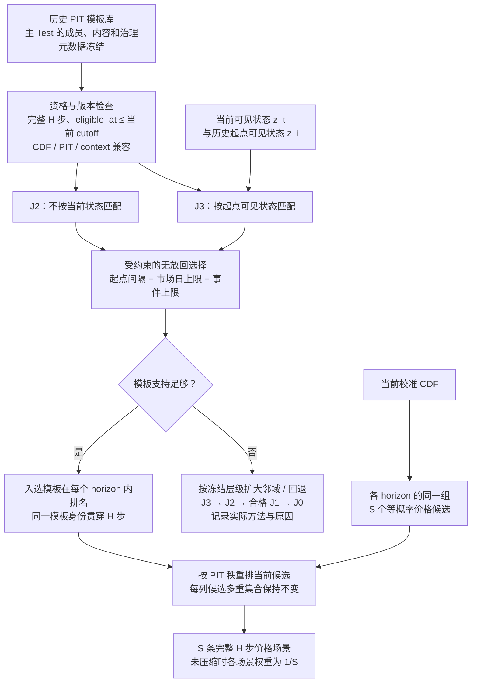

# NSW1 第一阶段：一小时残差概率预测与储能随机滚动优化技术方案

| 文档项 | 内容 |
|---|---|
| 文档性质 | 第一阶段离线研究与实现蓝图，不是生产控制设计 |
| 主预测任务 | 每 5 分钟预测 NSW1 未来 60 分钟、12 个五分钟区间的 RRP 概率分布 |
| 决策任务 | 10 kW / 20 kWh 合成表后储能的风险感知滚动优化 |
| 版本 | v1.6 |
| 编制日期 | 2026-08-26 |
| 修订日期 | 2026-08-27：v1.1 补全 PIT 模板构建、快照、治理及解释性示例与四幅示意图；v1.2 整合 M0/M1/M2 模型阶梯讲解、手算示例、角色关系与“价格电影”流程图；2026-08-28：v1.3 聚焦扩写 J3 的两阶段机制、信息边界、手算示例、权重解释与晋升条件；v1.4 将教学性解释拆分到 `explain/` 目录，正文保留技术契约与链接；v1.5 将长字段字典和版本别名关系移入 `schema/` 目录，正文只保留核心字段组；v1.6 合并重复的信息/结论边界并压缩交付检查清单 |
| 市场事实核验日期 | 2026-08-26 |
| 上位契约 | `AGENTS.md`、`docs/RESEARCH_SCOPE.md`、`docs/DATA_CONTRACT.md`、`docs/FORECAST_PROTOCOL.md`、`docs/BESS_BACKTEST_PROTOCOL.md` |
| 主要输入方案 | `NSW1_生产首版_残差概率预测与储能滚动优化技术方案.md`、`NSW1_第一阶段_一小时概率预测与终端价值方案.md` |
| 讨论补充 | “NSW预测与联合模板”及小时级口径、条件 ECC 定位、路径方法和一小时视野的澄清；[PIT模板重复度分析](chatgpt-conversation://6a8fd579-1674-83e9-a8f6-baa83fe14240)关于五分钟保存、月度快照、批量推断和去集中化的讨论；[解释模型阶梯](chatgpt-conversation://6a8ffe49-9c1c-83e9-aee4-60bbd87dbe49)关于 M0/M1/M2 的直观解释、算例、分布一致化及联合路径衔接；[《J2/J3 讲解与 PIT 未来信息辨析》](../J2_J3_讲解与PIT未来信息辨析.md)关于 J3 条件检索、PIT 使用边界及防泄漏解释的对话归档 |

> 本文档用“事实”“推断”“假设”“建议”区分证据强度。凡涉及市场字段、发布时间或规则的事实，均以 AEMO/AEMC 一手资料为准，并注明核验日期。凡涉及资产、费用、终端价值、模型和收益的内容，均是离线研究配置或待验证假设，不代表真实项目收益、市场接入能力或商业承诺。

---

## 0. 执行摘要

### 0.1 调整结论

本方案不沿用“五区域 × 24 小时 × 在线 EMS”的生产化主线，而将研究闭环收敛为：

```text
AEMO 历史原始数据
  -> 按决策时可见性重建 P5MIN forecast vintage
  -> NSW1 未来 12 步残差概率预测
  -> 边际校准与 NSW1 一小时价格路径
  -> 随机滚动优化 + 窗口末终端价值
  -> NMI 能量与参数化费用核算
  -> 相对 P5MIN 的样本外风险调整增量净收益
```

调整不是为了简化而简化，而是为了使表示精度、数据证据和第一阶段问题一致：P5MIN 本身提供未来一小时、五分钟分辨率的短期价格与需求预测；项目唯一结算标签是 NSW1 RRP；当前仓库是离线研究环境，尚无真实站点、合同、EMS 或生产运行数据。

### 0.2 已冻结的主决策

| 维度 | 第一阶段决定 |
|---|---|
| 区域 | 仅 NSW1；其他区域只能作为决策时可见辅助特征 |
| 时间粒度 | 5 分钟，interval-ending |
| 主预测范围 | 未来 60 分钟，h = 1...12 |
| 视野敏感性 | 30 / 60 / 120 分钟；60 分钟仍是唯一正式验收任务 |
| 概率输出 | 对外至少 P10/P50/P90；优化内部使用更完整的校准分布或情景样本 |
| 锚点 | 决策截点前最新可见、覆盖目标区间的 P5MIN NSW1 RRP |
| 首个概率基线 | 按 horizon 构建的 P5MIN 条件经验残差分布 |
| 候选模型 | NSW1 标签的 LightGBM 残差分位数与事件概率模型 |
| 路径生成 | 独立采样、残差块重采样、无条件 PIT 重排、条件 PIT/Schaake 重排公平比较 |
| 路径方法选择 | 不预设条件重排为默认方案，以时间外路径质量和运营价值证据晋升 |
| PIT 历史库 | 合格五分钟起点全量保存；首版月度完整预测快照 + 分批推断；M0-PIT 先行、M1-PIT 再验证 |
| 模板使用 | J2/J3 均限制市场日与事件集中度；主 Test 冻结模板库，不吸收 Test 结果增库 |
| 优化 | 期望净价值减风险惩罚的随机 MPC，每轮只执行第一步 |
| 终端处理 | V0/V1/V2 对照；V1 历史价值表为首个候选，V2 Predispatch 为数据门控 challenger |
| 资产 | 10 kW / 20 kWh 可用能量、25 kWh 毛能量的合成表后储能 |
| 费用 | Gross-RRP 诊断 + Low/Base/High 三档显式费用 |
| 环境 | 离线回放；不连接设备、不报价、不做真实结算 |

### 0.3 方案的真正重点

优先级按“若此层错误，后续结论是否仍成立”排序：

1. **时间和可见性正确**：不能用目标时点之后才发布的数据或最终 forecast vintage；
2. **边际概率可信**：P10/P50/P90、事件概率和完整分布必须校准；
3. **随机决策不偷看未来**：场景树和 non-anticipativity 必须与未来可观测信息一致；
4. **终端 SOC 有合理价值**：一小时窗口不能把视野之外的剩余电量当成零价值；
5. **物理与结算守恒**：功率、电量、效率、NMI 和费用符号必须一致；
6. **公平样本外比较**：模型、基线和储能策略使用相同 issue、target、样本、状态与费用。

联合场景生成很重要，但它是服务于储能决策的可替换模块，不是整个系统的核心假设。边际分布失准时，任何重排方法都无法修复预测；边际分布已经可信后，才有必要研究如何把 12 个时点连接成合理路径。

PIT 模板库的细节按 7.5–7.8 节执行；直观说明见 [`explain/PIT模板_随机化与历史快照.md`](explain/PIT模板_随机化与历史快照.md)。

### 0.4 成功标准

第一阶段只有在以下证据共同成立时，才能宣称形成了完整改进：

- 概率指标相对预注册的 P5MIN 条件误差/校准基线改善，且覆盖率改善不是通过无约束扩宽区间获得；
- P50 点预测诊断相对原始 P5MIN 不退化或有可解释改善；
- 负价和参数化高价事件概率在样本量允许的层级上更可信；
- 联合路径在 ramp、持续时间、转折和多变量评分上优于独立采样；
- 风险调整滚动净收益相对原始 P5MIN 和简单概率校准策略有样本外增量，或至少在预注册非劣效界限内用更低复杂度获得相当表现；
- 无 SOC、功率、NMI、费用或能量守恒违规；
- 结果可从数据 manifest、配置、随机种子、模型和产物版本复算。

不预设缺乏依据的固定改善百分比。置信区间跨 0 只能表示“未证明存在稳定增量”，不能被写成“已经证明没有价值”。

### 0.5 明确非目标

第一阶段不包括：

- NSW1 以外区域的预测目标或结算收益；
- 五区域联合价格场景、多区域资产组合或网络风险模拟；
- 24 小时五分钟级概率路径；
- FCAS、容量、网络支持或其他收入堆叠；
- 真实负荷、真实光伏、真实零售合同或 VPP/FRMP 结算复刻；
- 实时 API、EMS/BMS/PCS 接口、生产 SLO、高可用和自动控制；
- 把完美预知、合成资产或参数化费用结果表述为可部署收益。

### 0.6 当前仓库状态

截至编制日，仓库已经建立研究协议、文档和 uv 环境，锁定 Python 3.11、nemseer 1.0.7 与 nemosis 3.8.1；尚无 `src/`、`tests/`、数据目录、模型、优化器或回测实现。当前目录也没有可用的 Git 元数据，因此“代码 commit 血缘”在进入实现前必须补齐或显式记录为不可用，不能在实验 manifest 中伪造。

---

## 1. 问题定义与固定契约

### 1.1 预测与决策问题

在每个五分钟模型发行时点 $t$，使用不晚于决策截点 $c_t$ 可见的信息，预测：

```math
Y_{t,h}=\operatorname{RRP}_{NSW1}(t+5h\text{ minutes}),
\qquad h=1,\ldots,H,
```

其中主任务 $H=12$。模型输出每个 horizon 的条件概率分布摘要，并形成保留时间依赖的 NSW1 联合价格路径。储能优化器消费这些路径，只决定当前第一个五分钟动作；五分钟后用实际 SOC、最新数据和新预测重算。

“小时级预测”在本文中始终指**未来一小时的预测范围**，不是把五分钟价格聚合成一个小时均价。小时聚合会掩盖负价、尖峰、ramp 和储能首动作价值，不属于第一阶段标签。

### 1.2 时间语义

| 时间字段 | 定义 | 用途 |
|---|---|---|
| `nominal_run_time_aest` | AEMO run 的名义时间 | 标识 forecast vintage，不等同于真实可用时间 |
| `source_available_at_aest` | 数据当时可被研究系统使用的时间或保守代理 | 是否允许进入 snapshot 的最终判据 |
| `decision_cutoff_aest` | 本轮冻结信息集的截点 | 所有输入必须满足 available time 不晚于该截点 |
| `model_issue_time_aest` | 预测产物对应的五分钟决策时点 | 预测主键 |
| `target_interval_end_aest` | 被预测五分钟区间的结束时点 | 标签主键，采用 interval-ending |
| `outcome_available_at_aest` | 实际结果或完整路径何时已揭晓 | 训练、校准和模板资格控制 |
| `ingested_at_utc` | 本地实际抓取时间 | 上线后的真实 first-seen 证据；历史通常不可恢复 |

市场数据层统一使用 NEM time，即固定 UTC+10 的 AEST，不切换夏令时。新州站点日历可使用 `Australia/Sydney`，但必须在进入市场数据层前显式转换并保存原时区。`model_issue_time + 5h` 只是目标时间计算，不代表该目标一定存在有效 P5MIN；仍需以 source run 和 target key 实际连接。

### 1.3 标签、区域与价格版本

主标签契约：

```text
dataset/table       = DISPATCHPRICE
region_id           = NSW1
price_field         = RRP
intervention        = 0
unit                = A$/MWh
interval_semantics  = interval-ending
price_version       = 由数据快照显式声明
```

`RRP` 是模型和基础市场结算映射使用的价格字段；`ROP`、`APCFLAG`、市场暂停和修订字段作为诊断及制度状态保留，不能与 `RRP` 混用。最终实验必须声明使用哪一版月度归档或修订价格；标签价格版本改变时，需要新建数据快照和实验，而不是覆盖旧结果。

### 1.4 资产固定参数

| 参数 | 基准值 |
|---|---:|
| 额定充电功率 | 10 kW |
| 额定放电功率 | 10 kW |
| 可用能量窗口 | 20 kWh |
| 推导毛能量 | 25 kWh |
| 安全 SOC 范围 | 10%–90%，即 2.5–22.5 kWh |
| 普通市场运营备用下限 | 20%，即 5.0 kWh |
| 初始 SOC | 50%，即 12.5 kWh |
| 连续回测段目标期末 SOC | 50%，通过公平终点处理实现 |
| 单程充电效率 | 95% |
| 单程放电效率 | 95% |
| 决策间隔 | 1/12 小时 |

连续回测段的目标期末 SOC 不等于每个一小时 MPC 窗口都必须回到 50%。若每轮强制一小时末回到 50%，终端价值将失去意义并压制跨小时套利。本文在每个滚动窗口使用终端价值，在整段评价终点才使用共同目标 SOC、显式偏差成本或可比的终端现金调整。

### 1.5 核心研究问题

1. P5MIN 的 NSW1 未来 12 步误差在 horizon、时段和市场状态上如何变化？
2. 简单条件残差校准是否已经能产生可信的 P10/P50/P90 与事件概率？
3. LightGBM 残差分位数模型是否在严格 as-of 特征下增量改善概率和点预测？
4. 其他区域和联络线信息是否在 NSW1 标签上提供可重复的增量，还是仅增加复杂度？
5. 12 个边际分布之间的时间依赖是否会改变储能当前首动作？
6. 残差块、无条件 PIT 重排和条件 PIT 重排分别带来多少路径及运营增量？
7. 随机 MPC 相对 P50 确定性优化是否改善下行风险和错误动作成本？
8. 一小时视野加终端价值是否相对 30/120 分钟方案足够；该结论对费用和资产参数是否稳定？

### 1.6 60 分钟主任务与 30/120 分钟敏感性

主报告、模型接口和第一阶段完成定义均以 60 分钟为准。敏感性实验遵守：

- **30 分钟**：使用同一模型输出的 h=1...6，检验过短视野的损失；
- **60 分钟**：正式任务，使用完整 P5MIN 一小时窗口；
- **120 分钟**：仅在历史 Predispatch vintage、可见时间和 h=13...24 分布构造通过数据审计后运行；前 60 分钟必须与主方案完全相同，后 60 分钟使用粗粒度且诚实扩宽的不确定性，不能伪装为 P5MIN 同精度；
- 120 分钟配置中的 `h=13...24` 表示五分钟控制区间，不表示存在 12 个独立的官方五分钟远期预测；从 30 分钟 Predispatch 桶映射时必须保存 `source_resolution_minutes=30`、来源 bucket、映射和不确定性扩宽规则；
- 三种视野使用同一资产、费用、风险、回测时段和终端价值口径；
- 若要宣称 60 分钟相对 120 分钟“足够”，必须在验证期预注册运营非劣效界限，并在测试期使用单侧置信区间检验；没有合格 120 分钟数据时不得作该结论。

---

## 2. 关键设计澄清

### 2.1 统一信息与结论边界

后续章节不再反复展开以下共性规则；若局部规则未另行收紧，均默认适用：

| 边界 | 统一规则 |
|---|---|
| 信息集 | 任一输入必须在 `decision_cutoff_aest` 前可见；历史回放使用 as-of snapshot、合格模板和冻结 Test 库。 |
| 标签与结算 | 标签、回测和收益均严格属于 NSW1 RRP；其他区域只能作为经审计的辅助特征。 |
| 概率优先 | 路径、MPC 和收益实验必须建立在已校准的边际概率基础上；P10/P50/P90 不等于完整 CDF。 |
| 复杂度 | LightGBM、J3、多阶段树、CVaR、V2 等均是 challenger，只有相对简单基线有时间外增量才晋升。 |
| 结论措辞 | 合成资产、参数化费用、完美预知和离线回测不得表述为真实项目收益或商业承诺。 |

### 2.2 条件 PIT/Schaake 的定位

条件 PIT/Schaake 重排是十二步路径生成候选之一，不是系统核心。它只改变各 horizon 候选价格的横向连接方式，不改善单点边际分布，也不会自动把跨区信息传递给 NSW1。其价值只可能体现在尖峰持续、负价成片、ramp、SOC 保留和风险指标上，并必须通过路径与运营回测验证。

| 方法 | 从历史借什么 | 是否保持当前离散边际 | 是否按当前状态选历史 | 研究用途 |
|---|---|---:|---:|---|
| J0 独立边际采样 | 不借历史依赖 | 是 | 否 | 时间依赖零基线 |
| J1 残差块重采样 | 历史误差金额与形状 | 否 | 基础版否 | 低成本端到端基线 |
| J2 无条件 PIT 重排 | 历史 PIT 高低秩次序 | 是 | 否 | 无条件依赖基线 |
| J3 条件 PIT/Schaake 重排 | 相似历史 PIT 高低秩次序 | 是 | 是 | 条件依赖 challenger |

直观解释见 [`explain/十二步价格路径_J0_J1_J2_J3.md`](explain/十二步价格路径_J0_J1_J2_J3.md) 与 [`explain/J3条件检索_信息边界与权重.md`](explain/J3条件检索_信息边界与权重.md)。

### 2.3 晋升与简化规则

路径方法分两类比较：J1 回答“极简历史误差端到端表现如何”；J0/J2/J3 共享同一当前边际样本，仅比较连接方式。J3 晋升必须同时满足：无未来信息、边际不变量成立、路径评分或 episode 形态改善、首动作/风险/净价值有可解释增量、极端状态支持度足够、复杂度成本可接受。

若无条件重排已足够，应删除条件检索；若残差块或独立采样已足够，应保留更简单方法。复杂度本身不计作研究成果。

### 2.4 跨区域信息应该放在哪里

其他区域信息的正确注入点是：

1. **残差模型特征层**：QLD1/VIC1 当时可见 RRP、跨区价差、P5MIN 区域预测、直接联络线 flow/limit/headroom；
2. **条件模板检索层**：用上述状态判断哪些历史 NSW1 PIT 路径更接近当前；
3. **消融层**：删除跨区特征重跑相同 NSW1 标签、回测和结算，量化增量。

其他区域不作为标签、不生成五区域价格路径，也不参与 NSW1 结算。SA1/TAS1 等间接区域信息不是第一批特征，只有在 NSW1–QLD1/VIC1 与直接联络线特征已通过可见性和消融后才可增加。

### 2.5 为什么不能先断言一小时足够

10 kW / 20 kWh 可用能量的储能从空到满约需两个小时，一小时视野可能看不到更远的充电准备或晚高峰机会。滚动重算和终端价值可以缓解，但是否足够是待验证假设，而不是逻辑必然。

因此：

- 主任务仍严格保持未来 60 分钟；
- 终端价值是核心组件，不是文末补丁；
- 30/60/120 分钟做配对敏感性；
- 只有满足预注册非劣效判断，才可写“一小时方案在当前数据和资产假设下足够”；
- 即便 60 分钟足够，也不能外推到更大储能、不同功率能量比或真实合同。

---

## 3. 总体架构与模块边界

### 3.1 端到端架构


### 3.2 模块职责

| 模块 | 输入 | 输出 | 不负责 |
|---|---|---|---|
| Raw/Manifest | AEMO 文件、查询参数 | 不可变对象、SHA-256、来源与版本 | 推断历史可见时间 |
| Snapshot Builder | 原始版本、cutoff、可见性规则 | 当时可见的单轮特征快照 | 用最终版本替代当时版本 |
| Anchor Builder | P5MIN vintages、目标区间 | NSW1 h=1...12 锚点与质量标志 | 预测残差 |
| Probability Model | 锚点、历史与市场特征 | 残差分位数、事件概率 | 连接路径 |
| Calibration | 原始概率输出、校准期 | 单调、一致、校准后的 CDF | 修改测试期参数 |
| Path Factory | 当前 CDF、历史误差/PIT 模板 | NSW1 12 步场景和权重 | 改善边际预测 |
| Tree Builder | 路径、可观测信息规则 | 多阶段节点和场景归属 | 假设未来场景标签已知 |
| Optimizer | 场景树、SOC、资产、费用、终端价值 | 当前共同动作和解释计划 | 绕过物理约束 |
| Simulator | 当前动作、实际价格/站点状态 | 下一轮实际 SOC 和能量流 | 执行未来未兑现计划 |
| Settlement | NMI 能量、RRP、费用配置 | 五分钟现金流与增量净价值 | 把 RRP 当作真实零售电价 |
| Evaluation | 配对预测与决策产物 | 指标、置信区间、归因与结论 | 用测试集调参 |

### 3.3 版本化产物链

任一储能首动作必须可以沿以下键回溯：

```text
decision_id
  -> optimization_config_id
  -> scenario_batch_id / scenario_method_version
  -> forecast_distribution_id / forecast_snapshot_id
  -> forecast_cdf_family_version / model_snapshot_id / calibration_snapshot_id
  -> template_library_id / template_library_manifest_hash / source_template_id（J2/J3）
  -> anchor_run_at / feature_snapshot_id
  -> source_manifest_hash
  -> asset_config_id / fee_scenario_id / terminal_value_id
  -> code_version / environment_lock_hash / random_seed
```

如果当前工作目录仍无 Git commit，则 `code_version` 必须使用明确的替代标识，例如打包源码 SHA-256，并在 manifest 中设置 `git_commit_available=false`。建立 Git 后不得覆盖旧实验的版本字段。

### 3.4 初始 champion/challenger 关系

“Champion”表示当前证据下默认比较或运行的方法，不代表永久正确。初始顺序为：

| 层 | 初始基准/候选 | 晋升依据 |
|---|---|---|
| 边际概率 | P5MIN 条件经验残差为基准；LightGBM 残差分位数为候选 | pinball、覆盖率、宽度、Brier 与稳定性 |
| 路径 | 独立采样和残差块为基准；无条件/条件 PIT 重排为候选 | 联合分数、首动作、收益与模板支持度 |
| 决策 | 原始 P5MIN 确定性滚动优化为基准；概率随机 MPC 为候选 | 配对净价值、CVaR、错误动作与约束 |
| 终端价值 | V0 为诊断；V1 为首个候选；V2 为数据门控 challenger | 跨小时 regret、收益、SOC 行为和稳定性 |

任何复杂模块若无法在相同数据和决策条件下证明增量，应停留在 challenger 或删除。

---

## 4. 数据、市场事实与 Point-in-Time 体系

### 4.1 已核验的一手事实

以下事实截至 2026-08-26：

- AEMO 将五分钟预调度（P5MIN）描述为每 5 分钟更新、向前看一小时的短期价格和需求预测；截至核验日的生产数据模型 v5.7 将其定义为 12 个五分钟 dispatch cycles，并以 `RUN_DATETIME + INTERVAL_DATETIME + REGIONID` 区分 run、目标区间和区域。来源：[AEMO Pre-dispatch 数据页](https://www.aemo.com.au/energy-systems/electricity/national-electricity-market-nem/data-nem/market-management-system-mms-data/pre-dispatch)、[AEMO Electricity Data Model v5.7](https://di-help.docs.public.aemo.com.au/Content/Data_Model/Electricity_Data_Model_Report_57.pdf)。
- AEMO 的 30 分钟 Predispatch 数据按区域提供至下一市场日的预测并每半小时更新；本文仅在 120 分钟敏感性或 V2 终端价值中把它作为可选输入，不把它提升为第一阶段主标签。来源：[AEMO Pre-dispatch 数据页](https://www.aemo.com.au/energy-systems/electricity/national-electricity-market-nem/data-nem/market-management-system-mms-data/pre-dispatch)。
- `DISPATCHPRICE` 记录五分钟 energy/FCAS 价格、intervention 和价格覆盖信息；`RRP` 是对应 dispatch period 用于市场结算的区域参考价格，单位 A$/MWh、公开报价不含 GST；价格调整时 `RRP` 与 `ROP` 具有不同语义。来源：[AEMO Electricity Data Model v5.7](https://di-help.docs.public.aemo.com.au/Content/Data_Model/Electricity_Data_Model_Report_57.pdf)、[AEMO 术语表](https://tech-specs.docs.public.aemo.com.au/Content/TOC_common-topics-DOnotChange/Glossary.htm)。
- NEM 五分钟结算于 2021-10-01 开始，第一阶段优先研究该日期之后的共同可用数据。来源：[AEMC 五分钟结算说明](https://www.aemc.gov.au/news-centre/media-releases/commission-confirms-five-minute-settlement-commence-1-october-2021)。
- AEMO 市场运行时间表统一使用 AEST，数据模型中的 NEM 时间固定为 UTC+10；项目市场层不采用夏令时切换，五分钟时间戳按 interval-ending 解释。来源：[AEMO Spot Market Operations Timetable v1.13](https://www.aemo.com.au/-/media/files/stakeholder_consultation/consultations/nem-consultations/2026/spot-market-operations-timetable/spot-market-operations-timetable-v113---clean.pdf)、[AEMO Electricity Data Model v5.7](https://di-help.docs.public.aemo.com.au/Content/Data_Model/Electricity_Data_Model_Report_57.pdf)。

P5MIN 的 `RRP` 是价格预测，不是自带 P10/P50/P90 或成员权重的概率预测。AEMO 数据模型中的需求情景和价格敏感性字段也不能在没有官方概率权重时直接解释为价格概率分布；本文概率输出来自历史误差、残差模型和校准。

这些来源说明产品结构和字段语义，不证明某条历史文件在名义 run time 后立即可用。历史 available time 必须另行审计，`LASTCHANGED` 只能作为代理之一，不能称为 AEMO 官方发布 SLA。

### 4.2 数据源与权威边界

| 数据 | 首选入口 | 权威事实源 | 作用 |
|---|---|---|---|
| P5MIN 历史 vintages | NEMSEER 1.0.7 | AEMO 原始 P5MIN 文件与数据模型 | 锚点、基线、残差、未来可见特征 |
| 实际 NSW1 RRP | NEMOSIS 3.8.1 | AEMO DISPATCHPRICE | 标签与结算基础 |
| 区域状态 | NEMOSIS / AEMO 归档 | DISPATCHREGIONSUM、P5MIN_REGIONSOLUTION | NSW1 与辅助区域特征 |
| 联络线 | NEMOSIS / AEMO 归档 | DISPATCHINTERCONNECTORRES、P5MIN_INTERCONNECTORSOLN | flow、limit、headroom |
| 约束 | NEMOSIS / AEMO 归档 | P5MIN_CONSTRAINTSOLUTION 等 | 绑定/近绑定代理，需字段审计 |
| Predispatch | NEMSEER 或 AEMO 归档，待审计 | AEMO Predispatch | V2 与 120 分钟敏感性 |
| 合成负荷/PV | 本地确定性配置或冻结随机生成器 | 研究假设 | S2 表后站点模拟 |
| 费用/退化 | 版本化研究配置 | 有来源的公开费率或显式假设 | 参数化结算 |

NEMSEER 与 NEMOSIS 是访问适配器，不替代 AEMO 对表、字段和规则的定义。包升级前必须先通过数据和回测兼容性验证。

### 4.3 不可变原始层与 manifest

每个原始对象至少记录五类信息：来源身份、查询参数、名义/可见/抓取时间、内容哈希、解析与质量状态。完整字段字典见 [`schema/README.md#31-raw-manifest`](schema/README.md#31-raw-manifest)。

同名文件或查询结果变化时新增版本，不覆盖旧对象。标准化、特征、预测、场景、决策和结算产物分别落层，并携带上游 manifest hash。

### 4.4 历史可见时间策略

历史 `first_seen_at` 通常无法事后恢复，因此需要把事实和代理分开：

1. **本地采集期**：使用真实 `local_first_seen_at`；
2. **历史归档期**：根据 `RUN_DATETIME`、`LASTCHANGED`、文件命名时间和小样本下载审计，建立版本化 `availability_policy_id`；
3. **保守代理**：只有审计支持后，才可采用 `source_available_at = max(LASTCHANGED, nominal_run + conservative_lag)` 或其他明确规则；
4. **不确定窗口**：无法判断是否及时可用的记录不得进入主证据，可进入单独敏感性；
5. **措辞边界**：报告必须写“代理 available time”，不得写“官方在该时刻保证发布”。

### 4.5 Snapshot 与 P5MIN vintage 选择

对于每个 `decision_cutoff_aest`：

1. 只保留 `source_available_at_aest <= decision_cutoff_aest` 的记录；
2. 对每个目标区间选择 cutoff 前最新可见、有效且覆盖该目标的 P5MIN run；
3. 主比较要求 12 个 horizon 均有有效 NSW1 锚点；缺任一关键锚点则该 cutoff 不进入配对主样本；
4. 不得使用同一目标区间后来发布的最终 P5MIN；
5. 不得把上一轮旧 vintage 或日历预测静默填入主样本；这些只能作为显式降级敏感性；
6. 保存所有未选中的 vintages，用于 revision 特征和可追溯审计。

Snapshot 元数据至少覆盖 snapshot 主键、decision/model/target 时间、horizon、可见性政策、特征版本、上游 manifest、完整率、陈旧度和质量标志。完整字段字典见 [`schema/README.md#32-snapshot-metadata`](schema/README.md#32-snapshot-metadata)。

### 4.6 标准化长表

标准化层至少包含三张长表：

| 表 | 核心键 | 核心数值/状态 |
|---|---|---|
| P5MIN vintage | `region_id`、`run_datetime_aest`、`source_available_at_aest`、`target_interval_end_aest`、`horizon_step` | P5MIN RRP、需求、last changed、raw lineage、可见性质量 |
| 实际价格 | `region_id`、`target_interval_end_aest`、`intervention`、`price_version` | RRP、ROP、APC、市场暂停、raw lineage |
| 模型样本 | `sample_id`、`snapshot_id`、`model_issue_time_aest`、`target_interval_end_aest`、`horizon_step` | 锚点、实际值、残差、价格版本、特征版本、可见性质量 |

完整字段字典见 [`schema/README.md#33-p5min-vintage-table`](schema/README.md#33-p5min-vintage-table) 至 [`schema/README.md#35-model-sample-table`](schema/README.md#35-model-sample-table)。同一 issue time 的 12 行属于一个预测组，切分、bootstrap 和模板构建都必须保留这种组内相关性。

### 4.7 缺失、异常与快速失败

不得静默填补：

- NSW1 RRP 标签；
- 主样本的 P5MIN NSW1 锚点；
- horizon、issue、available、target 时间；
- SOC、充放电功率、NMI 能量；
- 费用场景的关键参数；
- 场景权重、终端价值版本。

允许研究性填补的普通特征必须同时产生 `missing_flag`、`fallback_flag`、`imputation_policy_id`，且填补参数只能在训练窗口拟合。价格极值不得为改善主指标而 winsorize；若模型内部使用 `asinh` 或 signed-log，评价和结算必须恢复原始 A$/MWh。

### 4.8 数据审计门

扩展到完整历史前，先用小时间窗口回答：

- NEMSEER 与 NEMOSIS 可访问的实际月份、表和字段；
- P5MIN 12 个 horizon 的完整率、重复和 run revision；
- `RUN_DATETIME`、`INTERVAL_DATETIME`、`LASTCHANGED` 与文件时间的关系；
- NSW1、`INTERVENTION=0` 和价格版本过滤；
- AEST 与 `Australia/Sydney` 转换及夏令时边界；
- 5 分钟 interval-ending 是否存在 off-by-one；
- A$/MWh、MW/MWh 与 kW/kWh 单位是否一致；
- Predispatch vintage 是否足以支撑 V2 和 120 分钟敏感性。

数据审计报告必须先冻结共同可用区间，之后才能冻结最终测试边界和费用日期。若数据不支持 V2/120 分钟，不影响 60 分钟主任务，但必须明确标记为未执行，而不是使用事后曲线补齐。

### 4.9 时间切分

数据审计后采用滚动起点切分：

```text
Train -> Validation -> Calibration -> Test（最新完整 12 个月）
```

- Test 默认选择审计确认的最新完整 12 个月；
- Train 使用 Test 之前的完整共同历史，至少覆盖一个完整年度；
- Validation 只用于模型、特征、窗口和超参数选择；
- Calibration 只用于边际、事件和终端价值折扣等校准；
- Test 全程冻结模型、校准器、特征、超参数和选择规则，不吸收 Test 标签重新拟合；
- 主 Test 同时冻结 PIT 模板库成员、PIT 内容、历史 context 和治理元数据；只纳入首个 Test cutoff 前已合格且不含 Test 目标标签的模板，仍遵守 embargo。J1 历史残差块采用同样的 Test 标签禁入规则；
- 相邻集合设置不短于最大评估 horizon 的 embargo；运行 120 分钟敏感性时 embargo 至少 120 分钟；
- 禁止随机切分；滚动窗口、重训和校准更新频率必须写入实验配置；
- 最终测试期若被反复查看，应记录为探索性使用，并另设 untouched holdout 才能恢复强结论。

这里的“冻结”不等于停止每五分钟预测：当前可见的 P5MIN、市场特征和 SOC 仍随决策时点更新，检索结果也可随当前状态变化；冻结的是拟合参数、选择规则和可选历史库。历史库重建及 Validation 回放可以按预注册日程更新快照，并只在模板合格后逐步纳入，不能一开始加载整段 Validation 的未来结果。正式 Test 不执行月度再训练或增库；在线更新只能另立实验，不能覆盖本冻结主实验。

---

## 5. 特征、基线与实验公平性

### 5.1 必须实现的预测基线

| 编号 | 基线 | 定义 |
|---|---|---|
| B0 | 最近实际价格持久性 | 决策时最新可见 NSW1 RRP 用于全部 horizon |
| B1 | 日内/周内季节性 | 仅用训练和当时可见历史计算相同时段统计分布 |
| B2 | 原始 P5MIN | cutoff 前最新可见的每目标 P5MIN NSW1 RRP |
| B3 | P5MIN 条件经验残差 | 按 horizon、时段及预注册状态估计残差分位数，是概率首要基线 |
| B4 | 简单事件基础率 | 按 horizon/时段估计负价和高价概率，或由 B3 分布推导 |

B3 不是随意弱基线。候选模型的概率改进必须首先相对 B3 报告；P50 和运营价值还必须相对 B2 报告。

### 5.2 特征分组

#### F0：P5MIN 锚点与曲线

- 当前 12 点 NSW1 P5MIN RRP 曲线；
- 当前 horizon 锚点；
- 曲线斜率、范围、极值、上升/下降段和形状摘要；
- 同一目标相邻 run 的 revision 及 revision 速度；
- P5MIN 需求、供给和其他经字段审计的区域量。

#### F1：近期 NSW1 实际与误差

- 最新可见的 5/10/15/30/60 分钟 RRP 滞后；
- rolling median、MAD、原始尺度波动和符号变化；
- 最近负价/高价距离、episode 状态；
- 历史 P5MIN 残差及 revision 误差。

所有窗口只向过去，不得包含目标区间或 cutoff 后修订。

#### F2：NSW1 供需与网络

- 决策时可见的需求、可用容量、净交换、备用代理；
- NSW1–QLD1、NSW1–VIC1 直接联络线的 flow、正反向 limit 与 headroom；
- 经可见性审计的 P5MIN 联络线预测和约束摘要；
- binding/near-binding 计数和状态变化。

#### F3：其他区域辅助特征

- QLD1/VIC1 当前可见 RRP；
- NSW1–QLD1、NSW1–VIC1 价差；
- QLD1/VIC1 P5MIN 价格与需求摘要；
- 与 NSW1 直接网络关系相符的状态量。

F3 只进入 NSW1 模型和条件模板距离，必须提供去掉 F3 的完整消融。任何改善仍只按 NSW1 标签、路径和结算报告。

#### F4：日历与制度

- NEM AEST 五分钟 slot、小时、星期、月份、季节；
- 转换后的 NSW 工作日、周末和节假日；
- intervention、APC、市场暂停和价格版本状态；
- 数据模型或规则版本。

#### F5：数据质量

- 各源 age、missing、fallback、reconstructed；
- snapshot completeness；
- 锚点 run age 和 revision 可用性；
- availability policy 与质量等级。

天气 forecast vintage 不是第一阶段必需入口。只有能证明历史发行版本和可见时间时才可加入；事后实况天气不能冒充预测时可见天气。

### 5.3 变换与防泄漏

- LightGBM 数值特征默认不标准化；距离、线性或概率校准模块使用的尺度参数只在训练期拟合；
- 极端连续变量允许 `asinh` 或 signed-log，但保留原始值用于阈值、诊断和结算；
- 时间周期可同时使用离散 slot 与 sin/cos；
- 分位数、缺失填充值、类别字典、阈值、特征选择和所有 rolling 统计均只在相应训练窗口拟合；
- 同一目标的多个 vintage 可以作为 revision 历史，但不能让模型看到 cutoff 后的 revision；
- 特征表每个值应能回溯 `source_run_at`、`source_available_at` 和原始对象。

### 5.4 公平比较规则

所有模型与基线必须在以下条件完全一致时比较：

```text
model_issue_time
decision_cutoff
target_interval_end
sample inclusion mask
actual price version
feature availability policy
initial battery state
site trajectory
asset and NMI constraints
fee and degradation scenario
optimizer information structure
random-seed protocol
```

若候选模型因更多特征缺失而减少样本，应同时报告共同样本比较和覆盖率损失，不得只在更容易的子样本上宣称改善。

---

## 6. 一小时残差概率预测与边际校准

本章正文只保留残差概率预测的技术契约。教学性解释、类比和手算示例已拆分到 [`explain/`](explain/README.md)，仅用于帮助理解，不替代市场事实来源或实验依据。

### 6.1 锚点残差分解

对 issue time $t$、horizon $h$：

```math
Y_{t,h}=A_{t,h}+E_{t,h},
```

其中 $A_{t,h}$ 是决策截点前最新可见且覆盖目标区间的 P5MIN NSW1 RRP，$E_{t,h}=Y_{t,h}-A_{t,h}$ 是锚点残差，$Y_{t,h}$ 是实验标签版本中的 NSW1 RRP。残差符号固定为“实际减预测”：正残差表示 P5MIN 低估，负残差表示 P5MIN 高估。

若模型给出残差条件分位数 $Q_E(\alpha\mid X_{t,h})$，则价格分位数为：

```math
Q_Y(\alpha\mid X_{t,h})=A_{t,h}+Q_E(\alpha\mid X_{t,h}).
```

该式成立的前提是给定当前信息集后锚点 $A_{t,h}$ 已知；它是对 P5MIN 锚点做概率误差校准，不是把两个未知变量的分位数任意相加。历史残差必须用当时可见 vintage 计算，不能替换为目标区间的最终或后续 P5MIN。

教学解释与算例见 [`explain/残差概率模型_M0_M1_M2.md`](explain/残差概率模型_M0_M1_M2.md)。

### 6.2 外部最小输出与内部完整分布

每个 horizon 的外部最小契约为：

```text
P10 / P50 / P90
P(RRP < 0)
P(RRP > high_price_threshold)
```

P10/P50/P90 只是预测分布的三个位置，不等于完整 CDF，也不足以在未声明插值、尾部和点质量规则时生成概率场景。优化内部默认使用更密的分位数网格，首轮起点为：

```text
alpha_grid = [0.01, 0.025, 0.05, 0.10, 0.25,
              0.50,
              0.75, 0.90, 0.95, 0.975, 0.99]
```

该网格是实现起点而非市场事实；实验配置必须记录实际网格。若尾部样本不足，可以减少专门训练的极端分位数，但必须明确完整分布的插值、外推和事件概率约束。对外报告始终至少保留 P10/P50/P90。

分位数与 CDF 的直观解释见 [`explain/分位数_CDF_事件概率一致化.md`](explain/分位数_CDF_事件概率一致化.md)。

### 6.3 模型阶梯

本节 M0 对应 5.1 节的概率基线 B3；本节 M2 指事件概率模块，11.2 节实验矩阵中的 M2 则指“M1 + 事件概率模块”的组合配置。第 13 章 M0–M6 是实施里程碑，与这里的模型编号不同。

| 模型 | 回答的问题 | 方法 | 主要输出 | 角色 |
|---|---|---|---|---|
| M0：P5MIN 条件经验残差 | 类似历史下 P5MIN 通常错多少 | 按 horizon、时段、季节/价格状态等预注册条件估计经验残差分布，并做小样本收缩 | 残差经验分布/分位数，加回锚点得到价格分布摘要 | 首要概率基线和降级候选 |
| M1：LightGBM 残差分位数 | 当前复杂可见状态下，这次 P5MIN 可能错多少 | NSW1 标签的 pooled-horizon quantile models，`horizon_step` 作为显式特征 | 配置分位数网格上的残差分位数，加回锚点得到价格分位数 | 主要候选模型 |
| M2：事件概率模型 | 负价/高价事件发生概率是多少 | 二分类概率模型及校准，阈值由实验预注册 | $P(RRP<0)$、$P(RRP>\theta)$ | 关键事件补充 |

M0/M1/M2 不是逐级替换关系。M0 必须长期保留为强基线；M1 只有在时间外 pinball、覆盖率、宽度、Brier 和稳定性上相对 M0 有证据时才晋升；M2 只作为事件信息通道，需与分位数 CDF 一致化后才能进入优化。

首版 M1 采用 pooled-horizon 结构以提高样本效率，但同一 issue 的多行及相邻 issue 的重叠窗口不得被当成独立样本。直接预测 NSW1 RRP 分位数的模型作为 challenger，用于检验 P5MIN 锚点是否确有价值。

模型角色、直观类比和手算示例见 [`explain/残差概率模型_M0_M1_M2.md`](explain/残差概率模型_M0_M1_M2.md)。

### 6.4 训练与选择流程

```text
Train：
  拟合特征处理、M0经验分布、M1分位数模型、M2事件模型

Validation：
  选择特征组、模型结构、训练窗口、超参数和ensemble规则

Calibration：
  拟合分位数单调/概率校准、事件校准和层级收缩参数

Test：
  冻结模型、校准器、特征、超参数、选择规则和历史模板库，执行一次主滚动评价
```

随机种子、训练窗口、样本权重、LightGBM 参数、早停规则和模型选择指标进入 `model_manifest`。超参数搜索主目标为分 horizon pinball/WIS 与校准稳定性，不以 MAE 单独选概率模型，也不以储能测试收益反向挑模型。

上述流程定义最终候选的选型与评估，不授权用最终模型、校准器回填历史 PIT。历史模板另按 7.5.7 节执行：每个快照在其允许的过去内划分拟合、内部选择和校准窗口；特征处理、早停和尾部估计也不能读取后续数据。应预先登记候选方法并分别回放，或记录严格历史内部选择过程。若某个 family 是根据后期 Validation 标签修改后才确定的，不能直接将它的早期回算称为“历史当时的选择”；须另作探索性回算，或从方法选择信息已可用后的起点积累合格库。支持不足则按 7.8 节降级。

### 6.5 分位数单调化

独立分位数模型可能产生交叉。对每个 `(issue_time, horizon)`，将原始分位数投影为非递减序列：

```math
\widetilde Q_h(\alpha_1)\le \widetilde Q_h(\alpha_2)
\quad\text{for}\quad \alpha_1<\alpha_2.
```

首版采用 monotone rearrangement 或带权 isotonic projection，并同时保存：

```text
raw_quantiles
adjusted_quantiles
crossing_count
maximum_adjustment
monotonicity_method_version
```

交叉率本身是模型诊断指标。不能只保存修复后的结果，从而隐藏原模型不稳定性。

### 6.6 分位数与事件概率的一致分布

M1 分位数与 M2 事件概率必须映射到同一个 CDF，不能让优化器同时消费互相矛盾的概率数字。首版将信息映射到统一的 `(price, cumulative probability)` 节点：

```text
分位数节点：(Q(alpha), alpha)
负价左限：  (0-, P(Y<0))
高价节点：  (theta, 1-P(Y>theta))
规则支持：  P(Y < floor)=0, P(Y > cap)=0
```

`P(Y<0)` 对应 $F(0^-)$ 而不是 $F(0)$；若零价存在点质量，需要同时表达左右极限。规则边界只限制支持域，不强迫 `F(floor)=0`；历史上若价格恰好落在 floor/cap，可显式估计边界点质量。

对重复或冲突节点执行有记录的约束单调投影。事件节点与分位数节点的权重由 Validation/Calibration 预注册，测试期不得调整。输出必须满足：

- CDF 随价格非递减；
- 所有概率在 $[0,1]$；
- 分位数顺序正确；
- 多个高价阈值的超越概率随阈值升高而不增加；
- 价格不越过目标时点有效的市场规则边界；
- 负价与高价概率不会构成逻辑矛盾。

数学合法的 CDF 不代表已经校准，仍须接受时间外概率、事件与运营评价。直观解释见 [`explain/分位数_CDF_事件概率一致化.md`](explain/分位数_CDF_事件概率一致化.md)。

### 6.7 CDF 插值与尾部

中心区间默认使用单调分段线性或 PCHIP 插值。两种方法在 Validation 上比较后冻结；不得使用会产生额外振荡或越界的普通高阶样条。

P01 以下和 P99 以上的尾部采用以下顺序：

1. 当前时点有效的市场 floor/cap 给出硬支持边界；
2. 使用训练期、按 horizon/时段/制度状态分组的经验残差尾部；
3. 小样本组向 NSW1 更宽时间池收缩；
4. 不借用其他区域价格作为 NSW1 尾部标签；
5. EVT/GPD 仅作为样本量和阈值稳定性得到支持后的 challenger；
6. 人工压力价格单独形成 stress package，不混入概率场景。

极端价格不裁剪或 winsorize 以改善主指标。只有当时有效的市场规则边界可以作为支持裁剪，并须记录规则版本。

### 6.8 滚动校准

校准目标是使名义概率与实际频率一致，而不是单纯缩窄区间。首版比较：

- 按 horizon 或 lead bucket 的 rolling quantile mapping；
- conformalized quantile adjustment challenger；
- 事件概率的 isotonic 或 beta calibration；
- 小样本状态向 horizon/全局校准器层级收缩。

校准窗口长度和更新频率在 Validation 冻结，Calibration 期拟合最终参数，Test 期不再拟合。任何校准报告必须同时给出覆盖率和区间宽度，避免通过无限扩宽取得虚假覆盖改善。若未来研究在线更新，应使用独立、预注册的滚动评估版本，并保留 untouched holdout；不得覆盖第一阶段冻结 Test 的主结果。

历史 PIT 的月度快照必须包含当时的校准器，而不只是当时的 LightGBM。用六月之前拟合的模型配上全年标签拟合的校准器，仍不能生成七月合格的 as-of CDF。历史校准窗口必须在快照生效前结束、标签已经可见，并使用时间外预测拟合；不能拿模型拟合内误差冒充时间外校准样本。完整快照期间不另行更新校准器；如需不同更新日程，须生成新的完整快照身份并作为独立配置验证。

### 6.9 OOD 与降级输出

第一阶段的 OOD 主要用于诊断和敏感性，不直接假定某个扩宽因子有效。每轮记录：

```text
feature_range_flags
missingness_shift
anchor_revision_anomaly
price_regime_rarity
model_disagreement
ood_score
```

只有在 Validation 证明某种单调扩宽能改善覆盖且不过度扩大区间后，才允许形成 `ood_widening_policy_id`。主评价中 P5MIN 锚点缺失的 cutoff 不用降级模型填入；运营降级策略在单独样本中报告。

### 6.10 概率预测接口

概率预测持久化采用长表，核心字段分为五组：

| 字段组 | 内容 |
|---|---|
| 主键与时间 | `forecast_distribution_id`、issue/cutoff/target、horizon、`region_id=NSW1` |
| 锚点 | P5MIN 锚点价格与 run time |
| 概率输出 | 分位数水平、原始/校准后价格分位数、负价概率、高价阈值与概率 |
| 版本血缘 | CDF family、forecast/model/calibration/data snapshot、CDF 构造版本 |
| 质量与生成 | quality flags、生成时间 |

完整字段字典见 [`schema/README.md#41-forecast-distribution-long-table`](schema/README.md#41-forecast-distribution-long-table)。外部可以将常用分位数透视为宽表，但长表是唯一持久化事实结构，不能把固定 12 步数组作为唯一接口。

版本命名统一见 [`schema/README.md#2-版本命名与兼容别名`](schema/README.md#2-版本命名与兼容别名)：`data_snapshot_id` 表示本轮可见输入，不是拟合后的模型快照；`model_id`、`calibration_id` 仅作兼容别名。

### 6.11 边际评价

按 horizon、月份、时段、价格状态和数据质量层报告：

- P10/P50/P90 及内部网格的 pinball loss；
- P10–P90 覆盖率与宽度；
- WIS，完整样本分布可用时报告 CRPS；
- PIT/随机化 PIT 直方图与分位数 reliability；
- 负价和高价事件 Brier、reliability、样本数与 episode 数；
- P50 的 MAE、RMSE、Bias 和 median AE；
- 相对 B2/B3 的配对差值与区块 bootstrap 置信区间。

概率区间更窄但失去覆盖率不算改进；普通状态改善但尖峰失真不能被包装成全面改善。

---

## 7. NSW1 十二步联合价格路径

### 7.1 目的与术语边界

第 6 章给出每个 horizon 的校准边际分布；路径工厂进一步把 12 个边际连接成 $S$ 条 NSW1 一小时场景：

```math
\mathbf Y_t^{(s)}=(Y_{t,1}^{(s)},\ldots,Y_{t,12}^{(s)}),
\qquad s=1,\ldots,S.
```

路径用于表达负价连续性、尖峰持续时间、ramp、恢复速度及其对当前储能首动作的影响。J0/J2/J3 可以使用相同的当前边际候选值，只改变跨步连接方式；J1 直接搬用历史残差块，可能改变边际，因此属于端到端简单基线。

严格术语上，本项目更接近 PIT-based Schaake shuffle，而不是经典 Ensemble Copula Coupling（ECC）。正文统一称为“条件 PIT/Schaake 重排（项目历史名称：条件 ECC）”。

“价格电影”的直观解释见 [`explain/十二步价格路径_J0_J1_J2_J3.md`](explain/十二步价格路径_J0_J1_J2_J3.md)。

### 7.2 共同边际样本

对当前校准 CDF $F_{t,h}$，构造分层等概率候选：

```math
q_j=\frac{j-0.5}{S},
\qquad
X_{(j),h}=F^{-1}_{t,h}(q_j),
\qquad j=1,\ldots,S.
```

其中 $h$ 是未来步索引，$s$ 是场景编号，$j$ 是固定 horizon 内从低到高的候选价格索引。$F^{-1}_{t,h}$ 是分位数函数；每个 horizon 都有自己的 CDF，不能仅凭 P10/P50/P90 三点推断任意分位。

到这一步只确定每一列的候选价格多重集合，还未决定哪些值横向连成同一条路径。J0、J2、J3 使用相同候选集合及权重，仅比较连接方式；它们保持的是有限离散边际样本，而非声称有限场景完全等于连续 CDF。

索引和候选构造示例见 [`explain/十二步价格路径_J0_J1_J2_J3.md`](explain/十二步价格路径_J0_J1_J2_J3.md)。

### 7.3 J0：独立边际采样

J0 对每个 horizon 独立、均匀抽取一个排列 $\pi_h$：

```math
Y_{t,h}^{(s)}=X_{(\pi_h(s)),h}.
```

每列恰好使用每个候选一次，不是在该列有放回抽样 $S$ 次。J0 的硬不变量是：

```math
\operatorname{sort}\{Y_{t,h}^{(s)}\}_{s=1}^S
=(X_{(1),h},\ldots,X_{(S),h}),\qquad h=1,\ldots,H.
```

“独立”指各 horizon 的排列独立抽取；不能有意复用同一排列生成共单调路径。J0 是不引入跨时间依赖结构的零基线，用于回答时间联系建模是否带来额外价值。

手算示例见 [`explain/十二步价格路径_J0_J1_J2_J3.md`](explain/十二步价格路径_J0_J1_J2_J3.md)。

### 7.4 J1：历史残差块重采样

J1 抽取某个合格历史起点的完整残差块：

```math
e_{i,h}=y_{i,h}-a_{i,h},
\qquad
\mathbf e_i=(e_{i,1},\ldots,e_{i,H}).
```

为当前场景 $s$ 抽取历史起点 $i_s$ 后：

```math
Y_{t,h}^{(s)}=a_{t,h}+e_{i_s,h}.
```

历史块必须来自当前 cutoff 前已合格的训练/模板历史，且完整 $H$ 步结果、价格版本和质检均已可见。J1 保留历史误差金额、持续和恢复形状，但不保证符合当前校准 CDF；因此它是低成本端到端基线，不是与 J0/J2/J3 同类的“只比较依赖结构”实验。

可选 J1s 使用标准化残差块：

```math
r_{i,h}=\frac{y_{i,h}-a_{i,h}}{\sigma_{i,h}},
\qquad
Y_{t,h}^{(s)}=a_{t,h}+\sigma_{t,h}r_{i_s,h}.
```

尺度估计规则必须只在训练期拟合；原始块与标准化块不得混称。方法直观解释见 [`explain/十二步价格路径_J0_J1_J2_J3.md`](explain/十二步价格路径_J0_J1_J2_J3.md)。

### 7.5 PIT 模板如何形成

PIT 模板记录历史实际价格在当时预测 CDF 中的相对位置：

```math
u_{i,h}=F^{asof}_{i,h}(y_{i,h}),
\qquad
\mathbf u_i=(u_{i,1},\ldots,u_{i,H}).
```

若实际值处存在点质量，使用随机化 PIT：

```math
u_{i,h}=F^{asof}_{i,h}(y^-_{i,h})
+v_{i,h}\left[F^{asof}_{i,h}(y_{i,h})-F^{asof}_{i,h}(y^-_{i,h})\right],
\qquad v_{i,h}\sim U(0,1).
```

工程上用 `template_id + horizon + pit_method_version` 的冻结哈希生成确定性伪随机 $v$，以保证重放稳定；不得使用 Python 内置 `hash(text)` 作为跨进程稳定哈希。

$F^{asof}_{i,h}$ 必须是历史起点当时可生成的预测 CDF。没有归档 CDF 时，按严格 rolling-origin 的月度完整预测快照构建：快照生效前拟合模型、特征处理、事件组件、校准器和 CDF 构造；生效期内批量推断；待完整实际标签和治理信息可见后再计算 PIT。不得用最终模型和全年校准器回算全历史。

模板至少记录模板身份、issue/cutoff、完整 PIT/residual path、结果与资格时间、CDF/model/calibration snapshot、PIT/context/episode policy、source manifest、价格版本和质量标志；完整字段字典见 [`schema/README.md#42-pit-template-table`](schema/README.md#42-pit-template-table)。只有完整 $H$ 步实际标签、PIT 计算、质检和事件治理信息均已可见后，模板才合格：

```math
template\_eligible\_at_i\le decision\_cutoff_t.
```

`forecast_cdf_family_version` 表示方法规范，`forecast_snapshot_id` 表示某次完整拟合流水线，`forecast_distribution_id` 表示单个起点输出；跨 family 混用 PIT 默认禁止，除非通过预注册兼容性回放。版本别名关系见 [`schema/README.md#2-版本命名与兼容别名`](schema/README.md#2-版本命名与兼容别名)。

PIT、随机化、五分钟保存和月度快照的解释见 [`explain/PIT模板_随机化与历史快照.md`](explain/PIT模板_随机化与历史快照.md)。

### 7.6 J2：无条件 PIT 重排

从时间合格、版本兼容的模板中，在 7.8 节相同市场日/事件治理约束下无条件、无放回选择 $S$ 条。“无条件”指不按当前市场状态匹配，不表示忽略重复来源。对每个 horizon，在入选模板间计算 PIT 秩：

```math
\rho_{s,h}
=\operatorname{rank}\left(
u_{i_s,h};u_{i_1,h},\ldots,u_{i_S,h}
\right).
```

再按秩把今天的有序候选连接成路径：

```math
Y_{t,h}^{(s)}=X_{(\rho_{s,h}),h}.
```

因此对每个 horizon 有硬不变量：

```math
\operatorname{sort}\{Y_{t,h}^{(s)}\}_{s=1}^S
=
\operatorname{sort}\{X_{(s),h}\}_{s=1}^S.
```

J2 只借历史的高低次序，不搬历史金额，严格保持当前离散边际样本。它表达的是冻结抽样与治理规则下合格历史池的时间依赖；去集中化会改变模板的入选分布，不能将其称为原始库的简单频率平均。

### 7.7 J3：条件 PIT/Schaake 重排

J3 的生成公式与 J2 完全相同，只改变模板选择。设当前可见状态为 $z_t$，历史起点当时可见状态为 $z_i$：

```math
P(i\mid t)\propto
\mathbf 1_{\{eligible_i\}}
K\!\left(\frac{d(z_t,z_i)}{b}\right).
```

条件检索只使用可解释、已通过可见性审计的起点信息，包括 NEM 时段、星期/季节、P5MIN NSW1 曲线与 revision、近期 NSW1 RRP 与波动、需求/备用代理、负价/高价校准概率摘要、NSW1–QLD1/VIC1 价差及直接联络线 flow/limit/headroom、数据质量标志等。

严禁使用历史起点后来实现的价格、PIT、残差、尖峰标签或未来约束判断相似度。距离尺度、分组权重、带宽 $b$ 和缺失惩罚只在 Validation 选择并随场景引擎版本冻结。历史 episode 标签只用于 7.8 节去集中化治理，不进入 $z_i$ 或相似度距离。

实际抽取还受无放回、起点间隔、市场日上限、事件上限和版本兼容约束；上式不能误称为最终入选概率。选中后原始场景等权：

```math
w_s=\frac{1}{S}.
```

选择概率只回答“谁更容易入选”，不应在优化中二次作为场景权重，否则会破坏当前离散边际。J3 相对 J2 的唯一主动差异应是条件检索；晋升必须同时满足无泄漏、支持度充分、路径质量或首动作/风险/净价值有时间外增量。

J3 两阶段机制、A/B 区信息边界、非法用法和权重解释见 [`explain/J3条件检索_信息边界与权重.md`](explain/J3条件检索_信息边界与权重.md)。

### 7.8 模板治理与冷启动

图 7-4：历史模板到当前场景的使用流程。历史库提供依赖结构，当前 CDF 提供价格候选，两路在秩重排处汇合。



读图：J2/J3 只在“是否按当前状态匹配”上不同，都要控制日/事件集中度；图中的选择与限额是一个受约束过程，不是抽完不足后复制模板补齐。历史价格不流入右侧的当前候选价格。回退分支按实际方法另行生成并标记场景，其中 J1 不保证保持当前边际；非法 CDF、缺失关键输入或血缘损坏仍报错，不属于普通支持不足回退。

#### 7.8.1 市场日与事件去集中化

假设检索出 100 条相似模板，其中 28 条来自同一天，20 条又覆盖同一次尖峰。这只是示例：它们提供了多个观察角度，却不是 20 次独立尖峰的证据。`day` 限制一天的总贡献，`episode` 限制同一场事件的总贡献；两者同时约束，避免跨日事件绕过日限额。

- `market_day_id` 使用版本化的 AEST 研究日分组规则；日界线在配置中明确，不能按 Sydney 夏令时日期隐式分组，也不能未经核验把研究分组称为官方市场日定义。
- `episode_id` 由预注册的负价/高价阈值、事件起止和间隔合并规则生成；需定义跨日事件、普通非事件窗口及事件闭合确认时间。不是每个五分钟窗口都新建一个事件 ID。
- 一条模板覆盖多个事件时，关联全部事件并分别计入各事件上限，不能任选一个 ID 绕过约束；事件为空只表示不含已定义事件，仍接受日和时间间隔约束。
- 事件标签可使用已经揭晓的历史结果，但仅用于去集中化和诊断。其元数据可见时间纳入模板资格；尚未闭合的事件不能用未来结果提前确定全貌。历史元数据按版本保存，禁止用后来事件合并结果覆盖早期检索记录。
- J2/J3 采用相同的日/事件上限、时间间隔和资格协议；上限值由 Validation 决定，不将解释示例中的“每事件 2–5 条”等数字写成既定参数。

去集中化控制的是贡献，不会凭空创造独立性，也可能牺牲近邻匹配质量或减少罕见事件支持。必须报告这种权衡，不能为了满足限额直接删除原始事件或静默放宽规则。

#### 7.8.2 无放回选择与有效支持度

每条模板必须有完整 $H$ 步，禁止拼接不同历史起点；同一起点的不同副本/版本不能当成额外唯一案例。选择器按冻结的顺序、随机种子和约束无放回抽取，记录资格过滤、版本过滤、距离、限额拒绝和最终入选原因。PIT 并列仍使用稳定次级键，不添加不可复现噪声。

每批报告原始候选数、合格数、唯一入选起点数、市场日数、事件数、最大日/事件占比、模板年龄、距离和实际回退层级。最小支持度须联合这些量定义，不只检查“候选数至少等于 S”；也不能把等权场景的名义有效样本数直接解释成独立历史事件数。CVaR 尾部支持另按 7.9 节检查。

#### 7.8.3 条件池不足与冷启动

J3 先按预注册层级扩大相似状态邻域；仍不足则尝试满足相同治理及版本约束的 J2。没有足够合格 PIT 模板时，按冻结路线尝试具备合格残差块的 J1，再退回具备完整当前 CDF 的 J0。默认路线在 Validation 后冻结，具体方法可按实验候选集显式关闭，但不得跳过任何方法的输入校验。

不得复制少量模板凑 S、静默降低场景数/限额，或跨不兼容 family 拼库。输入缺失、非法 CDF、血缘损坏不是“模板支持不足”，必须按边界报错，不能用回退掩盖。记录 `requested_method`、`actual_method`、原因及支持度；在共同样本和完整运行轨道分别报告结果，不能把回退区间记为 J3 成功。

#### 7.8.4 跨快照与跨 family 兼容性

同一 family 下的月度快照先检查目标、horizon、CDF/PIT/context schema、价格版本和时间血缘，再按预注册 Validation 指标检查分 horizon 校准、PIT 分层、事件支持与路径稳定性。仅“模型权重不同”不应形成模板孤岛，但仅“family 字符串相同”也不能跳过检查。

跨 family 或 CDF/PIT 大版本变化默认不混用。若要将旧 PIT 用于新的当前 CDF，必须以独立实验固定当前边际和其他条件，保存兼容性回放报告及有方向的允许关系；不得用新模型重算历史 PIT 来假造兼容。未通过则使用兼容模板的 J2，或按 7.8.3 节回退 J1/J0。所有允许关系、阈值和报告引用进入 `template_compatibility_policy_id`，Test 期间不再按测试结果修改。

#### 7.8.5 冻结 Test 的模板库

进入 Test 前生成不可变 `template_library_id` 和内容清单哈希，包含允许的模板、PIT、历史 context、事件关联及其版本。模板须在首个 Test cutoff 前合格且不含 Test 目标标签；后续每轮仍检查资格和兼容性，不因库已冻结就跳过。

“冻结经验库”不等于“每轮选同样的经验”：当前市场状态变化时，J3 可以在同一个库里选出不同模板；但不能将刚刚揭晓的 Test 尖峰加入库，或用 Test 结果修改历史事件划分。Test 结果可以用于独立评价产物，不反馈到模型、校准或模板选择。若研究在线增库，应另立版本和 untouched holdout，不能混进本方案的主 Test 结论。

### 7.9 场景数量、权重与压缩

不预先写死 300、500 或 2,000 条。首轮在 Validation 使用：

```text
S ∈ {50, 100, 250, 500}
```

比较：

- 边际与事件概率近似误差；
- Energy/Variogram Score；
- CVaR 尾部有效样本量；
- 不同初始 SOC 下首动作稳定性；
- 求解时间、最优性 gap 和失败率。

默认从 `S=100` 的无压缩实现开始，仅当更大 S 明显改善场景或决策质量且求解预算不满足时，才引入场景压缩。压缩后权重取被代表场景的概率质量总和，不再等权，并重新验证边际、尾部、首动作、CVaR 和收益。

场景数与 CVaR 水平必须联动。等权场景下名义尾部条数约为 $S(1-\alpha)$；加权或压缩场景使用尾部归一化权重的有效样本量 $1/\sum_s\widetilde w_s^2$。Validation 必须预注册最低尾部有效样本门槛，未过门的 `(S, alpha)` 组合不得进入主风险实验。

压力场景单独输出 `bundle_type=STRESS`，没有概率权重，不进入期望收益、CVaR 或概率评分。

### 7.10 路径评价与晋升门

所有路径方法按月、时段、horizon 前缀和价格状态报告：

- Energy Score 与 Variogram Score；
- 相邻五分钟差分、ramp、机械锯齿率；
- 负价、高价 episode 的开始、持续时间和恢复速度；
- 多变量 rank/PIT 诊断；
- 模板年龄、距离、唯一数、市场日与 episode 集中度；
- 候选/合格/入选数、有效日与事件支持、治理拒绝比例及 J3/J2 回退比例；
- 按 CDF family 和月度快照分层的校准、PIT 与跨版本兼容诊断；
- 不同 SOC 下的首动作、期望价值、P05 和 CVaR；
- 相对 J0/J1/J2 的配对区块 bootstrap 差值。

J3 只有相对 J2 在时间外证据中提供稳定增量且支持度足够，才成为默认路径方法。若只改善联合分数却不改变决策，可保留为预测研究成果，但不宣称产生运营价值；若只改善收益却破坏联合校准，需要先排查优化器是否利用了不真实依赖。

模板原始数量、唯一历史起点数与独立事件支持分别报告；限额合格不等于统计独立。模板构建另报告快照组/组件数、训练与推断耗时、峰值内存、存储量和排除率，避免仅以库更大或模型更复杂判定改进。

### 7.11 一个重要的可证伪关系

若优化器满足以下条件：

- 12 步动作全部对所有场景相同，即风险中性 open-loop；
- $\lambda_{CVaR}=0$；
- 约束和终端价值不依赖路径事件；
- J0/J2/J3 使用完全相同边际样本；

则这些重排方法应产生相同的期望价格系数，联合路径理论上不应带来系统性首动作差异。若实现中出现明显差异，优先检查随机误差、权重或代码错误。

联合依赖真正可能影响决策的通道是 CVaR、多阶段 recourse、路径相关约束和场景相关终端状态。这一关系应写入行为测试，防止把无关差异误认为条件重排贡献。

---

## 8. 储能随机滚动优化

随机 MPC、O0/O1/O2 与 CVaR 的教学解释见 [`explain/终端价值与随机MPC.md`](explain/终端价值与随机MPC.md)。

### 8.1 决策时序

每个 `model_issue_time` 执行：

1. 读取当时实际 SOC、站点状态、费用配置和未来 12 步概率场景；
2. 构建满足当时信息结构的场景树或 open-loop 问题；
3. 求解 12 步充放电计划；
4. 只执行根节点的第一个五分钟动作；
5. 用该区间实际 RRP、负荷/PV和执行结果更新 SOC/NMI；
6. 五分钟后丢弃旧的未来计划，用新 snapshot 和新预测重新求解。

主任务中优化器返回的后 11 步只用于当前首动作的机会成本估计和解释，不能当作未来已批准执行计划。

### 8.2 能量状态与单位

使用电池毛能量状态 $E_{k,s}$，单位 kWh。$k=1$ 表示当前窗口开始；一般 $H$ 步问题执行后状态为 $E_{H+1,s}$，主任务 $H=12$ 时即 $E_{13,s}$：

```math
E_{k+1,s}
=E_{k,s}
+\eta_c P^c_{k,s}\Delta t
-\frac{P^d_{k,s}\Delta t}{\eta_d},
\qquad \Delta t=\frac1{12}\text{ hour}.
```

其中 $P^c$、$P^d$ 是交流侧充、放电功率，单位 kW。基准约束中功率适用于 $k=1,\ldots,H$，状态边界适用于 $k=1,\ldots,H+1$：

```math
0\le P^c_{k,s}\le10,
\qquad
0\le P^d_{k,s}\le10,
```

```math
5.0\le E_{k,s}\le22.5,
\qquad k=1,\ldots,H+1
```

用于普通市场运营；2.5 kWh 安全下限只在明确应急敏感性中使用。10 kW 持续五分钟对应最大交流侧能量 $10/12=0.8333$ kWh。效率只按上式应用一次，不得在现金流或计量侧重复扣损耗。

### 8.3 禁止同时充放电

严格首版采用节点级方向二进制变量 $z^b_{k,n}$：

```math
P^c_{k,n}\le \overline P^c_k z^b_{k,n},
```

```math
P^d_{k,n}\le \overline P^d_k(1-z^b_{k,n}).
```

因此主优化问题通常是 MILP，而不是可以预先宣称“毫秒级”的纯 LP。可研究无二进制的净功率凸表达，但必须证明在负价、进出口价差和费用条件下不会出现同时充放电套利；未证明前不得作为主实现。

### 8.4 S1 纯价格信号

S1 不引入负荷和光伏，用于隔离价格预测对电池动作的贡献。交流侧能量：

```math
e^c_{k,s}=P^c_{k,s}\Delta t,
\qquad
e^d_{k,s}=P^d_{k,s}\Delta t.
```

在明确的进口/出口功率限制下，充电计为进口、放电计为出口。S1 结果只能称为 NSW1 价格信号下的运营代理价值，不能称为表后用户净收益。

### 8.5 S2 合成表后站点与 NMI

采用一致的非负变量：

```text
site_load_kw
pv_generation_kw
battery_charge_kw
battery_discharge_kw
nmi_import_kw
nmi_export_kw
```

每个区间满足：

```math
P^{imp}_{k,s}-P^{exp}_{k,s}
=P^{load}_{k}-P^{pv}_{k}
+P^c_{k,s}-P^d_{k,s}.
```

同时执行 NMI 进口/出口、逆变器及站点限制。若严格禁止同一 NMI 区间同时进口和出口，需要节点级方向约束或已经证明的等价表达。合成负荷/PV 采用冻结规则和种子；本地负荷、自用、出口和充电来源分别记账，禁止同一 kWh 同时获得避免购电价值和出口收入。

上式中的未来 `Pload/Ppv` 必须是决策截点时可得的站点预测，或事先冻结、可由日历直接计算的计划轨迹；实际合成结果只在五分钟执行后用于状态更新和结算。若生成器令未来轨迹完全可知，必须明确标注为“确定性合成站点假设”；否则首版至少使用持久性/季节性站点基线并保存 forecast vintage。不得把完整回测段的已实现负荷/PV 直接喂给候选优化器。价格场景与站点误差暂不联合建模时，应把这一点列为 S2 局限并做站点预测误差敏感性。

“本地价值优先、剩余容量响应市场”采用显式两层契约：先由冻结的 C1 本地策略根据当时可见的负荷/PV 与备用要求生成本地动作或保留包络，再把剩余功率、能量和 NMI headroom 交给市场优化；也可用经测试的词典序优化实现同等优先级。必须分别记录 `local_service_action` 与 `market_overlay_action`。关闭市场 overlay 时结果应逐步退化为 C1，且 overlay 不得侵占已承诺备用或把同一电量同时计为自用和出口。

### 8.6 多阶段信息结构

仅写“第一步对所有场景相同”仍不够。如果从第二步开始允许每条完整路径独立决策，相当于假设五分钟后就知道整条未来价格，形成乐观的完美信息 recourse。

设场景 $s$ 在阶段 $k$ 所属节点为 $n_k(s)$。第 $k$ 个动作在该区间价格实现前作出，只能依赖已经实现的价格前缀 $Y_{1:k-1}$。不可预知性要求：

```math
x_{k,s}=x_{k,s'}
\quad\text{if}\quad n_k(s)=n_k(s'),
```

其中 $x$ 包括充电、放电、方向二进制和其他控制变量。所有场景在 $k=1$ 共享根节点。

场景树通过嵌套前缀聚类构建：

- 第 $k$ 阶段只能读取 $Y_{1:k-1}$、已知 SOC 和当时可观测状态；
- 节点只能继续分裂，不能在后续阶段重新合并；
- 禁止使用 $Y_{k:12}$ 后缀帮助当前分组；
- 聚类变量、距离、分支数和阈值只在 Validation 确定；
- 当前单轮优化不假装知道未来 P5MIN revision，真实 revision 的价值通过五分钟滚动回放时重新求解体现。

叶场景权重沿树聚合：节点概率等于其后代叶权重之和，条件转移概率由父子概率之比得到；每层节点概率和必须为 1。聚类或剪枝不能悄悄删除低概率高损失分支，树近似前后需比较边际、路径分数、尾部概率、首动作和目标值。分支数、距离、节点上限与剪枝规则只在 Validation 冻结。

### 8.7 三种信息结构对照

| 编号 | 信息结构 | 定位 |
|---|---|---|
| O0 | Open-loop：全部 12 步动作对所有场景相同 | 最保守、最容易验证的基线 |
| O1 | 多阶段场景树：动作只在已观察前缀分叉后分叉 | 随机 MPC 主候选 |
| O2 | 两阶段乐观松弛：仅第一步共享，第二步起每条路径独立 | 完美信息 recourse 诊断上界，不可称为可实施策略 |

应满足同配置下 O2 的最优目标不低于 O1，O1 不低于或等于受限更强的 O0；若违反，应检查树、权重或约束实现。最终首动作必须同时报告其对 O0/O1/O2 的敏感性。

### 8.8 价格与五分钟现金流

先将 RRP 从 A$/MWh 转为 A$/kWh：

```math
p^{spot}_{k,s}=\frac{RRP_{k,s}}{1000}.
```

```math
p^{imp}_{k,s}=p^{spot}_{k,s}+a^{imp}_{k},
```

```math
p^{exp}_{k,s}=p^{spot}_{k,s}+a^{exp}_{k}.
```

`import_adders` 与 `export_adjustments` 的正负方向、单位、适用能量和来源必须在费用配置中说明。五分钟现金流：

```math
\Pi_{k,s}
=p^{exp}_{k,s}e^{exp}_{k,s}
-p^{imp}_{k,s}e^{imp}_{k,s}
-C^{deg}_{k,s}
-C^{aux}_{k,s}
-C^{other}_{k,s}.
```

RRP 为负时不自动截断；进口或出口是否完整传导负价由费用情景决定。

### 8.9 场景总价值与终端价值位置

一般窗口结束时点为 $\tau=t+H\Delta t$。场景 $s$ 的总价值：

```math
G_s=
\sum_{k=1}^{H}\Pi_{k,s}
-C^{switch}_s
+V^{(v)}_t(E_{H+1,s},ctx_{\tau}).
```

主任务 $H=12$、$\Delta t=5$ 分钟，因此终端价值使用窗口结束时的 $E_{13,s}$ 和 $ctx_{t+60}$，并位于场景价值内部。不同场景具有不同终端 SOC 时，目标自然包含：

```math
\sum_s w_sV^{(v)}_t(E_{13,s},ctx_{t+60}),
```

不能把一个不带场景索引的 `V_T(SOC_12, ctx_t)` 放在期望之外。

这里的 $ctx_{t+60}$ 表示在决策截点 $t$ 已知、但按窗口结束时刻取值的日历/费用等属性，或由合法场景信息生成的状态；它不是在回测中偷看的 $t+60$ 实现值。若 context 随场景变化，应写成 $ctx^{(s)}_{t+60}$ 并遵守同一信息结构。

### 8.10 增量价值与 CVaR

为避免风险项被共同的站点负荷成本或无关价格波动主导，主风险定义相对同一场景下的安全/反事实策略：

```math
\Delta G_s=G_s-G_s^{safe},
\qquad
L_s=\max(0,-\Delta G_s).
```

`safe` 是实验前冻结、物理可行且不读取未来价格的反事实：S1 默认 C0/维持备用，S2 默认 C1 本地价值策略。它与候选使用相同初始状态、场景外生量、费用和终端核算；不得为每条场景事后选择不同的“最佳安全动作”，否则会把新的完美预知塞进风险基准。

采用损失上尾 CVaR：

```math
\max\;
\sum_s w_s\Delta G_s
-\lambda_{CVaR}
\left[
\zeta+\frac{1}{1-\alpha}\sum_s w_s\xi_s
\right],
```

约束：

```math
\ell_s\ge-\Delta G_s,
\qquad \ell_s\ge0,
```

```math
\xi_s\ge\ell_s-\zeta,
\qquad \xi_s\ge0,
\qquad \zeta\ge0.
```

CVaR 的 $\alpha$、风险权重 $\lambda_{CVaR}$、安全策略、是否将终端价值纳入损失都必须版本化。主方案将终端价值包含在 $G_s$ 内；另做只对窗口现金流计风险的敏感性。压力场景不进入概率权重和 CVaR。

首版称为“根节点静态 CVaR + 每五分钟重算”，不宣称具有动态时间一致风险度量。若未来需要评价完整动态策略，再研究 nested CVaR。

### 8.11 退化与切换

没有真实电芯和保修数据时，退化使用参数化吞吐成本：

```math
C^{deg}_{k,s}
=c^{deg}_{fee}\left(e^c_{k,s}+e^d_{k,s}\right),
```

低/中/高退化成本与费用情景分别或组合敏感性。切换成本只惩罚无意义的高频方向改变，不应掩盖物理上合理的负价充电和尖峰放电；其权重在 Validation 冻结。

### 8.12 求解、失败与安全动作

首版优化器要求：

- 支持 MILP、场景权重和可重复求解；
- 保存 solver、版本、status、runtime、gap、node count 和时限；
- 先用小型手算问题验证，再进行整年基准压测；
- 不预先声称毫秒级或五分钟生产 SLO；
- 输入无效、求解不可行或超时时，输出显式状态，不沿用旧计划。

离线运营比较分三条轨道：

1. **共同输入合格轨道（运营主结论）**：仅按求解前即可判定的数据完整性规则选定连续区间；各策略的超时/不可行由其冻结安全动作接管，失败成本和后续 SOC 影响均留在策略结果中；
2. **全部求解成功子样本（诊断）**：只用于区分模型质量与求解器故障，不得替代主运营结论，因为按成功状态事后筛样本会产生选择偏差并破坏连续 SOC 语义；
3. **输入降级压力轨道**：关键输入不合格时按冻结规则执行 `NO_MARKET_ACTION`、维持备用或原始 P5MIN 安全策略，单独报告覆盖率与降级影响。

不得把缺失 P5MIN 填成日历值后混入主比较。

### 8.13 优化请求与响应

优化请求至少绑定决策身份、cutoff、场景批次、观测状态、初始能量、资产/NMI/站点/费用/退化/风险/信息结构/终端价值/求解器配置。响应至少返回状态、第一步动作、期望与风险摘要、终端价值诊断、约束解释、求解器运行信息、fallback 和质量标志。完整字段字典见 [`schema/README.md#52-optimization-request`](schema/README.md#52-optimization-request) 与 [`schema/README.md#53-optimization-response`](schema/README.md#53-optimization-response)。

所有解释性全窗口计划可以保存，但 `executed=true` 只能出现在第一步。

---

## 9. 终端价值与跨小时机会成本

终端价值的直观解释见 [`explain/终端价值与随机MPC.md`](explain/终端价值与随机MPC.md)。

### 9.1 为什么一小时窗口必须处理终端价值

若窗口结束后的电量被视为零价值，优化器会在第 12 步附近倾向放空；若每轮硬性要求回到固定 SOC，又会压制真实套利。终端价值的作用是给窗口末库存一个可标定的延续价值：

```text
当前总价值
= 一小时窗口内已经获得的净现金流
+ 窗口结束时剩余电量在以后可能产生的增量价值
```

终端价值不是额外收入，也不能脱离费用、效率、退化和可执行策略单独创造利润。它只是对视野外机会成本的近似。

### 9.2 统一接口

所有方法实现：

```math
V_t^{(v)}(E_{H+1,s},ctx_{t+H\Delta t}),
\qquad v\in\{V0,V1,V2\}.
```

主任务代入 $H=12$ 后为 $V_t^{(v)}(E_{13,s},ctx_{t+60})$；30/120 分钟敏感性分别使用其真实窗口后状态，不能仍硬编码 `E13`。

输入：

```text
window_end_aest = t + horizon_steps * step_minutes
terminal_energy_kwh
context_at_window_end
asset_config_id
fee_scenario_id
site_scenario_id
terminal_value_version
```

输出是相对参考能量状态的增量价值，单位 A$。不同场景终端能量不同时逐场景计算并按真实权重取期望。

价值表进入优化器时采用有记录的一维分段线性表达。由于本文不预设 $V(E)$ 单调或凹，不能只用无约束凸组合形成可能高估价值的凸包；首版使用 SOS2 或显式相邻区间选择变量，保证只在相邻能量格点间插值，并在每个格点和区间内部做目标值一致性测试。

### 9.3 V0：零终端价值

```math
V_0(E,ctx)=0.
```

V0 故意保留终端效应，只作为消融和故障诊断。它不是推荐默认值，也不能把 V0 下的近视行为归因于价格预测。

### 9.4 V1：训练期历史延续价值表

#### 9.4.1 构造问题

对 Train 中每个历史窗口结束时点 $\tau_i$ 和起始能量格点 $E_j$，在与主 MPC 相同的资产、费用、效率、退化和 NMI 契约下求解延续问题：

```math
J_i(E_j)=
\max_{\mathbf a}
\sum_{\ell=1}^{L}\Pi^{actual}_{i,\ell}
+\Phi(E_{i,L+1}),
\qquad E_{i,1}=E_j.
```

首轮延续窗口取 48 小时作为候选，Validation 与 24/48/72 小时比较。为减轻延续窗口末端效应，所有起始能量格点使用相同的最终能量目标 $E_{ref}$ 或同一版本化 salvage 条件；不能在午夜把剩余能量直接置零。

以普通市场运营备用能量 $E_{ref}=5.0$ kWh 为参考，去掉对当前决策无影响的共同绝对水平：

```math
\widetilde J_i(E_j)=J_i(E_j)-J_i(E_{ref}).
```

因此 $V_1(E_{ref},ctx)=0$。这不是说处于备用能量的电池未来不能赚钱，而是把“即使从参考状态也能通过以后充电赚到的共同价值”扣除，只保留额外库存的增量价值。

#### 9.4.2 Context 与聚合

首版 context 保持低维：

```text
NEM five-minute slot at window end
weekday/weekend/holiday type
season or month bucket
fee scenario
S1/S2 site scenario
```

按 context 对 Train 中的 $\widetilde J_i(E_j)$ 求期望并做层级收缩：

```math
V_1(E,ctx)
=\gamma_{ctx}\,
\operatorname{Mean}_{i\in Train(ctx)}
\widetilde J_i(E).
```

SOC 格点间使用版本化分段插值。首轮可从 0.5 kWh 格点开始，但每个起始格点内部的能量和动作仍按连续约束求解，因此不要求 0.5 kWh 与单步 0.8333 kWh 完全整除。插值误差必须用更细网格敏感性验证。

不强制价值曲线单调：高初始 SOC 可能降低负价时继续充电的容量，因此“更多电量永远更值钱”并非在所有价格和费用状态下成立。任何单调或凹性约束都需通过理论条件和回测证明。

#### 9.4.3 乐观偏差与冻结

V1 使用历史实际未来价格做延续优化，含完美预知成分，通常偏乐观。处理方式：

- `Train` 只负责构建原始价值表；
- `Validation` 只选择 context 粒度、延续长度、SOC 网格、平滑和折扣 $\gamma_{ctx}$；
- `Calibration` 可校准统一折扣或层级收缩，但不能读取 Test；
- `Test` 期间 V1 完全冻结；
- 增加“固定可实施 rollout 策略”计算的延续价值作为敏感性，量化完美预知高估；
- 极端价格不裁剪，改用 episode 计数、层级收缩和不确定性报告。

主实验采用严格 Train-only 价值样本。若未来希望在 Test 前用 Train+Validation 重新估计表，必须作为预注册的独立实验版本，不能覆盖 Train-only 结果。

### 9.5 V2：Point-in-Time Predispatch 延续价值

V2 只在历史 Predispatch vintage 和 available-time 审计通过后启用。每个决策时点 $t$：

1. 选择 `decision_cutoff` 前最新可见的 Predispatch run；
2. 从主 MPC 窗口结束 $\tau=t+60$ 之后开始取粗粒度价格上下文；
3. 对多个终端能量格点分别求解相同资产与费用口径的延续优化；
4. 减去 $E_{ref}$ 的共同价值并插值；
5. 使用 Validation 冻结的偏差折扣 $\gamma_{PD}$；
6. 数据缺失、过期或解无效时显式回退 V1，并记录原因。

数学形式：

```math
J_t^{PD}(E_j)=
\max_{\mathbf a}
\sum_{\ell:\,target_\ell>\tau}
\widehat\Pi^{PD,\le t}_{\ell}
+\Phi(E_{end}),
\qquad E_{\tau}=E_j,
```

```math
V_2(E;t)=\gamma_{PD}\,
\operatorname{Interp}
\left\{
J_t^{PD}(E_j)-J_t^{PD}(E_{ref})
\right\}.
```

Predispatch 的原生长视野粒度为 30 分钟；映射到窗口边界时须版本化处理重叠、插值和不确定性，不得称为官方五分钟精度。

#### 9.5.1 关于影子价格的技术修正

一次 LP 在某个初始能量 $E_j$ 上得到的对偶变量，只表示该点附近的局部边际价值或子梯度，不能直接生成完整 SOC 价值表。完整曲线需要：

- 对多个 SOC/能量格点分别求解；或
- 使用正规的参数化 LP 枚举所有断点。

若禁止同时充放电使问题成为 MILP，普通 LP 对偶变量没有全局影子价格解释，V2 必须使用多格点目标值而不是宣称“一次求解得到全表”。

### 9.6 V0/V1/V2 的角色

| 方法 | 角色 | 主要优点 | 主要风险 |
|---|---|---|---|
| V0 | 终端效应诊断 | 最简单、可量化不设终端价值的损失 | 系统性近视 |
| V1 | 首个候选 | 不依赖 Predispatch 历史入口，稳定可冻结 | 历史完美预知偏乐观、context 过拟合 |
| V2 | 数据门控 challenger | 适应当日可见的远期形状 | vintage/可见性成本、远期偏差、求解复杂度 |

V2 只有在共同有效样本上相对 V1 的风险调整净价值增量具有稳定时间外证据时才晋升。普通日表现相当、极端日失真时不能因均值略高而替换 V1。

### 9.7 连续回测段期末公平

每轮一小时窗口使用 $V_t(E_{13})$，不硬拉回 50% SOC。连续回测段最终时点则采用以下之一，并在所有策略间一致：

1. 最后一段显式约束 $E_{end}=12.5$ kWh；
2. 对期末偏差使用共同、预注册的现金调整；
3. 在足够长回测段中删除边界缓冲区后比较。

主方案优先采用共同期末现金调整，避免最后几小时为满足硬约束产生不代表日常运营的异常动作；硬约束作为敏感性。不得让候选策略通过留下更多未计价电量虚增收益。

每轮 MPC 目标中的 $V_t(E_{13})$ 只用于形成当前首动作，不是已经实现的现金流，不能在每个五分钟窗口重复计入回测 PnL。连续回测只结算实际执行区间的能量与费用；`terminal_adjustment_aud` 仅可在整段评价终点按共同规则记一次。逐决策保存的 `expected_terminal_value_aud` 只能作为诊断字段。

### 9.8 终端价值验收

- V1/V2 使用 $E_{13,s}$ 与 $ctx_{t+60}$；
- 场景相关终端 SOC 时验证 $\sum_sw_sV(E_{13,s})$；
- V1 artifact 血缘证明未读取 Test；
- 深夜价值不被午夜置零边界支配；
- V1 与主 MPC 的资产、效率、费用、退化和 NMI 口径一致；
- V2 只读取 cutoff 前可见 Predispatch，近端窗口与延续区间无重叠、无缺口；
- 多 SOC 解与单点局部对偶明确区分；
- V2 缺失时确定性回退 V1，同一输入和版本得到相同结果；
- 手工两阶段例证明 V0 可能近视放空，而合理 V1/V2 能在视野外高价有价值时保留库存；
- 终端价值没有导致无价格依据的长期囤电、SOC 贴边或收益由期末调整主导。

---

## 10. 结算、反事实策略与滚动回测

S1/S2、RRP 到进出口价格和费用口径的教学解释见 [`explain/表后结算与S1S2.md`](explain/表后结算与S1S2.md)。

### 10.1 结算边界

预测模型只输出 NSW1 RRP 分布。用户侧进口、出口和电池价值由独立 settlement module 计算：

```math
spot\_price_{t}=\frac{RRP_{NSW1,t}}{1000}
\quad [A\$/kWh].
```

```math
import\_price_t=spot\_price_t+import\_adders_t,
```

```math
export\_price_t=spot\_price_t+export\_adjustments_t.
```

每个 adjustment 必须声明：

```text
name
value
unit
sign_meaning
applies_to_import_or_export
applies_per_kwh_or_per_interval
source_or_assumption
effective_start/end
verified_at
fee_config_version
```

固定且对所有策略相同的费用可在增量比较中抵消，但仍需声明。缺失费用不能静默设为零。

### 10.2 费用情景

| 情景 | 用途 | 报告措辞 |
|---|---|---|
| Gross-RRP | 仅隔离 RRP 价格信号 | 毛价值诊断，不称净收益 |
| Low-fee | 较低摩擦假设 | 该假设下净价值 |
| Base-fee | 有来源的中间假设 | 主费用情景，冻结后使用 |
| High-fee | 较高网络/零售/平台/损耗假设 | 压力净价值 |

具体数值在数据与公开费率审计阶段冻结。不得只展示最有利情景，也不得让费用值在 Test 结果出现后调整。

### 10.3 退化、辅助功耗与吞吐

基础退化采用参数化吞吐成本，分别记录充电、放电和总吞吐。辅助功耗若未建模必须明确写“未建模”，不能默认吸收进效率。每个策略报告：

- 充/放电 kWh；
- 等效完整循环；
- 退化成本；
- SOC 分布与贴边时间；
- 单位吞吐毛利与净利。

### 10.4 S1 与 S2 两类研究场景

#### S1：纯价格信号

- 不引入真实负荷和光伏；
- 进口/出口由资产与参数化 NMI 边界决定；
- 用于隔离概率预测、路径和优化信息结构的贡献；
- 结果按资产、kWh 可用容量和循环报告；
- 只能称运营代理价值。

#### S2：合成表后站点

- 使用冻结规则或随机种子生成负荷/PV；
- 将决策时可用的负荷/PV 预测与事后实现轨迹分开保存；除明确的确定性合成假设外，优化器不得读取未来实现值；
- 显式设置进口、出口、逆变器和本地价值优先规则；
- 分别保存负荷、PV、电池、NMI 和现金流；
- 不能称“典型 NSW 用户”或真实户用/工商业收益；
- 只有 S1 数据、模型和优化链稳定后才进入主实验。

### 10.5 必须比较的运营策略

| 编号 | 策略 | 作用 |
|---|---|---|
| C0 | 不进行市场响应 | 最低反事实；维持初始/备用状态 |
| C1 | 本地价值策略 | S2 中只服务自用、备用和本地规则 |
| C2 | 固定/滚动历史阈值策略 | 简单可解释规则基线，阈值只用训练/验证期确定 |
| C3 | 原始 P5MIN + 确定性滚动优化 | 官方点预测运营基线 |
| C4 | P5MIN 条件经验概率 + 随机 MPC | 简单概率运营基线 |
| C5 | 候选残差概率模型 + 随机 MPC | 本方案候选全链路 |
| C6 | 全评价段完美信息上界 | 机会空间与 regret 诊断；只有求解范围和边界足以证明时才称严格上界 |

路径方法 J0...J3、信息结构 O0...O2 和终端价值 V0...V2 在 C4/C5 内作为受控实验因子，不另起不同资产或费用配置。

### 10.6 五分钟事件级回放

```text
for each decision cutoff t in chronological order:
    release only source events with available_at <= t
    build point-in-time snapshot
    select P5MIN vintage for h=1...12
    generate baseline and candidate marginal distributions
    build each configured path bundle
    solve each paired strategy from the same actual state
    execute only the first action
    observe actual interval RRP/load/PV and application result
    update battery and NMI state
    settle five-minute cash flow
    persist all intermediate artifacts and flags
```

各策略拥有各自连续 SOC 轨迹，但在配对开始时使用相同初始 SOC；不能每轮把候选 SOC 重置为基线 SOC。若某策略失败，保存失败和安全动作，并让其实际影响继续传播到后续状态；不得删除失败区间后把剩余五分钟现金流拼成一条虚构的主回测。

### 10.7 干预、暂停与价格修订

`INTERVENTION=0` 表示 pricing run，通常是价格预测比较与结算标签应使用的版本；`INTERVENTION=1` 的 physical run 不替代结算价格标签。但发生干预的市场区间不能悄悄从研究中消失：

- 保留 intervention、APC、市场暂停和 price status 标志；
- 审计 P5MIN 在这些区间是否持续提供可比 pricing-run 输出；
- 主样本纳入规则在实验前冻结；
- 分别报告“纳入主样本”“单独压力分层”“排除后敏感性”的结果和样本量；
- 不得只保留最容易预测的普通区间。

实际价格若有修订，主结算版本与 as-published 诊断版本分开保存。不能在同一结果中混用第一次发布和最终归档 RRP。

### 10.8 延迟与第一可执行区间

名义 P5MIN run 不代表数据已经到达。回测至少模拟：

- 可见时间代理；
- 数据下载/解析延迟；
- 预测和优化计算延迟；
- 第一目标区间剩余可执行时间；
- 延迟导致 h=1 已不可执行时的跳步规则。

第一阶段可先使用冻结的保守延迟情景，而不是声称真实现场时延。主结果必须说明第一个执行区间的定义；不同模型不得因运行较慢而仍假装可以执行已经过去的 h=1。

### 10.9 完美预知的正确用途

C6 在完整连续评价段上使用实际未来价格优化，并仍遵守 SOC、功率、效率、NMI、费用、退化和同样的最终 SOC 处理。S1 中它是价格完美预知；S2 为保持数学上的上界性质，还允许读取实际站点结果，因此是更强的全信息 oracle。它只回答：

> 在当前资产和费用假设下，历史价格中最多存在多少可捕获机会？

C6 不参与模型排名、不作为可部署收益，也不能用于训练候选策略。报告候选相对 C6 的 regret 和机会捕获率，同时说明 S2 regret 还包含站点预测不确定性的差异。

另设 `C6p` 价格 oracle 归因诊断：只替换 C3–C5 的价格输入，负荷/PV 信息集保持相同。C6p 更适合隔离价格预测 regret，但不保证在每个样本上构成严格上界。O2 则只是单个一小时窗口内的乐观 recourse 松弛，不能替代 C6。

若因规模限制将 C6 切成独立日/月并人为固定分段边界，或仍使用近似终端价值，就只能称“完美信息 benchmark”，不能称严格上界。严格上界需要覆盖完整评价段，或证明分解与边界处理没有收紧相对候选的可行域。

### 10.10 回测明细表

每个五分钟、策略和情景至少保留四组信息：

| 字段组 | 内容 |
|---|---|
| 回测主键 | backtest run、strategy、decision、执行区间、实际价格版本 |
| 上游产物 | forecast distribution、scenario batch、site forecast/outcome |
| 物理能量 | 初末 SOC、充放电、负荷/PV、NMI 进出口 |
| 现金流与质量 | 避免购电、出口、充电成本、费用、退化、终点调整、净值、solver/fallback、quality flags |

完整字段字典见 [`schema/README.md#62-backtest-detail-table`](schema/README.md#62-backtest-detail-table)。不能只保存最终总收益；每个增量值必须能够追溯到五分钟能量与费用组成。

---

## 11. 实验矩阵、统计比较与验收

### 11.1 分阶段实验顺序

| 实验 | 核心问题 | 必要前置 | Go/No-Go 结果 |
|---|---|---|---|
| E0 数据审计 | P5MIN、RRP、时间和版本是否可形成可信共同样本 | 环境可用 | 冻结可用区间、可见性政策和测试候选 |
| E1 概率基线 | B3 是否校准、各 horizon 误差结构如何 | E0 | 建立第一项可验收概率能力 |
| E2 残差模型 | LightGBM 是否相对 B3 有增量 | E1 | 决定特征与模型是否保留 |
| E3 校准与完整分布 | 密集分位数、事件概率和 CDF 是否一致可信 | E2 | 冻结优化可消费的边际分布 |
| E4 路径方法 | J0/J1/J2/J3 谁能形成更真实且有用的一小时路径 | E3 | 按 2.3 选择或简化路径方法 |
| E5 信息结构与风险 | O0/O1/O2、CVaR 是否改变首动作和下行风险 | E4 | 冻结随机 MPC 信息结构 |
| E6 终端价值 | V1/V2 是否相对 V0 缓解近视且不过度囤电 | E5 | 冻结终端价值方法和回退 |
| E7 视野敏感性 | 60 分钟相对 30/120 分钟是否足够 | E6 + 120 数据门 | 只在非劣效证据成立时支持简化结论 |
| E8 S2 与费用 | 预测增量在合成表后、费用和退化后是否仍存在 | E1–E7 | 给出假设下净价值与外推边界 |

不得跳过 E1–E3 直接优化 ECC 或 MPC 收益。若边际概率基线尚未可信，后续路径和收益差异没有稳定概率语义。

### 11.2 预测实验矩阵

#### 基线与模型

```text
B0 最近实际持久性
B1 季节性分布
B2 原始 P5MIN
B3 P5MIN 条件经验残差
B4 事件基础率
M1 P5MIN + LightGBM 残差分位数
M2 M1 + 事件概率模型
M3 直接 NSW1 分位数 challenger
```

编号说明：本表 B3 对应 6.3 节的模型 M0；本表 M2 是“M1 + 事件概率模块”的组合实验名，不是说事件模型替代了 M1。第 13 章的 M0–M6 则是实施里程碑编号。

#### 特征消融

```text
F0
F0 + F1
F0 + F1 + F2
F0 + F1 + F2 + F3
F0 + F1 + F2 + F3 + F4/F5
```

跨区增量用“含 F3 vs 不含 F3”在完全相同 NSW1 样本上判断。某个特征组只有在至少一个预注册概率/事件指标改善，且没有不可接受的覆盖、稳定性或样本损失时保留。

### 11.3 路径实验矩阵

```text
J0 独立边际采样
J1 原始历史残差块
J1s 标准化残差块（可选 challenger）
J2 无条件 PIT/Schaake 重排
J3 条件 PIT/Schaake 重排
```

对 J0/J2/J3 使用同一边际样本、场景数和随机种子协议。场景数测试 `{50,100,250,500}`。若启用压缩，增加“压缩前/后”成对比较，不把压缩收益归因于路径生成。

模板相关实验在 Validation 分步开展，先固定其他维度，再比较少量候选，不做全部参数的笛卡尔积：

| 实验轴 | 候选与含义 | 固定条件及主要观察 |
|---|---|---|
| 选用间隔 | T5/T15/T30/T60：同批入选起点至少相隔 5/15/30/60 分钟，不是只保留整点起点 | 原始库仍五分钟保存；日/事件治理相同；比较匹配距离、事件覆盖、支持不足与回退 |
| 快照频率 | monthly / quarterly | 方法规范和预注册窗口策略相同，按各频率重建合法快照；比较校准、路径质量与构建成本 |
| 模板来源 | M0-PIT / M1-PIT | 隔离来源效应须先通过兼容门并固定当前边际；未通过时只比较完整流水线 |
| 集中度治理 | 无上限诊断 / 仅日上限 / 日与事件双上限 | 无上限仅用于诊断，不默认进入主 Test；比较集中度、近邻距离、稀有事件支持 |

每项同时评价 Energy/Variogram Score、ramp 和 episode 持续性、首动作稳定性、费用后净价值及构建/求解成本。T60 只排除同批一小时窗口的直接时间重叠，不保证不同窗口的市场状态独立。最低间隔、限额和支持度门槛由 Validation 冻结；如果选不到 S 条，应记为支持不足而不是放宽间隔凑数。

对比使用相同的可评价 cutoff 并披露共同样本覆盖；另外报告包含全部回退的完整运行轨道，避免只在模板充足的容易时段展示结果。正式 Test 只运行冻结后的少量主比较，不继续按 Test 收益选择密度、频率、family 或治理阈值。

### 11.4 决策与终端实验矩阵

至少覆盖：

```text
P50 deterministic vs stochastic expectation
O0 open-loop vs O1 multistage tree vs O2 optimistic relaxation
CVaR off/on with pre-registered alpha/lambda grid
V0 vs V1 vs V2
C3 raw P5MIN vs C4 calibrated P5MIN vs C5 candidate model
S1 vs S2
Gross / Low / Base / High fee
```

为控制多重比较，先在 Validation 缩小到少量候选组合，再冻结 Test 主比较。Test 结果不能继续用于调整风险参数、场景数、模板距离或终端折扣。

### 11.5 运营指标

主指标：

- 扣除费用、效率和退化后的滚动净价值；
- 相对 C3 原始 P5MIN 的增量净价值；
- 相对 C4 简单概率校准的增量净价值；
- 日/周/月增量价值分布和 P05/P50/P95；
- 下行 CVaR 与最大回撤；
- 相对 C6 完美预知的 regret 和机会捕获率。

行为与风险指标：

- 负价充电捕获率、false charge 成本；
- 高价放电捕获率、false discharge 和提前放空成本；
- 尖峰前 SOC 保留与尖峰后恢复；
- 吞吐、循环、退化和 SOC 贴边；
- 同时充放电、NMI 同时进口出口、功率/能量/备用违规；
- 优化失败、超时、降级和不可执行首区间比例；
- 收益集中度：前若干尖峰日贡献、去除这些事件后的结果。

### 11.6 配对统计与不确定性

所有主差值按相同 issue/target 或相同回测日期配对。时间序列高度相关，禁止把每个五分钟行当作独立样本。使用：

- 按完整市场日或连续多日块的 moving/block bootstrap；
- 极端事件按独立 episode 分块；
- 预测分 horizon 差值考虑同一 target 和相邻 issue 的相关性；
- 报告均值/中位数差、95% 置信区间、有效日数和 episode 数；
- 稀有事件样本不足时降低结论强度，不用 PR-AUC 或单次收益制造强结论；
- 多指标/多 horizon 比较预注册主指标或控制结论范围。

Bootstrap block 长度在 Validation 根据自相关和 episode 持续时间确定，Test 不再调整。

PIT 高频保存不改变上述统计口径；每日 288 个理论起点不是 288 个独立一小时事件。治理所用的历史 episode 元数据和评价阶段事后识别的 Test episode 分开存储，后者不得反馈到预测/模板库。事件数是分组支持度，不自动构成相互独立的证明；跨日、相邻或同一系统状态下事件的相关性须由区块设计与敏感性检查覆盖。

### 11.7 60 分钟非劣效判断

若 120 分钟 challenger 通过数据门，定义配对运营差值：

```math
D=V_{60}-V_{120}.
```

在 Validation 根据业务上可忽略的价值损失、估计噪声和复杂度收益预注册非劣效界限 $\delta>0$。Test 中只有当单侧置信区间下界满足：

```math
\operatorname{LCB}_{95\%}(D)>-\delta
```

且 60 分钟方案的下行风险、约束和尖峰行为没有不可接受退化时，才可写“在当前资产、数据和费用假设下，60 分钟相对 120 分钟非劣”。

若双侧置信区间跨 0，只能写“未证明 120 分钟有稳定增量”；不能称“120 分钟被证伪”或“60 分钟等效”。

### 11.8 联合成功判定

| 预测结果 | 运营结果 | 结论措辞 |
|---|---|---|
| 概率改善 | 净价值和风险改善 | 完整候选改进，但仍限于离线假设 |
| 概率改善 | 运营无显著变化 | 预测改进，尚未证明决策价值 |
| 概率改善 | 运营变差 | 不可判为全面改进；排查目标错配或优化偏差 |
| 概率无改善 | 运营改善 | 需要独立复核，不能仅凭收益晋升概率模型 |
| 概率严重失准 | 运营改善 | 不可部署性结论；可能是回测偶然或错误风险承担 |
| 两侧均无改善 | 选择更简单基线并停止增加复杂度 |

任何收益结论必须同时说明区域、价格版本、数据区间、信息集、资产、费用、退化、风险和终端价值配置。

### 11.9 PnL 归因

对 C5 相对 C3/C4 的差异依次替换单个组件：

```text
边际模型
  -> 概率校准
  -> 路径方法
  -> 信息结构/CVaR
  -> 终端价值
  -> 执行延迟
  -> 费用与退化
```

采用相同实际状态的配对反事实，保存每步差异。归因顺序会影响交互项，应报告固定顺序和至少一个反向顺序或 Shapley-like 敏感性；不能把全部最终收益归给预测模型。

### 11.10 主报告分层

最低分层：

```text
horizon_step
month / season
NEM five-minute slot / peak period
normal / negative / high-price regime
P5MIN level and revision regime
data availability quality
fee scenario
initial SOC bucket
```

每层同时报告样本数和独立 episode 数。图表明确 AEST、interval-ending、A$/MWh 或 A$/kWh，避免把不同单位或时间语义画在同一轴上。

---

## 12. 工程接口、配置与产物

### 12.1 建议模块划分

```text
src/nsw_bess/
  config/          # 解析、校验、哈希与冻结配置
  data/            # NEMSEER/NEMOSIS适配、raw、standardize、manifest
  snapshots/       # as-of选择、available-time与样本长表
  features/        # F0...F5及特征血缘
  forecasting/     # B0...B4、残差分位数、事件模型
  calibration/     # 单调化、CDF、滚动校准
  scenarios/       # J0...J3、模板、场景树与可选压缩
  optimization/    # 资产方程、O0...O2、CVaR、terminal value
  settlement/      # NMI、费用、退化和五分钟现金流
  backtesting/     # chronological replay、策略状态与失败轨道
  evaluation/      # 概率、路径、运营、bootstrap与报告
  cli/             # 明确边界的命令入口
tests/
  unit/
  integration/
  behavior/
  replay/
```

这是建议逻辑结构，不要求一次性创建全部目录。优先按 M0–M6 里程碑逐层建立，每个模块依赖上游稳定数据契约，不把下载、建模、优化和结算写进一个 notebook。

核心领域结构使用通用 `horizon_steps`、`step_minutes` 和长表键，不能在模型/优化器内部把 12 写成不可扩展常量。第一阶段配置固定 12，但 30/120 分钟敏感性复用同一接口。

### 12.2 场景长表

场景长表按 `scenario_batch_id × scenario_id × horizon_step` 保存，核心字段组包括：批次与场景主键、预测分布引用、时间与区域、场景价格、requested/actual 方法与回退原因、模板/残差块来源、当前 CDF 与场景引擎版本、权重、bundle 类型和质量标志。完整字段字典见 [`schema/README.md#51-scenario-long-table`](schema/README.md#51-scenario-long-table)。

概率包权重和必须为 1；压力包不携带可误解为概率的权重。J0/J1 没有 PIT 模板字段时显式为空并由 `scenario_method` 解释，不能伪造模板身份；J1 单独保留残差块库及来源键。日/事件数、拒绝数、距离和集中度摘要按 `scenario_batch_id` 另存，避免每个 horizon 重复计数。模板行连接 7.5 的 forecast snapshot 血缘；场景的 `distribution_version` 应映射到当前 CDF family，不混作历史模板 family。

### 12.3 Terminal value artifact

终端价值 artifact 至少绑定方法 V0/V1/V2、资产/站点/费用配置、训练与验证窗口、context schema、能量网格、参考能量、延续窗口、边界条件、折扣参数、Predispatch 可见性政策、价值表 URI、source manifest、代码版本和创建时间。完整字段字典见 [`schema/README.md#61-terminal-value-artifact`](schema/README.md#61-terminal-value-artifact)。

V2 每轮动态曲线另存 `terminal_value_instance_id`，引用当时 Predispatch run 和数据 snapshot。

### 12.4 实验 run manifest

实验 run manifest 至少记录研究问题、代码/环境/依赖、数据与 snapshot 政策、forecast CDF family 与快照注册表、历史回放政策、特征版本、模型/校准 snapshot、模板库及治理政策、场景/优化/终端/资产/站点/费用配置、随机种子、时间切分、产物 URI、状态和已知偏差。完整字段字典见 [`schema/README.md#63-experiment-run-manifest`](schema/README.md#63-experiment-run-manifest)。

每次实验按 `docs/EXPERIMENT_TEMPLATE.md` 登记，不允许只保留 notebook 输出或最终图表。

历史构建清单还需列出月度快照及完整组件哈希、合格/排除起点和原因、构建成本、抽样审计键；使用哪个 library 必须显式绑定，不得在运行时读取某目录下“最新库”。无 PIT 方法的实验相关字段显式不适用。归档历史 CDF 与模拟重建 CDF 分开标识，真实创建时间不用于伪造历史生效证据。

### 12.5 配置校验与快速失败

配置加载阶段至少验证：

- `region_id == NSW1`；
- 主任务 `step_minutes == 5`、`horizon_steps == 12`；
- 分位数严格递增并包含 0.10/0.50/0.90；
- 概率、场景权重、CVaR 参数在合法范围；
- 所有时区和 interval semantics 显式；
- 资产安全/运营边界顺序正确；
- 费用数值、单位、方向和来源非空；Gross-RRP 除外但须明确 `diagnostic_only=true`；
- V1/V2 的资产、费用与主 MPC 配置兼容；
- Test 时任何拟合、校准、模型选择和模板增库开关关闭，库成员/内容/治理元数据哈希与冻结清单一致；
- 历史快照的拟合数据 cutoff、有效期、内部校准和实际/代理生效时间政策完整，逐行特征及标签可见性合格；
- CDF family、snapshot 和兼容别名遵守 [`schema/README.md#2-版本命名与兼容别名`](schema/README.md#2-版本命名与兼容别名)，旧版本映射明确；
- 日/事件分组、间隔、限额、最低支持度和回退策略已冻结，未定义的关键规则快速失败；
- J2/J3 的 PIT/CDF 版本兼容且模板 eligible；
- 120 分钟 sensitivity 只有通过 Predispatch 数据门才可启动。

PIT 专属配置只在启用 J2/J3 或明确执行模板构建时要求；仅运行 J0/J1 时标记不适用，不为满足空字段而构造假库。Validation 阶段使用显式候选政策，Test 阶段必须绑定已冻结的主政策。

### 12.6 错误边界

只在 CLI、数据入口、模型接口和优化器边界把底层异常转换为领域错误。内部异常保留堆栈，不吞掉后返回空预测或零费用。

建议错误类别：

```text
DATA_SOURCE_UNAVAILABLE
RAW_HASH_MISMATCH
AVAILABILITY_UNKNOWN
SNAPSHOT_INCOMPLETE
P5MIN_ANCHOR_MISSING
TARGET_PRICE_MISSING
FEATURE_CONTRACT_VIOLATION
INVALID_QUANTILE_DISTRIBUTION
FORECAST_SNAPSHOT_ASOF_VIOLATION
TEMPLATE_LINEAGE_INVALID
TEST_TEMPLATE_LIBRARY_MUTATED
SCENARIO_MARGINAL_INVARIANCE_FAILED
SCENARIO_TEMPLATE_INSUFFICIENT
SCENARIO_WEIGHT_INVALID
NON_ANTICIPATIVITY_VIOLATION
TERMINAL_VALUE_INCOMPATIBLE
OPTIMIZATION_INFEASIBLE
OPTIMIZATION_TIMEOUT
NMI_ENERGY_IMBALANCE
FEE_CONFIGURATION_MISSING
SETTLEMENT_SIGN_ERROR
```

错误必须携带 `decision_id`、配置版本和可追溯上游键。

### 12.7 依赖与运行约定

当前依赖只有 nemseer/nemosis。实现需要的表处理、模型、求解和测试依赖必须通过 `uv add` 引入，提交 `pyproject.toml` 与 `uv.lock`，并执行：

```bash
uv lock --check
uv sync --locked
uv run python -c "import nemseer, nemosis"
```

候选技术栈：

- 列式数据：Polars/PyArrow/DuckDB；
- 概率模型：LightGBM、scikit-learn；
- 优化建模：支持 MILP 与权重场景的 Python 建模层；
- 求解器：优先选择可复现、许可适合研究环境且能报告 gap/status 的求解器；
- 测试：pytest；
- 图表：只用于报告，原始指标必须先落表。

具体包和求解器在实现前用最小原型验证，不在本文把尚未安装的组件写成既成能力。

### 12.8 最小命令边界

建议最终形成以下可组合入口：

```text
audit-data
build-snapshots
train-baselines
train-probability-model
fit-calibration
build-pit-templates
generate-scenarios
fit-terminal-value
run-backtest
evaluate-run
render-report
```

所有 Python 和工具命令通过 `uv run ...` 执行。命令必须幂等：相同输入、配置和种子生成相同内容哈希；已有实验产物默认拒绝覆盖。

### 12.9 交付物

第一阶段最小交付：

- 数据审计报告与 source manifest；
- NSW1 P5MIN vintage、实际标签和 feature snapshot 长表；
- B0–B4 基线与候选模型 artifact；
- 原始/校准概率长表与概率评价报告；
- 月度完整预测快照清单、M0/M1 分库的 PIT 及资格/集中度/兼容审计、冻结 Test 库（启用 J2/J3 时）；
- J0/J1 以及数据允许时的 J2/J3 路径与联合评价；
- O0/O1/O2、V0/V1/V2 的实验结果；
- S1/S2 五分钟 SOC、NMI、费用和现金流明细；
- C0–C6 策略比较、敏感性与置信区间；
- 数据卡、模型卡、场景方法卡、终端价值说明和风险登记；
- 单元、集成、行为与重放测试证据；
- 完整实验记录和可复算 manifest。

---

## 13. 实施路线与测试计划

### 13.1 M0：工程与版本前置

目标：把文档契约变成可追溯实现环境。

交付：

- 建立或确认 Git/源码哈希策略；
- 验证 `.python-version`、`pyproject.toml`、`uv.lock`；
- 添加最小测试框架；
- 定义配置加载、哈希和 artifact 目录规则；
- 建立不会覆盖既有实验的 run 目录。

退出门：相同最小命令两次运行产生相同配置和环境 hash。

### 13.2 M1：数据审计与共同样本

目标：先确认真实可用数据，再决定具体历史区间。

交付：

- 小窗口 NEMSEER/NEMOSIS 拉取与字段核验；
- P5MIN vintage/actual price 标准长表；
- availability proxy 审计与延迟敏感性；
- NSW1、价格版本、INTERVENTION、AEST 和 interval-ending 检查；
- 月份覆盖、缺失、重复、revision 与 Predispatch 可用性矩阵；
- 冻结最新完整 12 个月测试候选。

退出门：任一 `(issue,target)` 可追溯到原始文件，且随机抽查无 cutoff 后信息。

### 13.3 M2：预测与运营基线

目标：建立最小可验收闭环，不等待复杂模型。

交付：

- B0/B1/B2；
- B3/B4 概率基线；
- C0/C2/C3；
- 资产状态、S1、Gross/Low/Base/High 结算；
- C6 完美预知机会空间；
- 预测和运营基线报告。

退出门：概率输出存在、P5MIN 比较公平、能量/费用测试通过、只执行第一步。

### 13.4 M3：残差模型、校准与完整分布

目标：证明自研概率模型相对简单校准是否有价值。

交付：

- M1/M2 模型及 F0...F5 消融；
- 密集分位数、事件概率、一致 CDF；
- 单调、校准、尾部和 OOD 诊断；
- 冻结的概率模型与模型卡。

退出门：在 Validation 上选择唯一主配置；Test 之前冻结。

### 13.5 M4：联合路径

目标：回答时间依赖是否值得建模。

交付顺序：

1. J0 独立采样；
2. J1 原始/标准化残差块；
3. M0 月度完整快照、全量合格起点的批量 PIT 构建与审计；
4. J2 无条件重排、日/事件治理及支持度回退；
5. J3 条件重排、M1 月度 PIT 库及兼容门控的来源比较；
6. 分步开展模板间隔、快照频率、治理、场景数与可选压缩敏感性；
7. 冻结 Test 库、选择/回退规则和版本清单。

退出门：每种方法通过不变量、可见性、复现和联合评分；路径选择按 2.3 晋升与简化规则执行。

### 13.6 M5：随机 MPC 与终端价值

目标：形成不偷看未来的风险感知首动作。

交付：

- O0/O1/O2；
- CVaR 手算验证和参数敏感性；
- V0/V1；
- Predispatch 数据门通过时的 V2；
- 30/60/120 分钟视野实验；
- 求解正确性、运行时间和失败报告。

退出门：non-anticipativity、SOC、NMI、CVaR、终端价值和回退全部通过行为测试。

### 13.7 M6：S2、费用与最终样本外评价

目标：检验预测改进在表后和成本条件下是否仍存在。

交付：

- 合成负荷/PV 与本地价值优先逻辑；
- Low/Base/High、退化和资产敏感性；
- C0–C6 配对 Test 回放；
- 概率、路径、运营和置信区间联合报告；
- 结论、局限、停止/继续建议。

退出门：所有主结论可由 manifest 复算，且没有把合成结果写成真实项目收益。

### 13.8 时间与数据测试

- AEST 固定 UTC+10；
- `Australia/Sydney` 春秋夏令时边界显式转换到 AEST；
- interval-ending 的 00:05、04:05、跨日和月底行为；
- issue time 到 h=1...12 的目标映射；
- 30/60/120 分钟配置不改变主领域结构；
- P5MIN 相同目标的全部 run 均保留；
- as-of 选择只取 cutoff 前最新可见 run；
- 修改 cutoff 后的 future record 不影响旧 snapshot；
- 快照月初/月末切换只使用 cutoff 前已生效实例；延迟生效时使用仍有效的前一实例，若无则显式不合格；
- 跨月 horizon 的标签按 available time 筛选，训练/内部选择/校准均不能读取生效后信息；
- 模拟生效时间、模板资格时间与实际文件创建时间分别追溯，不互相替代；
- 修改 cutoff 后的负荷/PV 实现值不影响旧 S2 优化输入和首动作；
- 标签固定 NSW1、RRP、price version，ROP 不会被误选；
- intervention/pricing/physical 状态分层符合配置；
- 关键字段缺失快速失败，不产生零值样本。

### 13.9 概率模型测试

- residual = actual − anchor，符号正确；
- 所有分位数有限且单位为 A$/MWh；
- 单调修复后无 crossing，原始 crossing 仍可审计；
- 事件概率在 $[0,1]$；
- 高价阈值嵌套和分位数/CDF 一致；
- CDF 插值单调、逆 CDF 有界；
- 市场 floor/cap 按目标时点有效版本使用；
- 校准器没有读取 Test；
- 历史月度快照的特征处理、早停/选择、事件、尾部与校准均使用合法过去，校准样本为时间外预测；
- 修改快照拟合 cutoff 后的标签不改变旧模型/CDF；对应未来实际结果揭晓后 PIT 本身可以变化，二者不能混为同一不变量；
- 同 issue/target 的 B2/B3/M1 使用同一 inclusion mask；
- 输出 P10/P50/P90 和内部网格语义一致。

### 13.10 场景测试

- 每批为 `S × H`，时间无错位；
- J0 每个 horizon 使用独立排列，不误生成共单调路径；
- J1 逐元素等于当前锚点加被选历史残差；
- J2/J3 每个 horizon 重排前后排序样本完全一致；
- 所有 PIT 模板 `eligible_at <= cutoff` 且 12 步结果已可见；
- 固定历史起点 context 时，修改该起点事后价格/PIT 不改变相似度权重和距离；不把此断言扩大为“重建 episode 后入选集合也必须不变”；
- J3 检索 schema 只允许起点 as-of 的 A 区字段；实现价格、残差、PIT、未来 episode 或未来约束字段进入时必须失败；
- 固定 J3 入选模板身份后，修改 PIT 可以改变跨步重排结果，但未压缩场景仍等权 $1/S$ 且每列候选多重集合不变；
- PIT 并列稳定、模板唯一、market-day/episode 集中度合格；
- 一次事件覆盖多个窗口、跨日事件和一模板多事件归属均正确计数；未闭合/未可见事件元数据不得提前使用；
- T5/T15/T30/T60 仅限制入选起点间隔，原始库内容不变；候选不足不复制、不降低 S 或放宽限额；
- 相同快照按逐行/分批、不同顺序推断的 CDF/PIT 一致；抽样重放与全量血缘检查分别留证；
- 同一 family 不同 snapshot 可按冻结政策通过兼容门，未知映射、未授权跨 family 和血缘错误不得混库；
- 主 Test 的 PIT/残差库禁止加入 Test 标签；篡改库成员、PIT、context 或治理元数据触发失败，评价产物不回流；
- 条件池不足按冻结顺序回退，不复制模板；
- 回退记录 requested/actual 方法、原因和支持度；非法输入不能被支持不足回退掩盖；
- 相同输入、版本和种子逐元素复现；
- 压力包不进入概率权重；
- 压缩后权重和为 1，并重新验证边际和首动作。

### 13.11 MPC 与信息结构测试

- 根节点所有场景的充/放电和方向变量一致；
- 每阶段同节点的全部控制变量一致；
- 场景树分区嵌套且聚类只读已实现前缀；
- 每层节点概率和为 1，父节点概率等于子节点概率之和，尾部分支未被静默删除；
- 同配置最优目标满足 O2 ≥ O1 ≥ O0；
- 每轮只执行第一步，下一轮 SOC 来自实际执行；
- `lambda_CVaR=0` 退化为期望价值问题；
- `S=1` 退化为确定性问题；
- 相同边际、open-loop、风险中性时 J0/J2/J3 结果一致；
- CVaR 用小样本手算验证损失符号、权重和尾部质量；
- 所有主 `(scenario_count, alpha)` 组合满足预注册尾部有效样本门槛；
- 加入更差场景不能让下行 CVaR 改善；
- 10 kW × 5 分钟 = 0.8333 kWh；
- 效率方向正确且只应用一次；
- 普通运营不低于 5.0 kWh 备用；
- 充放电、NMI 进口出口不无解释地同时为正。

### 13.12 Terminal value 测试

- 主任务使用窗口后状态 $E_{13}$ 和 $ctx_{t+60}$；任意敏感性统一验证 $E_{H+1}$ 与 $ctx_{t+H\Delta t}$；
- 场景终端状态不同，终端价值按权重逐场景求和；
- 每轮 expected terminal value 不进入已实现 PnL，整段 terminal adjustment 只在终点记一次；
- V1 只使用允许的数据期，artifact 可证明无 Test 泄漏；
- $V(E_{ref})=0$ 的归一化正确；
- 深夜值不被午夜置零支配；
- SOC 网格插值相对更细网格误差可控；
- V2 只读取 cutoff 前可见 Predispatch；
- V2 延续区间与近端窗口无重叠、无空洞；
- 单点 LP 对偶不被误当成完整价值曲线；
- V2 缺失稳定回退 V1；
- 全回测段最终 SOC 处理对所有策略相同。

### 13.13 NMI 与结算测试

- RRP/1000 正确转换 A$/MWh 到 A$/kWh；
- 进口 adders 与出口 adjustments 符号正确；
- 负价进口和高价出口现金流方向正确；
- 站点功率与五分钟能量守恒；
- PV 优先服务本地负荷的规则符合配置；
- 优化输入引用 site forecast，结算引用 site outcome，二者不会被误连；
- 市场 overlay 关闭时逐步等于 C1，开启时不突破本地动作/备用保留包络；
- 自用和出口不重复计收；
- 费用缺失快速失败；
- Gross-RRP 明确仅为毛价值；
- 退化按真实吞吐计算；
- C6 仍遵守全部物理和费用约束。

### 13.14 重放与回归测试

- 固定一个小历史窗口作为 golden replay；
- 相同 raw hash、配置、源码和种子生成相同预测、路径、首动作和现金流；
- 依赖或数据模型升级前后比较字段、行数、时间和基线结果；
- NEMSEER/NEMOSIS 升级后重新验证关键入口；
- 性能测试报告数据处理、模型、场景、树和求解各环节分位数，但不把离线测试冒充生产 SLO；
- 大月份数据按月分区处理，避免无必要一次性加载全部高维结构。

---

## 14. 主要风险、停止条件与结论边界

### 14.1 风险登记

| 风险 | 影响 | 主要缓解 |
|---|---|---|
| 历史 P5MIN vintage 不完整 | 主基线和残差标签错配 | 数据审计、共同样本、缺失不填补 |
| available time 无真实 first-seen | 隐性未来信息 | 保守代理、延迟敏感性、降级结论强度 |
| 价格修订/INTERVENTION 混用 | 标签和结算失真 | 明确 price version、pricing run 与状态分层 |
| 尾部 episode 稀少 | 极端概率过拟合 | 事件数披露、层级收缩、压力场景分离 |
| P10/P50/P90 被当完整分布 | 场景概率无依据 | 密集网格、CDF/尾部契约、完整分布测试 |
| 条件模板池稀疏 | J3 经常退化或过拟合 | 无条件回退、支持度报告、证据晋升 |
| PIT 模板循环依赖 | 最终模型、后期选型或校准器回算历史造成泄漏 | 完整快照及选择血缘、逐起点自动校验、抽样重放 |
| PIT 构建成本 | 将 rolling-origin 误写成五分钟重训 | 月度快照组 + 分批推断，记录实际成本与暖启动排除 |
| 高频模板伪重复 | 同一次尖峰被当成许多独立事件 | 日/事件限额、唯一起点与事件支持、区块统计 |
| 版本隔离或误混 | 每月形成模板孤岛，或不同 CDF/PIT 机制无审计混用 | family/实例分层、方向性兼容政策、保留旧库 |
| Test 隐式增库 | 吸收测试结果，冻结主实验含义改变 | 冻结库内容哈希与元数据，在线更新另立实验 |
| O1 场景树提前揭示未来 | 首动作收益虚高 | 前缀嵌套、O0/O2 边界、non-anticipativity 测试 |
| MILP 规模或失败 | 样本覆盖下降、策略偏差 | 场景数收敛、gap/超时报告、显式安全动作 |
| V1 完美预知偏乐观 | 过度囤电 | 折扣、可实施 rollout 敏感性、Validation 冻结 |
| V2 Predispatch 偏差/缺失 | 动态终端价值不稳 | 数据门、偏差校准、回退 V1 |
| 费用与合同未知 | 净价值不可外推 | Low/Base/High、来源和符号、结果边界 |
| 合成负荷/PV | 站点收益代表性不足 | S1/S2 分开、种子与规则保存、不称典型用户 |
| S2 使用事后负荷/PV | 候选动作获得额外完美预知 | forecast/outcome 分层、as-of 站点输入、未来结果扰动测试 |
| 收益集中于少数尖峰 | 均值不稳定 | episode bootstrap、去尖峰敏感性、回撤报告 |
| 多重试验 | 选择偏差 | 预注册主指标、Validation 缩小候选、Test 冻结 |
| 当前无 Git 元数据 | 代码血缘不足 | 建立版本控制或源码包 SHA-256，不伪造 commit |

### 14.2 停止或简化条件

研究的合理结果可能是停止增加复杂度：

- 若无法重建可信 P5MIN vintage/可见性，停止残差模型的强运营结论，只保留数据审计；
- 若 B3 无法达到基本校准，停止联合场景与随机 MPC 的概率收益宣称，先修复边际；
- 若 M1 相对 B3 无稳定改善，保留简单校准，不继续堆复杂模型；
- 若 J2 相对 J0 不改善路径或首动作，停止依赖建模；
- 若 J3 相对 J2 无增量或支持度不足，删除条件检索；
- 若 O1 相对 O0 的首动作高度不稳或依赖乐观 O2 才有收益，不能宣称随机 recourse 可实施；
- 若 V1/V2 导致异常囤电或收益由终端调整主导，回退更简单的终端约束/固定 salvage 并重新评价；
- 若 C5 概率改善但费用后净价值不改善，结论应是“预测有进步，当前资产/费用下未转化为运营价值”；
- 若所有候选不优于原始 P5MIN，诚实交付负结果，不通过更换测试窗口或费用假设寻找正收益。

### 14.3 报告必须附带的边界

任何最终报告明确：

- 区域、标签、价格版本、数据区间和时间语义；
- issue、cutoff、available、target 和 P5MIN vintage 规则；
- 数据源、包版本、manifest、缺失和代理可见性；
- 模型、分位数、事件、校准、路径和信息结构；
- 资产、站点、费用、效率、退化、风险和 terminal value；
- 相对 B2/B3/C3/C4 的改善或退化及置信区间；
- 合成资产、费用、执行、合同和商业外推限制。

---

## 15. 未来演进条件

### 15.1 更长预测 horizon

只有以下条件同时满足才把 120 分钟或更长视野提升为正式任务：

- as-of Predispatch 或其他长视野预测历史完整；
- 远期粒度和不确定性得到诚实表达；
- 60 分钟相对 120 分钟未通过预注册非劣效判断，或错误明确来自视野不足；
- 更长视野在费用后运营价值上有稳定增量；
- 数据、模型、场景和求解复杂度增量可接受。

即使扩展，也通过配置和长表增加 horizon，不重写 12 步核心领域结构，更不能把 30 分钟信息插成五分钟后称为同等精度。

### 15.2 五区域联合场景

只有出现明确下游消费者时才建设五区域联合输出，例如：

- 多区域资产组合优化；
- 联络线/系统级联合风险研究；
- 需要区域共同尾部概率的独立研究任务。

单一 NSW1 BESS 不构成充分理由。跨区域特征可以改善 NSW1 边际预测，但不要求同时预测五区域，更不要求五区域 PIT 模板。

### 15.3 复杂模型

Graph、Flow、t-Copula 或深度时序模型只有在：

- 数据量、基线、回放和概率校准稳定；
- 已定位当前模型的具体瓶颈；
- challenger 能使用完全相同信息集和评价链；
- 增量价值足以覆盖训练、推理和维护复杂度；

时才立项。不得以“模型更先进”替代边际校准和运营证据。

### 15.4 从离线研究到生产控制

生产化是独立阶段，至少需要：

- 真实站点、SOC/SOH、BMS/PCS 与动态功率边界；
- 真实合同、NMI、零售/聚合/FRMP 关系；
- 实时 first-seen 数据、延迟和可用性测量；
- 安全、权限、命令确认、回滚和人工接管；
- Shadow/Canary/Limited Auto 治理；
- 法律、市场、计量、注册和设备合规评审。

本文不设计 EMS 命令、生产 SLA、OT 网络或自动控制门槛。未来生产方案可复用本文的数据、预测、场景、优化和回放接口，但必须重新验证真实执行与安全边界。

---

## 附录 A：首轮实验配置骨架

下列 YAML 是配置契约示意，不是已经冻结的费用或数据值。`REQUIRED_AFTER_AUDIT` 必须在实验启动前替换并通过校验；不得自动转成 0。

```yaml
project:
  name: nsw1_hour_ahead_probabilistic_bess
  research_only: true
  seed: 20260826

time:
  market_timezone: Etc/GMT-10        # 语义为固定 UTC+10，实际实现需测试库行为
  site_timezone: Australia/Sydney
  interval_semantics: interval_ending
  step_minutes: 5
  horizon_steps: 12
  horizon_sensitivity_steps: [6, 12, 24]
  decision_delay_seconds: REQUIRED_AFTER_AUDIT
  availability_policy_id: REQUIRED_AFTER_AUDIT

target:
  region_id: NSW1
  source_table: DISPATCHPRICE
  price_field: RRP
  intervention: 0
  price_version: REQUIRED_AFTER_AUDIT
  unit: AUD_PER_MWH

data:
  p5min_adapter: nemseer
  actual_adapter: nemosis
  nemseer_version: 1.0.7
  nemosis_version: 3.8.1
  start_date: REQUIRED_AFTER_AUDIT
  end_date: REQUIRED_AFTER_AUDIT
  test_latest_complete_months: 12
  require_complete_p5min_horizons: true
  allow_anchor_imputation_in_primary_sample: false
  predispatch_gate_required_for_h24: true

forecast:
  anchor: latest_visible_p5min_nsw1_rrp
  target_kind: anchor_residual
  external_quantiles: [0.10, 0.50, 0.90]
  internal_quantiles:
    [0.01, 0.025, 0.05, 0.10, 0.25, 0.50,
     0.75, 0.90, 0.95, 0.975, 0.99]
  probability_baseline: conditional_empirical_p5min_residual
  candidate_model: lightgbm_pooled_horizon_quantile
  event_thresholds:
    negative_aud_per_mwh: 0.0
    high_aud_per_mwh: REQUIRED_BEFORE_VALIDATION
  monotonicity_method: REQUIRED_BEFORE_VALIDATION
  cdf_interpolation: REQUIRED_BEFORE_VALIDATION
  tail_method: empirical_nsw1_residual_with_hierarchical_shrinkage
  calibration_method: REQUIRED_BEFORE_VALIDATION
  historical_replay:                 # 仅历史库/Validation，正式 Test 不重训
    snapshot_frequency: monthly
    frequency_sensitivity: [monthly, quarterly]
    family_specs: REQUIRED_BEFORE_REPLAY
    fit_and_inner_calibration_windows: REQUIRED_BEFORE_REPLAY
    minimum_warmup_history: REQUIRED_BEFORE_REPLAY
    snapshot_effective_time_policy_id: REQUIRED_BEFORE_REPLAY
    batch_size: REQUIRED_BY_BENCHMARK
    asof_checks: all_eligible_origins
    replay_audit_sample_policy: REQUIRED_BEFORE_REPLAY

features:
  groups: [F0, F1, F2, F3, F4, F5]
  cross_region_targets_allowed: false
  cross_region_features_initial: [QLD1, VIC1]
  weather_required: false
  require_feature_ablation: true

scenarios:
  methods: [J0, J1, J2, J3]
  initial_method: J0
  initial_count: 100
  count_sensitivity: [50, 100, 250, 500]
  raw_probability_weights: equal
  pressure_bundle_separate: true
  pit_template_source: rolling_origin_or_archived_asof
  initial_pit_source_kind: M0_conditional_empirical_residual
  pit_method_version: REQUIRED_BEFORE_REPLAY
  template_eligibility_policy_id: REQUIRED_BEFORE_REPLAY
  template_compatibility_policy_id: REQUIRED_BEFORE_TEST
  template_governance_policy_id: REQUIRED_BEFORE_TEST
  market_day_grouping_policy_id: REQUIRED_BEFORE_REPLAY
  episode_policy_id: REQUIRED_BEFORE_REPLAY
  selection_spacing_minutes: 5
  spacing_sensitivity_minutes: [5, 15, 30, 60]
  max_templates_per_day: REQUIRED_BEFORE_TEST
  max_templates_per_episode: REQUIRED_BEFORE_TEST
  minimum_template_support: REQUIRED_BEFORE_TEST
  fallback_order: [J3_expand_neighborhood, J2, J1, J0]
  require_template_eligible_before_cutoff: true
  conditional_selection_parameters: REQUIRED_BEFORE_VALIDATION
  scenario_reduction_enabled: false

optimization:
  information_structures: [O0, O1, O2]
  primary_candidate: O1
  enforce_non_anticipativity: true
  scenario_tree:
    method: nested_prefix_clustering
    branching_policy: REQUIRED_BEFORE_VALIDATION
    distance_features: REQUIRED_BEFORE_VALIDATION
    max_nodes: REQUIRED_BY_BENCHMARK
    preserve_tail_branches: true
  prohibit_simultaneous_charge_discharge: true
  formulation: MILP
  solver: REQUIRED_BY_PROTOTYPE
  solver_time_limit_seconds: REQUIRED_BY_BENCHMARK
  solver_mip_gap: REQUIRED_BY_BENCHMARK
  cvar:
    enabled: true
    alpha_grid: REQUIRED_BEFORE_VALIDATION
    lambda_grid: REQUIRED_BEFORE_VALIDATION
    min_effective_tail_scenarios: REQUIRED_BEFORE_VALIDATION
    loss_reference: safe_counterfactual_incremental_value
    include_terminal_value: true

terminal_value:
  methods: [V0, V1, V2]
  primary_candidate: V1
  reference_energy_kwh: 5.0
  energy_grid_step_kwh: 0.5
  continuation_horizon_hours_grid: [24, 48, 72]
  context: [window_end_slot, day_type, season, fee_scenario, site_scenario]
  discount: REQUIRED_BEFORE_TEST
  v2_requires_predispatch_gate: true
  v2_fallback: V1

asset:
  charge_power_kw: 10.0
  discharge_power_kw: 10.0
  gross_energy_kwh: 25.0
  safety_min_energy_kwh: 2.5
  operational_min_energy_kwh: 5.0
  max_energy_kwh: 22.5
  initial_energy_kwh: 12.5
  segment_end_target_energy_kwh: 12.5
  charge_efficiency: 0.95
  discharge_efficiency: 0.95
  ramp_constraint_enabled: false

settlement:
  scenarios: [Gross-RRP, Low-fee, Base-fee, High-fee]
  gross_rrp:
    diagnostic_only: true
    import_adders_aud_per_kwh: 0.0
    export_adjustments_aud_per_kwh: 0.0
  low_fee: REQUIRED_WITH_SOURCE
  base_fee: REQUIRED_WITH_SOURCE
  high_fee: REQUIRED_WITH_SOURCE
  degradation_cost_grid_aud_per_kwh: REQUIRED_WITH_SOURCE_OR_ASSUMPTION

site:
  s1_enabled: true
  s2_enabled_after_s1_gate: true
  s2_forecast_policy: REQUIRED_BEFORE_S2
  s2_outcome_generator_version: REQUIRED_BEFORE_S2
  allow_realized_future_in_optimizer: false
  site_forecast_error_sensitivity: REQUIRED_BEFORE_S2

evaluation:
  test_model_update_policy: frozen
  test_calibration_update_policy: frozen
  test_template_update_policy: frozen_pretest
  test_residual_library_update_policy: frozen_pretest
  bootstrap_block_policy: REQUIRED_BEFORE_TEST
  confidence_level: 0.95
  noninferiority_margin_60_vs_120: REQUIRED_BEFORE_TEST
  report_by:
    [horizon, month, slot, price_regime,
     data_quality, fee_scenario, initial_soc_bucket]

artifacts:
  overwrite_existing: false
  store_raw_predictions: true
  store_calibrated_predictions: true
  store_forecast_snapshots: true
  store_all_eligible_five_minute_templates: true
  store_template_exclusions_and_selection_audit: true
  store_scenarios: true
  store_five_minute_decisions: true
  store_five_minute_cashflows: true
  require_manifest: true
```

---

## 附录 B：权威流程伪代码

以下辅助函数表示待实现的模块契约，不是已有可执行 API。配置中的 `REQUIRED_*` 仍须在所指阶段前定义；Validation 比较时用显式候选值，进入 Test 前冻结唯一主政策。历史重建不得读取最终 Test 标签，主运行不得按目录“最新版本”自动换库。

### B.1 数据与概率模型

#### B.1.1 最终实验准备

```python
from datetime import timedelta


def prepare_experiment(config):
    validate_config(config)
    raw_manifest = fetch_and_hash_raw_sources(config.data)
    audit = audit_time_fields_versions_and_coverage(raw_manifest, config)
    boundaries = freeze_time_splits_from_audit(audit, config)

    snapshots = build_asof_snapshots(
        raw_manifest=raw_manifest,
        availability_policy=audit.availability_policy,
        require_complete_p5min_horizons=True,
    )
    samples = build_nsw1_residual_samples(snapshots, boundaries)

    baselines = fit_B0_to_B4(samples.train)
    candidate = fit_quantile_and_event_models(
        train=samples.train,
        validation=samples.validation,
        feature_groups=config.features.groups,
    )
    calibrator = fit_frozen_calibration(
        raw_model=candidate,
        calibration=samples.calibration,
    )

    if {"J2", "J3"}.intersection(config.scenarios.methods):
        # 历史 PIT 不调用上面的最终 candidate/calibrator 回算。
        history = build_historical_pit_library(
            samples, snapshots, boundaries, config
        )
        template_policies = load_frozen_template_policies(config.scenarios)
        template_library = freeze_pretest_template_library(
            history.templates,
            eligible_before=boundaries.first_test_cutoff,
            exclude_target_period=boundaries.test,
            embargo=boundaries.embargo,
            policies=template_policies,
        )
    else:
        # 未启用 PIT 是合法不适用状态，不是将构建失败吞掉。
        history = not_applicable_pit_history()
        template_library = None
        template_policies = load_non_pit_path_policies(config.scenarios)
    residual_library = freeze_pretest_residual_library(samples, boundaries)

    return freeze_artifacts(
        raw_manifest, audit, boundaries,
        snapshots, baselines, candidate, calibrator,
        history.snapshot_registry, history.audit_report,
        template_library, residual_library, template_policies,
    )
```

#### B.1.2 历史月度快照与 PIT 构建

下例展示无归档 CDF 时的回放分支。有历史归档时优先校验其完整分布、版本和时间血缘，复用相同的 PIT 构建与资格审计，不必为归档记录重新拟合模型。读取失败或归档血缘不明不能自动当作合格回放。

```python
def build_historical_pit_library(samples, features, boundaries, config):
    policy = config.forecast.historical_replay
    # family 规范和选择过程须符合 6.4 节，不接收最终拟合权重。
    families = load_asof_eligible_family_specs(policy.family_specs)
    history = exclude_test_targets_and_apply_embargo(samples, boundaries)
    output = new_immutable_history_build()

    for family in families:
        for window in historical_snapshot_schedule(policy, boundaries):
            fit_windows = select_past_fit_selection_calibration_windows(
                history,
                family=family,
                effective_window=window,
                policy=policy,
            )
            if not fit_windows.meet_warmup_contract:
                output.record_excluded_window(window, "WARMUP_INSUFFICIENT")
                continue

            forecast_snapshot = fit_complete_forecast_snapshot(
                family, fit_windows, effective_window=window,
                calibration_predictions="out_of_time",
            )
            validate_all_component_asof_lineage(forecast_snapshot)
            output.store_forecast_snapshot(forecast_snapshot)

            for batch in asof_feature_batches(
                features, effective_window=window, batch_size=policy.batch_size
            ):
                validate_every_origin_and_feature_asof(batch, forecast_snapshot)
                distributions = forecast_snapshot.predict_cdf(batch)
                context = freeze_historical_issue_context(batch, distributions)
                # 结果用于事后 PIT，不进入上述特征、推断或拟合。
                outcomes = join_declared_outcomes(history, batch.target_keys)
                templates, exclusions = build_complete_randomized_pit_templates(
                    distributions, outcomes, context,
                    pit_method_version=config.scenarios.pit_method_version,
                    eligibility_policy=config.scenarios.template_eligibility_policy_id,
                    episode_policy=config.scenarios.episode_policy_id,
                )
                output.store_predictions_context_templates_and_exclusions(
                    distributions, context, templates, exclusions
                )

    validate_all_template_lineage_and_eligibility(output)
    replay_sampled_origins(output, policy.replay_audit_sample_policy)
    return output.finalize_with_cost_and_audit_manifest()
```

模板构建函数必须检查完整 $H$ 步、标签/事件信息可见时间和计算质检延迟；批量已经读到事后结果，不意味着模板在历史起点就可用。Validation 加载库仍按每个 cutoff 筛选，Test 则额外绑定冻结成员清单。没有合格库可显式返回带排除报告的空库供 J0/J1 使用；非法 CDF 或血缘错误不能被转换为普通空库。

### B.2 单轮路径生成

```python
def generate_paths(
    distributions, method, scenario_count, cutoff, seed, *,
    template_library, residual_library, policies, current_context,
):
    validate_requested_method_and_current_cdf(method, distributions)
    current_samples = stratified_inverse_cdf_samples(
        distributions,
        scenario_count,
    )

    # 绑定库 ID/哈希，按当前 cutoff 和有方向的兼容政策筛选；
    # J2/J3 同样执行日/事件/间隔约束，不复制、不静默减少 S。
    # 仅显式支持不足允许回退，输入或血缘损坏直接报错。
    selection = select_path_source_with_frozen_fallback(
        requested_method=method,
        template_library=template_library,
        residual_library=residual_library,
        eligible_at_or_before=cutoff,
        current_cdf_family=distributions.forecast_cdf_family_version,
        current_visible_context=current_context,
        policies=policies,
        scenario_count=scenario_count,
        seed=seed,
    )

    if selection.actual_method == "J0":
        paths = independently_permute_each_horizon(current_samples, seed)
    elif selection.actual_method == "J1":
        paths = add_blocks_to_current_p5min_anchor(
            selection.residual_blocks, distributions.anchor_curve
        )
    elif selection.actual_method in {"J2", "J3"}:
        paths = reorder_current_samples_by_template_pit_rank(
            current_samples, selection.templates
        )
    else:
        raise UnsupportedScenarioMethod(selection.actual_method)

    if selection.actual_method in {"J0", "J2", "J3"}:
        assert_exact_marginal_multiset_invariance(current_samples, paths)
    assert_equal_raw_scenario_weights(paths, scenario_count)
    persist_selection_and_fallback_audit(selection, paths)
    return paths
```

### B.3 五分钟滚动回放

```python
def replay_strategy(strategy, chronological_cutoffs, frozen_artifacts):
    validate_frozen_libraries_and_disabled_test_updates(frozen_artifacts)
    state = initialize_battery_and_site_state(strategy.asset_config)

    for cutoff in chronological_cutoffs:
        snapshot = frozen_artifacts.snapshots.asof(cutoff)

        if not snapshot.primary_sample_eligible:
            action = explicit_safe_action(strategy, state, snapshot)
            record_degraded_interval(action, state, snapshot)
            state = apply_actual_interval(action, state, cutoff)
            continue

        distribution = predict_and_calibrate(snapshot, frozen_artifacts)
        scenarios = generate_paths(
            distribution,
            strategy.scenario_method,
            strategy.scenario_count,
            cutoff,
            strategy.derived_seed(cutoff),
            template_library=frozen_artifacts.template_library,
            residual_library=frozen_artifacts.residual_library,
            policies=frozen_artifacts.template_policies,
            current_context=build_current_context(snapshot, distribution),
        )
        tree = build_information_structure(
            scenarios,
            strategy.information_structure,
        )
        terminal_value = get_terminal_value(
            cutoff=cutoff,
            window_end=cutoff + timedelta(
                minutes=strategy.horizon_steps * strategy.step_minutes
            ),
            strategy=strategy,
            artifacts=frozen_artifacts,
        )
        solution = solve_stochastic_mpc(
            tree=tree,
            actual_state=state,
            terminal_value=terminal_value,
            asset=strategy.asset_config,
            settlement=strategy.fee_config,
            risk=strategy.risk_config,
        )

        action = solution.root_first_action
        state = apply_actual_interval(action, state, cutoff)
        settle_and_persist_every_component(
            strategy, cutoff, snapshot,
            distribution, scenarios, solution, state,
        )

    assert_frozen_libraries_unchanged(frozen_artifacts)
```

---

## 附录 C：交付前检查清单

本清单只保留交付签核层面的关键门槛；详细测试项见第 13 章，字段字典见 [`schema/README.md`](schema/README.md)。

| 检查门 | 必须确认 |
|---|---|
| 数据与时间 | NSW1、RRP、价格版本、AEST、interval-ending、P5MIN vintage、available-time policy、Train/Validation/Calibration/Test 与 manifest 均已冻结且可追溯。 |
| 概率与路径 | P10/P50/P90、负价/高价概率、完整 CDF、校准、J0/J1/J2/J3、PIT 模板资格、边际不变量、模板治理和回退记录均通过验证。 |
| 优化与结算 | O0/O1/O2、non-anticipativity、SOC、功率、效率、终端价值、NMI 能量、费用符号、退化、S1/S2 和每轮只执行第一步均通过验证。 |
| 评价与统计 | 概率相对 B3、点和运营相对 B2/C3/C4 公平比较；路径、终端、费用和执行贡献分开；使用配对 block bootstrap 并报告样本与 episode 数。 |
| 结论边界 | 60 vs 120、完美预知、合成资产、参数化费用、离线回测和负结果均按第 2.1、11.8、14.3 的边界措辞报告。 |

交付前还需确认所有主结论可由实验 manifest、配置、随机种子、源码/环境哈希和数据 manifest 复算。

---

## 附录 D：参考资料

### D.1 项目内契约

- `AGENTS.md`
- `docs/RESEARCH_SCOPE.md`
- `docs/DATA_CONTRACT.md`
- `docs/FORECAST_PROTOCOL.md`
- `docs/BESS_BACKTEST_PROTOCOL.md`
- `docs/EXPERIMENT_TEMPLATE.md`
- `docs/CONDITIONAL_ECC_EXPLAINER.md`
- `docs/plan/explain/README.md`
- `docs/plan/schema/README.md`

### D.2 AEMO/AEMC 一手资料（核验日期：2026-08-26）

- [AEMO：Pre-dispatch 与 5 Minute Pre-dispatch 数据说明](https://www.aemo.com.au/energy-systems/electricity/national-electricity-market-nem/data-nem/market-management-system-mms-data/pre-dispatch)
- [AEMO：Electricity Data Model v5.7](https://di-help.docs.public.aemo.com.au/Content/Data_Model/Electricity_Data_Model_Report_57.pdf)
- [AEMO：Electricity Data Model v5.7 版本页](https://tech-specs.docs.public.aemo.com.au/Content/TSP_EMMSDM57_May2026/DM_v5.7_May_26_Index.htm)
- [AEMO：DISPATCHPRICE 数据模型](https://visualisations.aemo.com.au/aemo/nemweb/mmsdatamodelreport/electricity/mms%20data%20model%20report_files/MMS_130.htm)
- [AEMO：Spot Market Operations Timetable v1.13](https://www.aemo.com.au/-/media/files/stakeholder_consultation/consultations/nem-consultations/2026/spot-market-operations-timetable/spot-market-operations-timetable-v113---clean.pdf)
- [AEMO：Guide to Intervention Pricing](https://www.aemo.com.au/-/media/files/electricity/nem/market_notices_and_events/market_event_reports/guide-to-intervention-pricing.pdf)
- [AEMC：Five Minute Settlement 于 2021-10-01 开始](https://www.aemc.gov.au/news-centre/media-releases/commission-confirms-five-minute-settlement-commence-1-october-2021)
- [AEMC：National Electricity Rules 3.8.20 Pre-dispatch schedule](https://energy-rules.aemc.gov.au/ner/177/29325)
- [AEMC：National Electricity Rules 3.9.2 Spot price determination](https://energy-rules.aemc.gov.au/ner/179/34668)

### D.3 方法资料

- [Schefzik, Thorarinsdottir & Gneiting：Ensemble Copula Coupling](https://arxiv.org/abs/1302.7149)
- [Clark et al.：The Schaake Shuffle](https://journals.ametsoc.org/abstract/journals/hydr/5/1/1525-7541_2004_005_0243_tssamf_2_0_co_2.xml)
- [Rockafellar & Uryasev：CVaR 优化表达](https://sites.math.washington.edu/~rtr/papers/rtr250-RiskUtility.pdf)

---

## 最终建议

第一阶段应先证明“当时可见的 P5MIN 条件误差能否被校准和改善”，再证明“这些概率是否通过不偷看未来的随机滚动优化转化为更好的首动作”。条件 PIT/Schaake 重排是值得研究的路径候选，但不应压过边际校准、终端价值、物理结算和样本外证据。

最合理的实施顺序是：

```text
可信数据与强基线
  -> NSW1 一小时概率分布
  -> 简单路径与储能闭环
  -> 无条件/条件 PIT 重排
  -> 多阶段随机 MPC 与终端价值
  -> 费用、合成站点和视野敏感性
```

如果最终结果表明简单 P5MIN 校准、残差块和 open-loop 优化已经达到相当表现，应选择简单方案；如果条件路径和多阶段风险确实改善首动作与费用后净价值，再按证据逐级晋升。该结论边界比预先指定复杂冠军更适合本项目的研究目标。
