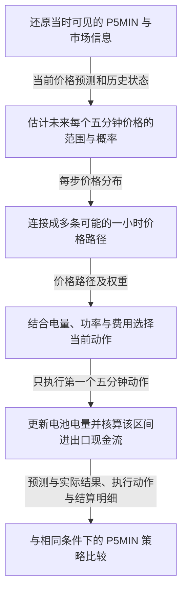
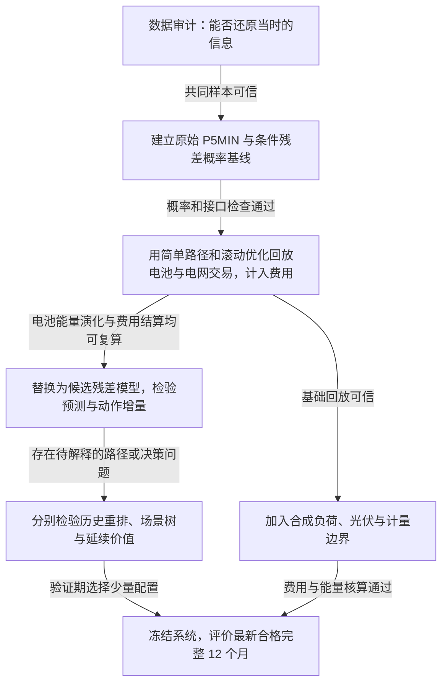
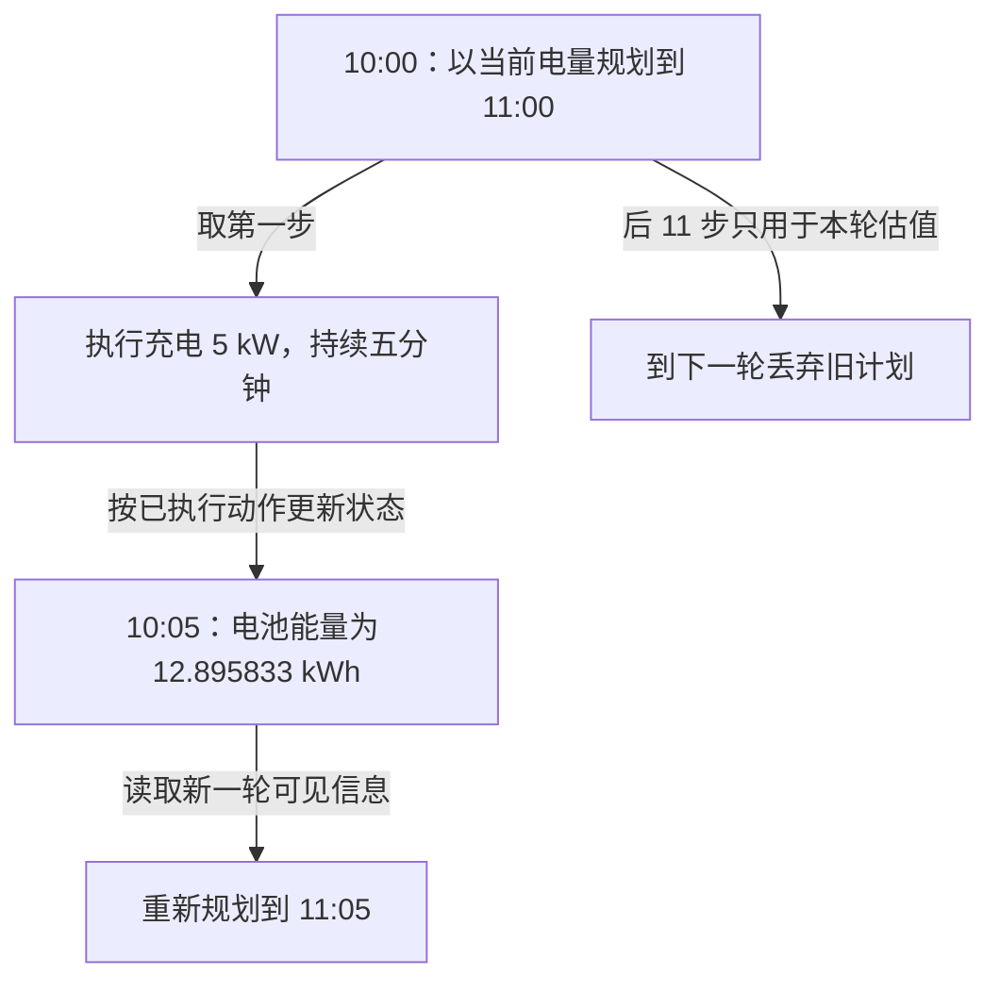
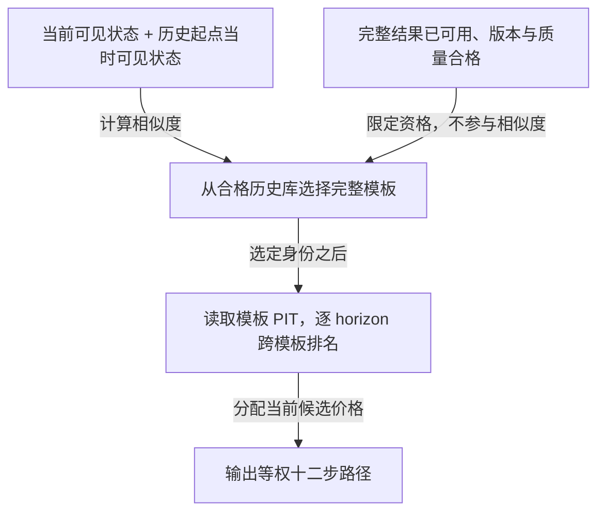

# NSW1 第一阶段：一小时残差概率预测与储能随机滚动优化技术方案（重写版）

> **建议路线：先用历史误差给 P5MIN 补上概率，再让这些概率参与每五分钟一次的储能决策；跑通可核算的基线闭环后，逐项检验更复杂的方法是否值得加入。**

| 文档项 | 内容 |
| --- | --- |
| 版本与修订日期 | v2.2，2026-09-06 |
| 目标读者 | 有基础编程和算法知识，但不了解本项目、电力市场和储能业务的新入职工程师 |
| 本文支持的决策 | 第一阶段先实现什么，各环节如何衔接，依据什么继续、保留或停止候选方法 |
| 当前状态 | 仓库已有研究协议、Python 3.11 约束、uv 锁文件和数据访问依赖；尚无 `src/`、`tests/` 及可运行研究闭环。本文是待实施设计，没有训练或回测结果 |
| 研究边界 | NSW1、五分钟价格、未来一小时、合成储能、参数化费用、离线回放 |
| 上位契约 | [仓库约定](../../AGENTS.md)、[研究范围](../RESEARCH_SCOPE.md)、[数据契约](../DATA_CONTRACT.md)、[预测协议](../FORECAST_PROTOCOL.md)、[储能回测协议](../BESS_BACKTEST_PROTOCOL.md) |

本文的资产与时间口径来自项目契约；模型和实施顺序是待检验的设计建议；所有教学数字均明确标为示例。外部事实的来源与本次核验范围见附录 D。参数尚未确定时可以继续设计和数据审计，但不能据此计算有效净收益。

阅读顺序：第 1–3 章建立背景、路线和完整例子；第 4–8 章沿数据流解释设计；第 9–11 章说明如何判断有效、处理失败和落地。附录用于查字段、方法细节和待定参数，理解主线不需要先读附录。

## 1. 我们要改善的是电池的当前决定

### 1.1 业务问题：现在充、放，还是等五分钟

表后储能是装在用户电表之后的电池。充电时，它消耗电网或本地光伏的电；放电时，它可以供本地负荷使用，也可以在允许的边界内送回电网。电池的功率有限、容量有限，而且充放电有损耗，所以“低价充电、高价放电”并不足以直接生成动作。

例如，现在价格看起来较高，但半小时后可能更高。立即放电能获得当前机会，却会减少后续可用电量。反过来，价格可能继续下降，过早充满也会失去后续吸收更便宜电量的空间。系统需要同时判断未来价格的不确定性和当前电池状态。

本项目只预测澳大利亚国家电力市场（National Electricity Market，NEM）中的 NSW1 区域价格。这个价格称为区域参考价格（Regional Reference Price，RRP），是本项目的预测目标，单位为澳元/兆瓦时（A$/MWh）。研究中再把它换算为澳元/千瓦时（A$/kWh）并叠加进出口费用。**RRP 与用户最终购售电单价之间还隔着一层显式费用假设。**

### 1.2 已有的价格预测能提供什么

澳大利亚能源市场运营机构（Australian Energy Market Operator，AEMO）提供五分钟预调度（5 Minute Pre-dispatch，P5MIN）：按五分钟粒度预测未来一小时的区域价格和需求，并每五分钟更新。这与本项目的预测范围相匹配。[AEMO P5MIN 说明，截至 2026-09-06 核验](https://www.aemo.com.au/energy-systems/electricity/national-electricity-market-nem/data-nem/market-management-system-mms-data/pre-dispatch)。

P5MIN 给了我们一个很有价值的起点。比如它预测 10:30 的价格为 120 A$/MWh，但仅凭这个数，不能判断实际落到 80 或升到 300 的可能性。我们的第一项工作是根据历史预测误差补上这种概率信息；随后再检验机器学习能否比简单历史统计做得更好。

同一目标还会有多个历史预测版本（forecast vintage）：较早时刻做一次判断，新信息到来后再修改。回放 10:00 的决定时，必须使用 10:00 当时已经可见的版本。较晚版本即使更准，当时也无法使用。保留这些旧版本，是整条研究路线成立的前提。

### 1.3 我们真正需要验证的因果关系

本项目要检验：**更可信的概率判断，是否让电池少做代价大的错误动作，并改善扣除费用后的历史回放价值。**

为此依次回答四个问题：当时知道什么；未来可能怎样；当前应该做什么；执行后实际得到什么。下图只展示一次运行中数据的传递关系。



概率模型不直接给出充放电指令。它把价格不确定性交给优化器；优化器输出当前动作；回放器用实际发生的结果核算。这个分工让我们能定位：改进究竟来自预测、决策方法，还是费用和资产假设。

第一阶段固定每五分钟决策一次，预测未来 60 分钟的 12 个区间。这里的“一小时”是预测范围，不是把价格平均成一个小时。研究不包括其他区域作为标签、辅助服务收入、真实设备控制、市场报价或真实合同结算。其他区域数据只有通过可见性审计和去除该特征的对照实验后，才能作为 NSW1 的辅助输入。

## 2. 整体路线：先跑通基线，再逐项证明增量

### 2.1 首个闭环具体采用什么

首轮先用历史预测误差给 P5MIN 补上概率，再把各个未来区间的可能价格连接成路径，用这些路径选择当前充放电动作，最后在只有电池与电网交换能量的场景中核算价值。这四个环节分别采用以下做法。

| 环节 | 首轮做法 | 选择原因与能力边界 |
| --- | --- | --- |
| 给 P5MIN 补概率 | 收集历史同类时段、同一预测步的误差，形成概率分布 | 能直接输出价格区间和事件概率；不必等待复杂模型 |
| 从概率到价格路径 | 每个未来区间分别取价格，再独立连接成多条路径 | 容易检查输入分布是否被正确使用；尚未学习跨时间依赖 |
| 从路径到动作 | 在所有路径下评估同一套未来动作，权衡平均价值和不利结果，只执行第一步 | 能验证概率、风险、物理约束与结算的连接；窗口内未来动作较保守 |
| 回放价值 | 先只模拟电池与电网的能量交换，再加入合成负荷和光伏 | 先隔离价格预测的作用，再研究表后站点的限制 |

先只按各条路径的平均价值选择动作，称为风险中性版本，用于检查优化目标是否计算正确；随后再对不利结果增加惩罚，形成风险感知版本，惩罚参数在验证期选定。一小时规划结束时，剩余电量仍可能在后续时段产生价值。首轮保留“暂不计入这部分价值”的诊断对照，正式比较必须报告这种有限视野的影响，并检验第 7 章的剩余电量估值方案。首个闭环跑通只证明链路可用，**不等于第一阶段验收完成，也不等于已证明优于 P5MIN**。

### 2.2 跑通之后，按什么顺序研究

下图回答实施先后关系。它与上一张图不同：上一张图是每轮数据流，这张图是研究推进顺序。



图中的“电池能量演化与费用结算均可复算”是进入候选模型比较的前提：一方面，能根据实际执行的充放电功率、效率和上一时点电量，重算每一步的电池能量；另一方面，能根据进出口电量、实际 NSW1 RRP、费用与退化参数，重算每个五分钟区间的现金流。这些都是离线研究假设下的回放记录，不是真实用户的财务结算。

候选模型没有改善时，仍可以用概率基线研究路径和控制，但必须说明研究问题已转为“决策方法能否改善基线”，不能继续声称残差模型有效。场景树、条件检索和更长预测也不是首个闭环的前置条件。

| 接下来的研究 | 只改变什么 | 保留它需要什么证据 |
| --- | --- | --- |
| 候选残差模型 | 用当前特征估计误差，替代粗分组统计 | 相对概率基线改善，且对动作和费用后价值的影响可解释 |
| 历史依赖重排 | 保持每步价格候选，改变哪些值连接在一起 | 路径持续性或风险决策有稳定增量 |
| 场景树优化 | 允许未来观察到新信息后再改变后续动作 | 非前视检查通过，增量足以覆盖求解成本 |
| 窗口末延续价值 | 给一小时后剩余电量一个价值估计 | 减少边界效应，且没有靠乐观估值虚增收益 |
| 合成表后场景 | 加入负荷、光伏、本地优先规则与进出口限制 | 预测价值在这些约束和三档费用下是否仍成立 |

具体算法分别在第 5–8 章解释。每次先固定其他组件，仅改变一个因素；验证期确定少量组合后，再进入最终测试。不会把全部模型、路径、风险、费用和终端配置做全年穷举。

### 2.3 “比谁好”从一开始就固定

| 要写出的结论 | 主比较对象 | 还要同时看什么 |
| --- | --- | --- |
| 概率更可信 | 按同类历史误差构建的 P5MIN 概率基线 | 报出的概率与实际发生比例是否相符，价格区间是否可靠 |
| 点预测更准确 | 原始 P5MIN | 各预测步和价格状态的误差 |
| 运营价值提高 | 直接使用原始 P5MIN 的滚动策略 | 使用上述概率基线的策略表现，以及费用、风险和约束 |

不能只击败“沿用上一价格”就宣称优于 P5MIN，也不能把预测分数提高直接解释为电池更赚钱。第 9 章给出完整比较与验收办法。

## 3. 从 10:00 到 10:05：把整条链实际走一遍

以下价格、延迟、费用和动作均为**教学假设**，不是历史样本或优化求解结果。正式系统仍输出全部 12 步；为便于手算，表中只展示部分目标。

### 3.1 决策前，先确定知道什么

所有时间均为澳大利亚东部标准时间（Australian Eastern Standard Time，AEST，固定 UTC+10）。10:00 是本轮预测和动作的起点；10:05 表示 `(10:00,10:05]` 的区间结束时间，这称为 interval-ending。最后一个预测区间结束于 11:00。

假设为数据处理和求解预留一分钟，输入在 09:59 截止。这个截止时点称为 `decision_cutoff`。它与 10:00 的预测生成时点 `issue_time` 不同，一分钟也不是正式默认值。

| 同一目标的预测版本 | 假设可见时间 | 本轮处理 |
| --- | --- | --- |
| A | 09:53:40 | 当时可见，但已有更新版本 |
| B | 09:58:20 | 选为当前锚点，即后续误差修正的起点 |
| C | 09:59:30 | 晚于输入截止时点，排除 |

对每个目标重复选择，并保留全部版本。假设本轮 12 个目标均有合格锚点，当前电池能量为 12.5 kWh。荷电状态（State of Charge，SOC）用来表示存电比例；按本项目 25 kWh 的推导毛能量，这对应 50% SOC。

### 3.2 给价格锚点加上误差范围

假设选中的 10:30 P5MIN 为 120 A$/MWh。残差是“实际价格减去当时的 P5MIN”：正数表示 P5MIN 低估，负数表示高估。将历史类似样本的残差从小到大排列，可以取不同概率位置上的值，即分位数。下表的 P10、P50、P90 分别表示第 10、50、90 百分位。

| 概率位置 | 历史残差 | 加上当前锚点后的价格 |
| --- | ---: | ---: |
| P10 | −40 A$/MWh | 80 A$/MWh |
| P50 | 0 A$/MWh | 120 A$/MWh |
| P90 | +70 A$/MWh | 190 A$/MWh |

将残差分位数加到当前 P5MIN 上，就得到价格分位数，用来回答“在当前信息下，价格可能落在哪里”。

P90 是预测分布的第 90 百分位，不是最高可能价格；P50 是中位数，不是确定会发生的价格。P10–P90 的名义覆盖率为 80%，但是否可靠必须检查大量未参与拟合的实际结果，不能把 80% 写成保证。

系统对 12 个目标都执行这一过程，并由完整的历史误差分布计算负价概率与超过配置阈值的高价概率。三个分位数只是对外摘要，不能仅凭这三点随意补出尾部。

### 3.3 把每步分布连接成完整路径

优化器必须评估一整小时的动作后果。为了说明路径是什么，假设从本轮分布取出以下三组等权候选；它们是单独的采样示意，不是上一表的 P10/P50/P90。

| 目标区间结束时间 | 每列排序后的候选，单位 A$/MWh |
| --- | --- |
| 10:05 | −100、20、100 |
| 10:10 | −80、30、150 |
| 10:15 | −50、50、200 |

把每列独立排列，可以得到三条路径的开头：`−100 → 150 → 50`、`20 → −80 → 200`、`100 → 30 → −50`。每列仍恰好使用原来的三个数，改变的是连接方式。正式运行继续连接到 11:00，并使用经过验证的场景数；三条路径只用于解释，不足以可靠衡量稀有尾部风险。

现在下游拿到的是“多条十二步价格路径及其权重”。这些路径还不是动作计划；在路径上如何充放电，由优化器决定。

### 3.4 比较动作，并且只执行第一步

首轮要求所有路径共用同一条未来动作序列。优化器把每套候选动作放到不同价格路径下，计算费用后价值和不利结果，再选择当前动作。未来计划也是共用的，不允许假装已经知道将实现哪条路径。

假设某个可行计划的第一步是充电 5 kW。这里只演示如何执行和核算它，不声称前面的教学路径足以推导出这个最优动作。电池单程充电效率为项目固定的 95%。

- 交流侧输入电量：`5 kW × 5/60 h = 0.416667 kWh`。
- 电池增加能量：`0.416667 kWh × 0.95 = 0.395833 kWh`。
- 执行后能量：`12.5 + 0.395833 = 12.895833 kWh`，约为 51.58% SOC。

这个动作处于 10 kW 功率上限内，执行后的能量也处于正常运营范围 5.0–22.5 kWh。正式系统还要检查本轮配置的进出口和逆变器限制，检查通过后才能执行。

### 3.5 用实际结果计算区间现金流，再进入下一轮

本例的纯价格信号场景没有本地负荷和光伏，因此本区间从电网进口 0.416667 kWh。假设事后用于结算的实际 RRP 为 −100 A$/MWh，进口附加费用为 0.03 A$/kWh，电池每充入或放出 1 kWh 交流侧电量，计提 0.01 A$ 的寿命损耗成本，即退化成本；其他增量成本在本教学配置中显式为零。

| 计算 | 教学结果 |
| --- | ---: |
| 进口单价 `−100 / 1000 + 0.03` | −0.07 A$/kWh |
| 能量现金流 `−进口电量 × 进口单价` | +0.029167 A$ |
| 退化成本 `0.416667 × 0.01` | 0.004167 A$ |
| 本区间净现金流 | +0.025 A$ |

负进口价意味着本例进口产生正现金流。它不是完整套利收益：电量还在电池里，后续使用和整段期末处理尚未发生。未来计划的预计收益也不计入该区间的已实现现金流。

到 10:05 时，系统沿用执行后的 12.895833 kWh，再用新一轮截止前可见的信息计算 10:10–11:05 的预测和计划。上一轮未执行的 11 步全部作废。结算价格若尚未发布，只能稍后按冻结版本补算该区间现金流，不能因此把它提前放入 10:05 的特征。

本例采用确定性执行假设：上一动作已确定，因此下一轮准备时可按能量方程推算动作开始时的电量。这是执行模型给出的状态，不是提前读到未来遥测。若引入执行误差或遥测延迟，必须单独声明可见状态、状态估计与实际状态的区别，不能把截止后才知道的测量值倒灌优化输入。

下图只回答：一小时计划中哪些部分会被执行。



这就是模型预测控制（Model Predictive Control，MPC）：反复预测、规划、只执行当前一步。电池状态连续变化，预测输入不断更新，模型参数是否更新则由另一套训练协议决定。

## 4. 数据层：先证明过去那一刻真的能这样预测

### 4.1 先从两个入口建立共同样本

历史预测通过 NEMSEER 获取 P5MIN/REGIONSOLUTION；实际价格通过 NEMOSIS 获取 DISPATCHPRICE。项目兼容基线为 `nemseer==1.0.7`、`nemosis==3.8.1`。它们是数据访问适配器，市场事实仍来自 AEMO 原始文件，不能把“包能下载”当成“当时已经发布”。

主标签固定为 DISPATCHPRICE 的 NSW1、`INTERVENTION=0`、`RRP`，单位 A$/MWh。干预标志用于区分记录类别，必须按表版本核验并筛选。AEMO 数据模型说明价格调整可能更新 RRP，因此价格版本会影响复算。[AEMO Electricity Data Model v5.7，DISPATCHPRICE 与 P5MIN_REGIONSOLUTION，截至 2026-09-06 核验](https://di-help.docs.public.aemo.com.au/Content/Data_Model/Electricity_Data_Model_Report_57.pdf)。

按[数据契约](../DATA_CONTRACT.md)，月度归档价格默认命名为 `aemo_archive_dispatch_rrp`。训练标签和结算标签分别冻结来源与版本；未保存并验证首次发布文件时，不称为 as-published（当时发布版本）。归档价格可以作事后标签，却不能自动作为当时可见的近期价格特征。

先审计小窗口的字段、重复键、版本修订、可见时间和单位，再按月扩展。项目优先研究 2021-10-01 之后的共同可用完整月份，具体起止日期由审计决定。不得先写死一个数据范围，再用填补制造完整样本。

### 4.2 一个样本必须区分这些时间

第 3 章的例子说明“预测什么时候运行”和“我们什么时候看到它”并不相同。实际实现还要区分结果何时可学习、何时下载到本地。

| 时间 | 含义与用途 |
| --- | --- |
| nominal run time | AEMO 预测批次的名义运行时间，用于识别版本 |
| available time | 该记录可进入研究信息集的时间或保守代理，是筛选依据 |
| decision cutoff | 本轮输入冻结时点，不晚于 issue time |
| issue time | 自研预测和首个动作对应的五分钟起点 |
| target interval end | 被预测区间的结束时点；相对 issue 的间隔定义预测步长 horizon |
| outcome available time | 实际结果何时可用于训练、校准或完整历史模板 |
| ingestion time | 本次下载、处理或写入本地的真实时间，不能反推历史可见性 |
| price revision time | 价格修订发生的时间，用于区分版本 |

市场层统一使用固定 AEST（UTC+10）。站点日历可使用 `Australia/Sydney`，进入市场层前显式转换并保留原时区；数据查询范围采用半开区间。第一阶段目标为 `issue + 5h 分钟`，`h=1…12`，不能把来源 run 到目标的间隔误当作自研模型 horizon。

所有外部输入满足 `available_time <= decision_cutoff`。`LASTCHANGED` 只是记录修改时间线索，未经审计不能称为官方发布保证。本地连续采集可提供首次观察时间；历史归档则需要来源字段、文件元数据和保守延迟政策。无法合理界定可见性的辅助特征先排除；核心 P5MIN 可见性无法确认时，只能交付受限审计。

预测、求解和准备动作所需延迟也要冻结。提前截止输入不能自动证明 12 个目标均有锚点，尤其最远一步可能缺失；必须实际按目标连接并报告覆盖。若另模拟动作晚到，应作为单独延迟压力实验，不能悄悄改变主任务第一步的含义。

### 4.3 每个目标如何选择 P5MIN

对本轮每个目标先筛选合格 NSW1、干预和表版本，再排除晚于 cutoff 的记录，最后从确实覆盖该目标的记录中按冻结的稳定规则选最新版本。保存选中 run、可见时间、预测年龄和来源行身份；全部未选版本继续保留，供修订特征与审计使用。

这里按目标逐一选择，不强制 12 步来自同一个 run。若来源不同，产物必须标为“多版本锚点曲线”，不能称为 AEMO 单次发布曲线。原始 P5MIN、概率基线和候选模型使用同一套锚点；“同一 run 覆盖全部目标”可以另作敏感性实验。

主预测比较要求 12 步锚点完整。无法解释的并列或重复键必须报错，不能任意保留第一行或最后一行。缺失锚点不填零、不借未来版本；对运营状态如何继续，见第 10 章。

### 4.4 数据审计交付什么，才允许进入建模

需要交付逐月覆盖矩阵、版本轨迹抽查、时间可见性政策、价格版本说明和不可变数据清单。清单称为 manifest，用于记录原始文件身份、查询参数、下载时间、包与表版本、SHA-256、处理脚本和输出哈希。

审计至少检查跨日、跨月、跨年及夏令时转换，NSW1/干预过滤，12 步对齐，近期实际价格的可见性，未解释重复与缺失，以及 A$/MWh、A$/kWh、MW、MWh、kW、kWh 的转换。若核心证据不足，应缩小可支持的结论，不继续生成“无泄漏”的模型收益。

数据以来源、月份和版本分层保存。原始、标准化、特征、预测、动作和结算产物只追加、不覆盖；表结构使用 issue–target–horizon 长表，核心领域结构通过配置支持一般步数。12 步是本次配置，不是唯一允许的数组长度。

## 5. 概率预测：先统计误差，再学习当前状态

### 5.1 预测残差，究竟简化了什么

P5MIN 已经提供未来曲线。我们的模型专注于“在当前状态下，它可能高估或低估多少”。对起点 `t` 和预测步 `h`，定义实际价格为 `Y`，当时可见 P5MIN 为 `A`，残差为 `E`，三者单位均为 A$/MWh：

```math
E_{t,h}=Y_{t,h}-A_{t,h},\qquad
Q_Y(\alpha)=A_{t,h}+Q_E(\alpha).
```

`Q_E(α)` 是残差分布在概率位置 `α` 的分位数，第 3 章已演示 `120 + (−40) = 80 A$/MWh`。加法成立是因为当前锚点已知，只平移一个分布。历史训练残差同样必须使用历史当时选中的锚点。

相比直接预测价格，这一设计更容易解释增量，也有现成的强比较对象。代价是依赖 P5MIN 覆盖与版本质量。直接预测 NSW1 价格仍保留为后续对照，用同一信息集检验这个锚点是否有价值。

### 5.2 概率基线和候选模型是什么关系

概率基线先按 horizon 收集历史残差。样本足够时，再按时段或 P5MIN 价格状态分组；样本太少就按预先约定的层级退回更宽的 NSW1 历史池，避免几个尖峰决定整条分布。分组、样本下限和历史窗口均由训练与验证决定。若将小组统计与较大历史池统计加权混合，以减少小样本波动，也要在这一阶段确定混合权重。将这些规则在最终测试前写明并冻结，本文称为预注册。

候选树模型进一步学习特征组合。比如相同 P5MIN 价格，在“近期价格快速上涨”和“近期平稳”两种状态下，误差可能不同。这里的“可能不同”是要验证的假设，不是已知市场规律。

以下用 M 编号标记模型方案，便于记录实验配置；编号在这里定义。

| 模型名称（编号） | 模型承担的工作 | 与其他模型的关系 |
| --- | --- | --- |
| 条件经验残差概率基线（M0） | 用条件经验残差生成完整概率基线 | 必须保留，也作为合格降级方案 |
| 残差分位数树模型（M1） | 用树模型预测残差分位数 | 首个机器学习候选，需击败 M0 |
| 事件概率模型（M2） | 单独预测负价、高价事件概率 | 补充尾部诊断，不替代 M1 的价格分布 |
| 直接价格模型（M3） | 不经残差加法，直接预测 NSW1 价格 | 后续对照，检验 P5MIN 锚点的价值 |
| 集成模型（M4） | 组合多个模型的预测 | 后续增强，不先做全面搜索 |

M1 建议先使用梯度提升树候选，例如 LightGBM；它通过多棵树组合表达特征与误差的非线性关系。首版可每个分位水平训练一个模型，把 horizon 作为特征，共享不同步长样本，而不是一开始训练 12 套互不相干的模型。共享训练并没有自动产生十二步联合路径。

LightGBM 尚非项目依赖，也不是已确定的最优选型。只有小原型验证训练、序列化、复现与概率表现后才采用。M2 若使用事件加权训练，校准与评价必须恢复真实事件发生率，不能把训练采样比例当概率。

补充手算见[残差模型 M0/M1/M2](explain/残差概率模型_M0_M1_M2.md)。该材料用于理解，本章已经包含实施主线。

### 5.3 特征逐组加入，才能知道信息来自哪里

先用 P5MIN 曲线和日历建立对照，随后加入已经审计的近期 NSW1 价格，再逐组检验市场特征。每加一组都做“去掉它”的消融，并保持比较样本不变。

下表用 F 编号区分特征组，供逐组加入或去除时记录配置。

| 特征组编号 | 输入内容 | 加入条件 |
| --- | --- | --- |
| F0 | P5MIN 曲线、当前步锚点、斜率和同目标修订 | 所有值绑定历史版本 |
| F1 | 近期 NSW1 实际价格、波动、符号变化和已揭晓残差 | 结果当时已可见，窗口只向过去 |
| F2 | P5MIN 区域需求、可用能力等候选字段 | 逐字段核验来源、单位和可见时间 |
| F3 | 其他市场需求、发电、联络线和约束；可包含其他区域辅助信息 | 独立可见性审计，NSW1 标签不变，必须消融 |
| F4 | AEST 时段、星期、月份及转换后的站点日历 | 预先可知且时区一致 |
| F5 | 天气预报 | 保留历史发布版本；不是第一阶段前置 |

数据年龄、缺失和回退记录先作为质量元数据；若作为特征，单独登记和消融，不占用 F5 天气编号。辅助缺失的填补只用训练期拟合和当时可见历史，附缺失标记；关键锚点和标签不填补。

还应标记当前状态是否明显超出训练数据覆盖，例如特征范围、缺失模式或预测修订异常。这称为分布外诊断（Out-of-Distribution，OOD）。参考统计只在训练期拟合，阈值在验证期冻结；陌生状态本身不等于非法预测，不自动扩宽区间或回退，先单独报告该组校准与动作表现。

### 5.4 从分位数得到可用概率，而不是几条互相矛盾的线

系统对外至少输出 P10、P50、P90、负价概率和配置化高价概率。为采样路径，内部需要说明所有概率位置对应怎样的价格。累积分布函数（Cumulative Distribution Function，CDF）就是“价格不超过某个值的概率”；逆 CDF 则由概率位置查价格。

M0 的经验分布可以直接承担这个角色。M1 若只拟合三个分位点，不能据此声称有完整分布；需要更密网格，以及在验证期冻结的插值和尾部规则，或明确回退到合格 M0 分布。

数学合法性和概率可靠性分两步处理。首先修复 `P10 > P50` 等分位数交叉，保证 CDF 单调、概率在 [0,1]、高价阈值越高超越概率越小，并保留原值与修复幅度。随后在未参与拟合的数据上校准：例如模型报 30% 负价概率的样本，长期是否约有 30% 真发生负价。合法的曲线仍可能失准，不能用单调化替代校准。

首轮从同一个校准 CDF 导出事件概率。M2 先独立评分与检查冲突，暂不强行修改主 CDF；只有联合一致化在验证期稳定，才允许融合。对于有跳点的经验分布，要区分：`P(Y<0)=F(0−)`，`P(Y>θ)=1−F(θ)`，其中 `θ` 是带单位的高价阈值。

尾部首先使用 NSW1 训练期经验信息，样本少时扩大合法历史池。若采用市场价格上下限限制预测支持域，必须连接目标时点有效的规则版本，不能套用今天的上下限。主标签、主指标和实际结算保留全部负价与尖峰，不能为改善分数裁剪极端值。

更详细的节点示意见[分位数、CDF 与事件一致化](explain/分位数_CDF_事件概率一致化.md)。

## 6. 联合路径：哪些高价会一起发生

### 6.1 为什么已有每步概率，还要做这一步

每个目标自己的分布称为边际分布。例如知道 10:20 和 10:25 各自有高价可能，还不知道它们会连续出现，还是仅短暂出现一次。连续高价和孤立尖峰对留电、放电功率和整条路径损失的影响不同。

路径方法只处理跨时间的连接关系。它不能靠“画得更平滑”证明正确，真实价格也可能跳变；要用历史时间外路径评分、事件持续性和下游动作检验。

### 6.2 四种方法借用了什么

下表用 J 编号区分价格路径的生成方法。每条路径都是未来十二个区间的一组可能价格；改变路径方法，是改变这些价格如何连在一起。

| 方法 | 怎样生成路径 | 当前价格范围来自哪里 | 适合回答什么 |
| --- | --- | --- | --- |
| 独立采样（J0） | 每步候选独立排列，再横向连接 | 当前校准分布 | 不建模时间依赖会怎样 |
| 历史残差块（J1） | 抽历史同一起点的完整误差序列，加到当前 P5MIN | 当前锚点加历史误差金额 | 简单保留历史误差形状是否已经足够 |
| 历史概率秩重排（J2） | 用历史误差所处的概率高低顺序，排列当前候选 | 当前校准分布 | 一般历史依赖能否改善 J0 |
| 条件重排（J3） | 先找与当前已知状态相似的历史，再做 J2 的排列 | 当前校准分布 | 按状态选历史是否比 J2 更好 |

J1 会连同历史误差金额一起搬过来，未必符合当前模型的边际分布。因此它是单独的端到端基线，不能把 J1 与其他方法的全部差异归因于时间依赖。

J0、J2、J3 则使用完全相同的逐列候选、场景数与随机种子协议，只改变连接。生成前后每列排序必须一致。原始场景等权，每条为 `1/S`，其中 `S` 是场景数。J3 相似度影响入选概率，入选后不再次加权，否则可能二次放大近邻并改变边际分布。

### 6.3 J2 的“历史概率秩”怎样变成今天的路径

直接复制历史金额容易与当前价格范围冲突。J2 先把历史实际价格换成它在历史预测分布中的位置，这个转换称为概率积分变换（Probability Integral Transform，PIT）。例如历史预测中实际落在很高位置，就记录接近 1 的数；它不是准确率，也不是价格。

这里把同一历史起点未来十二步的 PIT 序列称为一条历史模板，用它保留跨步的相对高低关系。设已选三条完整历史模板，下表只展示前两步。模板 A 的第一步 PIT 为 0.2，在三条历史里排名最低，因此领到今天第一步最低候选；第二步 PIT 为 0.9，排名最高，因此领到第二步最高候选。

| 历史模板 | 第一步 PIT | 第一步跨模板排名 | 第二步 PIT | 第二步跨模板排名 |
| --- | ---: | ---: | ---: | ---: |
| A | 0.2 | 1 | 0.9 | 3 |
| B | 0.8 | 3 | 0.4 | 2 |
| C | 0.5 | 2 | 0.1 | 1 |

若今天第一步候选为 `40、60、100`，第二步为 `30、70、150` A$/MWh，则得到 A：`40→150`，B：`100→70`，C：`60→30`。每一列金额不变；同一模板身份贯穿所有步骤，把各列的相对高低连接起来。

**排名是在同一个 horizon 的多条历史模板之间进行，不是在一条模板内部给 12 个时点排序。** 这类按历史秩重排当前候选的思想与 Schaake shuffle 相近；本项目采用历史 PIT 模板，是待验证的电价设计，不能由方法名称推断效果。

### 6.4 历史结果可以用，但不能用结局挑相似案例

构造历史模板当然需要后来实现的价格。合法条件是：模板的完整一小时结果已在允许的训练截点前可见，且用来计算 PIT 的历史 CDF 当时就能够生成。不能用最终模型和全年校准器重新解释更早历史，再称其为历史预测。

J3 进一步分两步：先用当前和历史起点各自当时可见的 P5MIN、近期价格、日历、市场状态和质量标记找相似案例；选好后才读取这些模板的 PIT 来排列。不能因为某个历史起点后来真的发生尖峰，就把它判为“与今天相似”。结果信息可用于资格与同一事件贡献限额，不能进入相似度距离。

下图专门说明 J3 的读取边界。



进入最终测试前冻结模板库成员、内容和治理元数据。测试中可以因当前输入不同选出不同模板，但不把测试新结果加入库。随机化 PIT、月度历史快照和具体重排公式见附录 A；更详细讲解见[PIT 模板](explain/PIT模板_随机化与历史快照.md)与[J3 信息边界](explain/J3条件检索_信息边界与权重.md)。

### 6.5 什么时候值得继续研究 J2/J3

保存所有合格五分钟历史起点，但使用时无放回选完整模板，并限制同一研究日和同一连续价格事件的贡献。相邻窗口高度重叠，不能把一次尖峰产生的几十条模板当成几十次独立证据。报告唯一起点、日数、事件数、年龄、距离和回退比例，不复制模板凑数。

支持不足时按预先冻结的顺序扩大合法邻域，再退 J2、合格 J1、J0；任何跨到 J1 的回退都要明确边际已变，不能仍计入纯依赖对照。非法 CDF 或无法追溯到完整来源记录的产物不是模板不足，应按第 10 章处理。

场景数由验证期的边际近似、尾部样本、动作稳定性和求解时间共同选择。比如 95% 尾部风险只看最差 5% 的概率质量，场景过少就没有足够尾部支持。人为极端压力路径单列为压力包，不赋予无依据概率，也不混入期望收益或概率评分。

J3 必须相对 J2 提供稳定的路径或风险决策增量，才值得保留。还有一个重要对照：在所有价格路径共用同一套动作、风险权重为零、约束和终端项与路径无关、现金流对逐步价格可加的条件下，同边际重排不会改变期望目标。此时首动作可能因并列最优或求解容差不同而变化，但不应出现系统性价值增量。不能在一个理论上不利用依赖的目标下，期待 J3 必然获胜。

## 7. 滚动优化：将不确定价格变成可执行动作

### 7.1 电池状态是每轮必须继承的输入

本项目采用[储能回测协议](../BESS_BACKTEST_PROTOCOL.md)的合成资产，不代表真实设备参数。

| 参数 | 固定口径 |
| --- | --- |
| 交流侧充、放电功率上限 | 各 10 kW |
| 安全可用能量窗口 | 20 kWh，对应推导毛能量 25 kWh 的 10%–90% |
| 安全能量边界 | 2.5–22.5 kWh |
| 正常运营下界 | 5.0 kWh，即 20% SOC；普通市场套利不得消耗该备用以下的能量 |
| 每个连续回测段初始及目标期末能量 | 12.5 kWh，即 50% SOC |
| 充、放电单程效率 | 各 95% |
| 额外爬坡限制 | 首阶段假设不构成约束，显式写入配置 |

状态方程计算执行一个区间后还剩多少电。`E_k` 为区间开始的电池能量，单位 kWh；`P_c,k`、`P_d,k` 为非负交流侧充、放电功率，单位 kW；`η_c`、`η_d` 为无量纲效率；`Δt=1/12 h`：

```math
E_{k+1}=E_k+\eta_c P_{c,k}\Delta t-P_{d,k}\Delta t/\eta_d.
```

充电进入电池要乘效率；为向交流侧送出电量，电池内部消耗要除以放电效率。第 3 章的能量增加量就是这个方程的代入。结算按交流侧能量计算，不再重复扣效率。

所有未来步都检查功率、能量、备用、逆变器与进出口限制。禁止同时充放电。首版用混合整数线性规划（Mixed-Integer Linear Programming，MILP），以离散模式变量约束每步只能充、放或停。它比纯线性规划更费算力，但负价下不能只凭“通常不会同时充放”删掉互斥约束。

### 7.2 先让所有场景共用动作，再考虑未来分支

规划后续动作时，需要规定到那一步允许知道哪些信息。下表用 O 编号区分这种信息约束；它与前面的模型、路径编号分别记录。

| 信息结构 | 优化器允许怎样行动 | 研究定位 |
| --- | --- | --- |
| 共用动作（O0） | 十二步动作对所有价格路径相同 | 首个基线，便于验证风险和能量方程 |
| 场景树（O1） | 未来观测历史分开后，后续动作才可分开 | 需要价值与算力证据的增强 |
| 提前预知路径（O2） | 第一动作共用，第二步起知道完整路径 | 乐观信息诊断，不是可执行策略 |

O0 在下一轮仍然会重新规划，所以“当前窗口共用动作”不表示现实中一小时都不能调整。O1 则更细致地估计未来调整的价值，但必须定义每个节点已经观察到什么：如果两条场景到某时点仍不可区分，它们的动作必须相同。这称为非前视约束（non-anticipativity）。不能让未来价格标签决定分支过早出现。

在同一目标、同一根动作约束、可行域嵌套且求解充分时，最优目标应满足 `O2 ≥ O1 ≥ O0`。这只比较规划目标，不代表真实回放收益也一定如此；若不满足，先检查信息约束、目标口径和求解间隙。

### 7.3 风险目标具体惩罚什么

优化器先用第 8 章唯一的价格映射，计算每条场景下的五分钟进出口现金流，再扣退化和显式经济成本。可选切换惩罚用来减少频繁充停放，仅在对应显式经济成本假设时才计入回测结算成本。最后加上窗口末剩余电量的估值。

风险不能只看站点总用电成本，因为其中大部分可能来自所有策略都相同的负荷成本。应在同一初始状态下，与冻结的安全基准策略比较。设场景 `s` 的规划价值为 `G_s`，安全策略价值为 `G_safe,s`，都以 A$ 计；定义增量 `ΔG_s=G_s−G_safe,s`，损失 `L_s=max(0,−ΔG_s)`。场景权重 `w_s` 非负且合计为 1。

条件风险价值（Conditional Value at Risk，CVaR）衡量损失最差一段尾部的平均值。教学上，若有 100 条等权场景，95% CVaR 对应最差 5 条的平均损失；一般离散权重需要处理分界处的部分质量。`β` 为尾部置信水平，`λ` 为无量纲风险权重。

优化目标是“平均增量价值减去尾部损失惩罚”，写成：

```math
\max\;\sum_s w_s\Delta G_s-\lambda\operatorname{CVaR}_{\beta}(L).
```

风险权重为零时，回到期望价值目标。

安全基准、尾部水平、权重、是否把终端价值和切换惩罚纳入损失口径都在验证期冻结。净收益、风险与规划目标分别报告，不能只展示一个混合目标值。

### 7.4 一小时结束时，剩余电量如何估值

10:00 的规划在 11:00 截止，但电池不会消失。如果目标中完全不评价剩余电量，规划可能偏向把电量在窗口末卖掉。每一轮又强迫回到 50% SOC，则可能过度限制跨小时使用。因此把窗口末的电量交给一个延续价值函数，估计它对后续时段的作用。下表用 V 编号区分估值方案。

| 方法 | 如何估计 | 采用边界 |
| --- | --- | --- |
| 零估值（V0） | 窗口末估值为零 | 必须保留的近视诊断对照 |
| 历史延续估值（V1） | 在训练期历史中估计不同剩余电量的后续价值 | 首个待验证候选，有历史完美预知偏乐观风险 |
| 更长预测延续估值（V2） | 用当时可见的更长官方预测估计延续价值 | 需另审计另一类官方预调度预测 PREDISPATCH，不是第一阶段前置 |

V1 按季节、日型、时段和当时可见价格状态抽取代表历史端点，在少量电量格点上求解后续价值，再做保守插值和折扣。整段延续价格必须在训练截点前已可用，不能只检查起点；也不对每个历史五分钟、每个电量格点都求解长窗口。

V1 分层、延续长度、抽样数、格点和折扣在训练/验证期确定，最终测试前冻结。更多电量不必总是更值钱：负价下空余容量也可能有价值，因此单调性是待验证形状约束。若估值导致异常囤电、边界贴靠或运营增量不稳定，保留 V0 对照并重估，不默认 V1 正确。

### 7.5 窗口末估值与回测末处理是两件事

| 位置 | 目的 | 是否计入回测结算结果 |
| --- | --- | --- |
| 每轮一小时窗口末 | 帮助优化器判断现在是否留电 | 否，只是本轮预计价值 |
| 整个连续回测段末 | 让不同策略以一致剩余电量口径公平比较 | 仅按预注册规则调整一次 |

回放过程中 SOC 连续推进，不每小时重置。每个连续段以 12.5 kWh 开始，并以 12.5 kWh 为期末公平目标，通过共同硬约束或显式惩罚/调整实现；调整价格与方式预先冻结并做敏感性，不能凭空补电。每轮终端估值不能反复加进收入。

进一步例子见[终端价值与随机 MPC](explain/终端价值与随机MPC.md)。

## 8. 站点与结算：收益只在实际能量边界记一次

### 8.1 先隔离价格信号，再加入本地用电需求

纯价格信号场景（S1）只模拟电池与电网交换能量，用于隔离价格信号的作用。合成表后站点场景（S2）在同一电池上加入可复现的合成负荷、光伏和进出口限制。光伏（photovoltaic，PV）是站点内的发电来源；负荷是站点自己的用电需求。

S2 遵循“本地价值优先、剩余容量响应市场”。先由本地策略确定光伏自用、备用及本地用电安排，形成当前可给市场使用的剩余功率和能量范围；市场优化在这个范围内调整。合并后重新校验能量守恒和所有边界，不能把两套独立动作简单相加。具体本地规则在 S2 实验前冻结，并检查市场叠加没有挤占受保护的本地服务。

优化输入用当时可用的负荷/PV 预测，或明确声明的确定性合成日程；事后回放使用实现值，二者分表存放。若有预测误差，要定义在实际站点限制下如何裁定可执行动作，例如缩减市场响应或弃光，随后按**实际执行动作**更新电池，不能直接按原计划结算。没有负荷和光伏的 S1 中，本地策略应与不动作基线一致。

### 8.2 电表边界如何避免重复计算

本项目用国家计量标识符（National Metering Identifier，NMI）对应的计量边界表示站点与电网之间的进出口。NMI 是标识符；下面计算的功率属于它所对应的边界。

定义交流侧负荷 `L`、可用光伏 `PV`、弃光 `C`、电池充电 `P_c` 和放电 `P_d` 均为非负功率，单位 kW。净功率 `P_grid` 以进口为正：

```math
P_{grid}=L-(PV-C)+P_c-P_d.
```

进口功率为 `max(P_grid,0)`，出口为 `max(−P_grid,0)`。例如负荷 4 kW、光伏 1 kW、无弃光、电池放电 2 kW，则电网进口 `4−1−2=1 kW`。这 2 kW 电池输出已减少购电，不能再当作出口收入。

除净功率，还保存来源去向：PV→负荷/电池/电网、电网→负荷/电池、电池→负荷/电网及弃光。各来源与去向总和必须一致，电池充放电不同时为正，NMI 进出口也不同时为正。这样才能解释电池价值来自自用还是上网，而不对同一电量计收两次。

### 8.3 优化与实际回放共用一套价格映射

设 `r` 为场景或实际 NSW1 RRP，单位 A$/MWh；`a_import` 为进口附加单价，`a_export` 为出口调整单价，单位均为 A$/kWh。正出口调整代表增加收入单价，负值代表折减。

```text
进口单价 = r / 1000 + a_import
出口单价 = r / 1000 + a_export
```

这两个公式是研究费用映射，不代表真实合同。如果费用含无量纲损耗乘数、周期金额等，必须分别声明计算基数，并由同一映射组件转换，不能把不同单位直接相加。

五分钟进口、出口电量分别是对应平均功率乘 `1/12 h`。回测结算按以下顺序计算，金额全部为 A$，收入为正、支出为负：

```text
区间能量现金流 = 出口电量 × 出口单价 − 进口电量 × 进口单价
区间净价值 = 能量现金流 − 退化成本 − 其他增量经济成本
连续段净价值 = 所有实际区间净价值之和 + 一次期末公平调整
相对基线增量 = 候选策略连续段净价值 − 基线连续段净价值
```

首版退化系数按 **A$/交流侧双向吞吐 kWh** 配置，吞吐等于充电交流侧电量加放电交流侧电量。后续改用电芯侧或寿命模型属于独立版本，不能无痕更换系数含义。第 3 章已给出完整单位和符号代入。

已经计入单价的费用不再单独扣除。各策略相同的固定费用可以在增量中抵消，但仍应声明。避免购电与净上网等分项用于解释候选减基线的差值，不能在 NMI 边界现金流之外再次计入同一份收益。

### 8.4 费用未定，不影响预测审计，但阻止净收益结论

| 费用轨道 | 用途与结论名称 |
| --- | --- |
| Gross-RRP | 仅 RRP 的毛价值诊断，不称净收益 |
| Low-fee | 显式低费用及摩擦假设下的净价值 |
| Base-fee | 显式中费用假设下的净价值 |
| High-fee | 显式高费用及摩擦假设下的净价值 |

每组包含数值、单位、作用于进口/出口/吞吐/固定周期的范围、正负方向、是否已经进单价、有效时间、来源或研究假设及日期。主费用情景和跨费用退化容忍规则在测试前注册；不能事后挑最有利的一档作为唯一结论。

费用和退化参数缺失时，净价值运行启动即失败。若需仅 RRP 诊断，显式另开 Gross-RRP 运行。S2 数字同样只代表合成负荷和 PV 情景；补充解释见[表后结算与 S1/S2](explain/表后结算与S1S2.md)。

## 9. 实验设计：怎样判断改进可信

### 9.1 先分开“训练系统”与“回放系统”

五分钟重新预测、重新求解，不等于五分钟重新训练。训练过程决定模型参数；回放过程使用已经生效的模型处理当时的新输入，并维护每条策略自己的 SOC。

主设计沿时间顺序划分以下用途，具体日期由数据审计冻结。

| 数据段 | 允许做什么 | 交给下一段什么 |
| --- | --- | --- |
| Train，训练 | 拟合特征处理、经验残差、候选模型与历史统计 | 可生成预测的模型候选 |
| Validation，验证 | 比较特征、模型、校准方法、路径、风险、终端方案和预算 | 选定的方法、参数规则和主比较 |
| Calibration，独立校准段，样本允许时设置 | 对已冻结基础模型的时间外预测拟合概率刻度；仅拟合预先限定的终端折扣等校准参数 | 冻结校准产物 |
| Test，最终测试 | 按五分钟起点滚动推断、执行首动作并评价 | 样本外证据，不再反馈选型 |

若不单独设置 Calibration，须在 Train/Validation 内保留时间外校准预测，不能用训练内拟合结果校准自己。若最终重拟合训练集扩大到验证期，必须另行预注册独立校准生成方法。

相邻数据段设置时间隔离带（embargo），排除目标跨入后一段的起点。假设后一段从 00:00 开始，则前一段 23:55 的预测覆盖到次日 00:55，不能留下；至少排除 23:00–23:55 的 12 个起点，还要满足结果可见时间和模型准备时间。用长于一小时的延续窗口生成训练对象时，也检查完整窗口没有越界。

最终测试默认使用最新合格的连续完整 12 个月。必须覆盖最后一个预测起点之后全部 12 步标签及其结果资格时间，不能只检查文件覆盖到月末。若最新候选不合格，按审计规则选择更早连续窗口并报告原因；没有合格完整窗口时，可以交付探索报告，不能称最终验收完成。

### 9.2 历史模板用月度快照，测试主轨冻结参数

为重建历史 PIT，需要历史当时能生成的分布。建议按月建立完整预测快照，再对该月的五分钟起点分批推断。快照包括特征处理、模型、事件组件、校准器与 CDF 规则，不能只冻结其中一个模型。

每个快照记录训练信息截点 `fit_cutoff`、生效开始 `effective_from` 和结束 `effective_to`，并满足：

```text
全部训练输入与标签的可见时间 <= fit_cutoff
fit_cutoff <= effective_from <= 本次决策 cutoff < effective_to
```

生效时间要包含训练和准备耗时。因此月末训练的快照不能回填服务同月月初；实际事后运行代码的创建时间另记，不能冒充历史生效证据。历史拟合与内部调参也只能使用当时合法的较早数据。

主 Test 开始前冻结模型参数、校准器、模板库、终端价值、选型规则和费用。每轮 P5MIN、近期可见市场输入和 SOC 仍更新；Test 新标签不用于重训、重校准或增库。冻结主轨是本方案的实验选择，不能把结果外推为已证明在线重训有效；后者需另设实验与独立留出期。

完整日期案例见[时间切分、滚动起点与 Test 冻结](explain/时间切分_滚动起点_Embargo与Test冻结.md)。

### 9.3 基线各自回答哪个问题

为记录比较结果，下表用 B 编号标记预测基线，用 C 编号标记完整的储能策略。第 5 章的条件经验残差模型 M0 在这里作为预测比较基线，编号为 B3；二者指同一种方法。C4 则是将这份概率预测交给优化器后形成的储能策略。

| 类别 | 必须保留的比较对象 |
| --- | --- |
| 预测 | B0 最近可见实际价格持久性；B1 日内/周内季节性；B2 原始 P5MIN；B3 条件经验残差概率；B4 简单负价/高价基础率 |
| 运营 | C0 不动作/无电池；C1 本地价值；C2 历史阈值规则；C3 原始 P5MIN 滚动控制；C4 概率基线控制；C5 候选概率控制；C6 完美预知上界 |

S1 的 C0 是电池不动作，S2 的 C0 是无电池站点，产物用不同显式名称。C6 使用未来实际价格但仍遵守资产、费用和站点约束，只估计机会空间，不参与模型选型或部署排名；只预知 60 分钟的版本须另标局部诊断，不能等同于完整上界。

所有预测比较使用同 issue、target、价格版本、锚点、缺失规则和共同信息集。运营比较用相同站点轨迹、初始 SOC、资产、费用与物理约束；C3/C4/C5 提供“只替换预测输入”的配对轨道。运行后各策略 SOC 可以不同，那正是其历史动作的结果，不能为了对齐而反复重置。若需要隔离首动作差异，另做相同初始 SOC 的单轮诊断。

### 9.4 指标要能定位问题，而不是只给一个总分

评分用来衡量预测与实际结果的差距；覆盖率则统计实际价格落入预测区间的比例。下表按评价对象分组，随后补充较难直观理解的指标。

| 层次 | 必须报告的量 | 它帮助发现什么 |
| --- | --- | --- |
| 分位数 | 分 horizon 的 pinball loss，即不同分位位置对应的预测损失；P10–P90 覆盖率和宽度 | 区间是否准确，是否靠变宽换覆盖，是否过窄失准 |
| 事件 | 负价及配置高价阈值的 Brier score，即预测概率与 0/1 结果的平方误差；可靠性、发生率、精确率/召回率及 PR-AUC | 稀有事件的概率是否可相信，漏报和误报代价 |
| 点预测 | 平均绝对误差 MAE、均方根误差 RMSE、平均偏差 Bias | 相对原始 P5MIN 哪些步长改善或退化 |
| 完整分布 | 适用的连续排序概率得分 CRPS、加权区间评分 WIS、PIT 诊断 | 整体概率与尾部是否可靠；只有完整表达合格才使用对应指标 |
| 联合路径 | 能量评分 Energy Score、变差函数评分 Variogram Score、跨步变化与负价/高价持续时间 | 多变量分布及其依赖是否接近实际，而不是只追求平滑 |
| 运营 | 三档费用后增量、日/月/季度/年度价值、回撤、亏损月份、最差日周月、错误充放成本、尖峰贡献 | 更准是否转成更有价值的动作，是否承担更大下行风险 |
| 物理与工程 | SOC/NMI 守恒残差、越限、互斥、吞吐/等效循环、终端调整、求解成功/超时/降级和耗时 | 收益是否来自不合法动作、边界处理或选择性删除 |

分位数损失（pinball loss）对高估和低估采用不同惩罚：例如评价 P90 时，实际价格超过该界限所受到的惩罚更重。事件评价中的精确率是“报出的事件里有多少真的发生”，召回率是“实际事件里有多少被报出”；改变报警概率阈值会得到精确率–召回率曲线，PR-AUC 是该曲线下面积。

连续排序概率得分（Continuous Ranked Probability Score，CRPS）评价整条预测分布与实际价格的差距；加权区间评分（Weighted Interval Score，WIS）综合多个预测区间，兼顾区间宽度与漏掉实际结果的代价。联合路径的能量评分比较整条价格向量与实际路径的距离，变差函数评分进一步关注不同预测步之间的价格差异。这里“能量评分”是统计指标名称，与电池存电量无关。这些评分通常越低越好，但仍需结合覆盖率与事件表现判断。

运营回撤指累计净价值从此前高点下降的幅度，用于检查总收益背后经历了多大损失。上述指标的具体计算配置在实验前冻结。

所有主指标在原始价格尺度计算，按 horizon、月份、时段、价格状态和数据质量分层。报告尖峰贡献及去除主要尖峰后的诊断，但主结果保留极端值；报告尾部价值分位数时必须说明是按天、月还是场景统计。

逐时点差值具有时间相关性，不能把十万条五分钟记录当作十万个独立样本。采用配对区块自助法（block bootstrap）：先计算同时间的候选减基线，再按连续日或预注册事件块重采样，保留块内顺序、共享目标与策略配对。区块长度、次数、种子与主比较在验证期冻结，给出差值区间和分层结果。

### 9.5 完成、改进与停止分别意味着什么

**实验完成**是证据齐全：数据可追溯，概率输出和风险决策可复算，S1/S2 与费用敏感性已评价，正负结果均报告。复杂方法没有增量也可以是有效研究结论。

**概率改进**要求相对 B3 的预注册指标与校准证据改善；**点预测改进**单独相对 B2 评价；**运营改进**要求相对 C3 至少在一个带费用情景下改善净价值且风险未显著恶化，并报告相对 C4 的结果。只在非主费用情景获胜，结论只能限定在该情景。

不带限定的全面改进应同时得到概率、点预测和运营证据支持，并说明跨月份、费用和资产假设的稳定性。预测变准但净价值下降，明确写“预测改进、决策未改进”；运营提高但概率严重失准，不判为全面成功或可部署。差值区间包含无改善时，写“尚未证明优于基线”，不宣称等效，不预设无依据的改善百分比。

如果使用了当时不可见的数据、违反硬约束，或能量不守恒、费用计算不一致，结果无效，应修复后重跑。如果候选无稳定增量、模板支持不足、费用改变就难以解释地反转、价值过度集中或计算超预算，应停止扩大该方法，保留简单基线与负结果。

## 10. 异常与降级：哪些可以继续，哪些必须中断

降级是预先定义的另一条策略分支。它不能获取更新输入、沿用旧计划、填零或读取未来价格来掩盖失败。先验证配置与血缘，再验证状态与预测，最后计算并保存区间结算明细。

| 发生什么 | 本轮如何处理 | 状态和报告如何处理 |
| --- | --- | --- |
| 候选分布非法或校准组件缺失 | 原预测标失败，以独立批次回退合格 B3/C4 | SOC 继续；回退预测不计入纯候选评分 |
| B3 不可用，P5MIN 完整 | 概率标缺失，回退 C3 | 继续回放并标记 |
| P5MIN 缺失或过期 | 退出共同预测样本；进入安全策略 | 仅预测缺口不重置 SOC |
| 模板支持不足 | 按第 6 章冻结路线回退，记录实际方法 | 不复制模板，不静默放宽限额或场景数 |
| 求解超时或不可行 | 仅按验证过的顺序减少场景重试、O1 退 O0、退确定性 P50，再退安全策略 | 保存耗时、原因、最终动作；减少场景后仍须检查尾部支持 |
| 终端价值不兼容 | 仅在预注册允许时退 V0 | 单列变体，不混入纯 V1 结果 |
| S2 未来负荷/PV 预测缺失 | 本地状态可验证时只执行 C1 | 无法验证本地安全时中断 |
| 当前 SOC、站点状态或 NMI 限制未知 | 不生成虚构安全动作 | 结束共同回放段 |
| 实际 RRP 或实际站点计量缺失 | 动作可保留诊断，净价值不可计算 | 结束共同段；恢复后按统一规则重启并报告缺口 |
| 费用、价格版本、可见性政策缺失，哈希损坏或未解释重复键 | 相关构建/运行失败，修复后重新生成 | 不属于普通时点降级 |
| SOC/NMI 守恒或硬约束违规 | 当前结果无效 | 不使用其收益结论 |

安全策略在 S1 中是当前能量和约束已知前提下不充不放；在 S2 中是当前状态与边界可验证前提下只执行已验证的本地 C1。S2 的“不充不放”不一定满足进口/出口限制，不能无条件称安全。

报告同时给出共同支持样本的纯方法比较，以及包含降级的完整运行表现。列出理论起点、有效预测、有效路径、求解成功、回退、安全动作、可结算及重启数量，尤其检查失败是否集中在尖峰。关键实际数据缺口使所有策略在共同分段比较，不能只为候选重置电量或删去亏损时点。

## 11. 从设计到实现：每一步交付可检查的产物

### 11.1 模块按可独立验证的职责划分

截至 2026-09-06，本仓库有协议、方案、`pyproject.toml`、`.python-version` 和 `uv.lock`，尚无 `src/`、`tests/`。下表目录均为**拟新增**模块，相对未来项目包根；包名在初始化时确定。现有[字段字典](schema/README.md)用于核对详细结构，不能为了一次填满全部字段推迟概率基线。

| 拟新增模块 | 负责的转换：输入 → 输出 | 为什么独立；不负责什么 |
| --- | --- | --- |
| `data/`、`normalize/` | 来源查询和原始文件 → 按月标准化价格与完整版本表 | 可独立复查来源和单位；不训练模型 |
| `snapshots/`、`features/` | 标准表、cutoff、可见性政策 → 锚点与可见特征快照 | 所有模型共用信息边界；不填补关键锚点 |
| `forecasting/`、`calibration/` | 快照、历史训练标签 → 分位数、事件概率与完整分布 | 替换模型不改变结算公式与费用口径；不生成动作 |
| `scenarios/` | 当前分布与冻结历史库 → 价格路径、权重和来源 | 单独检验连接关系；不修复非法边际 |
| `optimization/` | 路径、当前状态、约束、费用映射和终端版本 → 首动作、计划与求解状态 | 区分估计与执行；不执行后 11 步 |
| `backtesting/` | 首动作、实际站点结果、上一状态 → 执行记录和下一状态 | 维护各策略连续轨迹；不修改冻结模型 |
| `settlement/` | 场景/实际 RRP、边界电量、费用配置 → 进出口单价与区间结算明细 | 优化和回放复用映射；不额外加一份自用收益 |
| `evaluation/` | 预测、路径、执行记录与结算明细 → 配对指标、区间与报告 | 判断证据范围；不用 Test 选模型 |
| `config/`、`lineage/`、`cli/` | 必填配置与运行请求 → 可复现身份和分层产物 | 统一校验与边界错误转换；内部错误不吞掉 |

每条区间结算记录应能反查到首动作、场景批次、概率分布、模型/校准快照、输入快照、选中 P5MIN 行与原始文件。manifest 还记录 Git commit、未提交源码差异或源码包哈希、依赖锁哈希与随机种子，不能只写 HEAD 冒充实际运行版本。

### 11.2 只保留一套实施阶段与通过条件

下表承接第 2 章路线，作为实施顺序的唯一清单。这里的 P0–P6 是实施阶段编号，用于记录工作进度。实现时每项填写[实验模板](../EXPERIMENT_TEMPLATE.md)的适用部分。通过阶段检查不等于研究假设成立。

| 阶段 | 涉及文件或拟新增模块 | 交付与通过条件 |
| --- | --- | --- |
| P0 契约与环境骨架 | 现有 `.python-version`、`pyproject.toml`、`uv.lock`；拟新增配置、血缘与测试目录 | 必填参数能拒绝缺失，人工小样本可生成不可覆盖产物；确认依赖关键入口可用 |
| P1 数据审计与共同样本 | 数据、标准化、快照模块；核对 `docs/DATA_CONTRACT.md` | 月度覆盖、vintage 修订轨迹、区域/版本/时间/单位、manifest 通过；冻结切分候选 |
| P2 概率基线 | 特征、预测、校准与评价模块 | B0–B4 同样本输出；B3 给出 P10/P50/P90、事件概率与可采样分布；时间外概率评价可复算 |
| P3 S1 基线闭环 | 场景、优化、回放与结算模块 | J0/O0、C0–C4/C6、V0 对照，显式费用与风险参数；小规模连续回放中电池能量演化与费用结算正确；风险中性和风险感知版本均可解释 |
| P4 候选模型与有条件增强 | 预测/校准、场景、优化、终端价值产物 | 完成至少一个候选概率残差模型；J1 对照；J2/J3、O1、V1 各有选择或不采用依据；所有选择只用训练/验证 |
| P5 S2 与敏感性 | 合成站点、回放、结算与评价模块 | 本地优先和剩余容量明确，预测/实际分开，实际执行可行，来源去向与 NMI 守恒；三档费用及资产敏感性完整 |
| P6 冻结最终评价 | 冻结配置、全部产物与实验报告 | 最新合格完整 12 个月滚动评价；基线齐全、含失败轨道、配对不确定性、正负结论与限制；可从清单复算 |

P4 的方法不必全部晋升。若候选残差模型未胜过 B3，也应完成公平评价并报告；不能把它的失败变成隐瞒概率基线的理由。30 分钟视野可以作短视敏感性；120 分钟及 V2 只有输入可见性、覆盖与预算通过后研究，正式验收仍是 60 分钟。

### 11.3 测试先证明有资格算收益

| 验证组 | 必须通过的具体行为 |
| --- | --- |
| 时间与数据 | 固定 AEST 与 Sydney 夏令时转换；interval-ending；12 步及跨月边界；cutoff 等值规则；修改未来记录不改变旧快照；保留全部版本；NSW1/干预/价格版本筛选 |
| 概率 | 分位数单调、概率合法；负价左限与高价超越一致；手算 pinball/Brier/覆盖率；极端值保留；校准标签与历史模型生效时间合规 |
| 路径 | J0/J2/J3 每列候选不变；同模板身份跨步一致；历史结果资格、跨模板排名、并列随机化可复现；支持不足显式回退；权重归一；压力包隔离 |
| 优化 | 功率到电量、效率方向、SOC 连续、安全与备用、互斥与进出口边界；O0/O1 非前视；风险为零回到期望目标；只执行首动作；每轮终端估值不计入已实现现金流 |
| S2 与结算 | PV/负荷/电池/NMI 来源去向守恒；本地优先；预测误差后的动作可行；负价符号、费用不重复、退化吞吐口径；连续段期末只调整一次 |
| 集成 | 多 vintage 泄漏陷阱；手算电池能量变化与区间现金流；含负价、剩余 PV、进口与出口的合成站点；输入缺失和求解超时；重复运行与恢复结果可解释 |

正式报告必须说明实际执行了哪些测试。本次只是文档修订，没有运行上述训练、优化或回测验收。

### 11.4 先测计算成本，再承诺全年实验

先取约 50 个覆盖普通、负价、高价和不同初始 SOC 的验证期决策点，测建模与求解时间、可行率、最优性间隙、内存及失败类型。再用分层验证样本选择场景数和有限主配置。求解器名称、单次时限、CPU 小时、墙钟时长、最大并行数和内存都由实测冻结；未定义预算不启动全年回放。

预算超限时保存检查点并停止，先减少非必要候选组合，不能缩短必须的测试窗口、删除困难样本或丢掉基线来换取表面完成。各月可分区处理，但连续回放仍继承状态。

所有 Python、测试与项目命令使用 `uv run ...`，同步环境使用 `uv sync --locked`。依赖变更用 `uv add`/`uv remove`，同时保持配置和锁文件一致，并执行 `uv lock --check`、`uv sync --locked` 与 NEMSEER/NEMOSIS 导入和关键数据入口验证。不手工修改锁文件。

## 附录 A. 路径实现时需要核对的细节

### A.1 当前价格候选与历史重排

当前 CDF 为 `F_t,h`，场景数为 `S`，`j=1…S`。先把 [0,1] 等分并取中点 `q_j=(j−0.5)/S`，再取价格 `X_j,h=F_t,h⁻¹(q_j)`。例如 `S=4` 时概率位置是 0.125、0.375、0.625、0.875；这些是采样位置，不是市场状态标签。

J0 对每一列独立置换，连接同一行形成路径。J2/J3 在选定的 S 条完整历史模板中，按每个 horizon 的 PIT 求排名 `ρ_s,h`。分配规则为：

```math
Y_{s,h}=X_{\rho_{s,h},h}.
```

它表示：**场景 s 在第 h 步，拿该列排名为 ρ 的当前候选**。同一模板身份在各 horizon 不变。

### A.2 PIT 的跳点、版本与资格

对历史起点 `i`、步长 `h`，历史实际价格为 `y_i,h`，历史当时可生成的分布为 `F_i,h`。连续分布使用 `u_i,h=F_i,h(y_i,h)`。经验分布有跳点时，令 `v_i,h` 为 (0,1) 的可复现均匀随机数：

```math
u_{i,h}=F_{i,h}(y_{i,h}^-)+v_{i,h}\,[F_{i,h}(y_{i,h})-F_{i,h}(y_{i,h}^-)].
```

例如 `P(Y<0)=0.3`、`P(Y=0)=0.2` 且实际为零，PIT 在 0.3–0.5 之间取值；没有改变实际价格。该定义参考 [Gneiting 与 Ranjan，Combining Predictive Distributions，Definition 2.6](https://arxiv.org/pdf/1106.1638)。

随机数由运行种子、模板稳定身份、horizon 和方法版本生成，不依赖文件顺序或进程内不稳定哈希。继续存在并列时也固定打破规则，报告并列比例与换种子后的动作敏感性。

方法族版本表示 CDF 构造规范，快照 ID 表示某次拟合参数，分布 ID 表示某个起点实际生成的分布。不同方法族的模板默认不混用，除非预注册兼容性回放通过。先构建 M0 合法历史库，再验证 M1 历史库，不能把升级后的校准规则倒灌旧历史。

## 附录 B. 关键产物最少保留什么

字段由生产者保存，供下游运行和反向审计使用。这里是设计摘要，完整命名核对[字段字典](schema/README.md)及专项协议；未实现字段不能标成已有能力。

| 产物 | 最少内容 | 消费者 |
| --- | --- | --- |
| 原始与标准表 | 来源身份、查询、下载时点、包/表版本、内容哈希、全部版本、区域/干预/价格版本、单位与时间 | 快照、标签、审计 |
| 输入快照 | issue、cutoff、target、horizon、可见性政策、逐步选中 run、age、特征及来源 | 预测与所有基线 |
| 历史模型快照 | 拟合信息截点、生效区间、特征/模型/校准/CDF 版本与哈希 | 历史批量推断、Test |
| 概率分布 | 原始及校准后分位数、事件阈值/概率、CDF、交叉修复量、质量和降级标记 | 场景、概率评分 |
| 场景批次 | 场景及权重、逐步价格、方法请求值与实际值、模板身份、支持度、种子 | 优化、路径评分 |
| 决策 | 输入电量、资产/费用/风险/终端版本、第一步功率、解释计划、预计值、求解状态/时限/间隙与回退 | 执行回放 |
| 区间执行与结算明细 | 实际执行动作、初末能量、SOC、NMI 来源去向、单价、费用、退化、现金流、可结算状态 | 运营评价 |
| 实验清单 | 上述产物哈希链、代码及工作区身份、锁文件、种子、冻结边界、缺失与分段统计 | 复算与报告 |

带 kWh 单位的字段命名为能量，不命名为 SOC 百分比；预计收益与实际现金流分字段。S1/S2、纯方法/回退轨道、完整预知/局部预知也使用不同实验身份。

## 附录 C. 运行前还要确定的参数与结论边界

没有足够依据的参数保留待定义。每项最终配置都记录决定依据、数据范围、版本和生效时间；缺失时在消费该参数的边界报错，不阻止无关设计工作。

| 参数组 | 由什么工作决定 | 未确定时不能做什么 |
| --- | --- | --- |
| 数据范围、完整月份、价格版本、干预/修订处理、缺失阈值 | P1 来源和覆盖审计 | 正式共同样本与最终标签结论 |
| 可见时间代理、准备延迟、并列版本规则、过期阈值 | P1 时间审计与延迟敏感性 | 宣称无泄漏和第一步可执行 |
| 切分、隔离带、拟合窗口、快照生效区间、校准窗口 | P1/P2 数据支持与训练协议 | 合法训练、历史模板和最终评价 |
| 高价阈值、条件分组、稀疏回退、模型与特征、CDF 网格/尾部 | P2/P4 训练与验证 | 确定的概率模型比较与场景语义 |
| 场景数、模板资格、距离、邻域、年龄、日/事件限额、种子 | P3/P4 验证与支持度审计 | 复杂路径与可靠尾部风险 |
| 安全策略、风险水平与权重、切换惩罚、求解时限/间隙与总预算 | P3/P4 原型和验证 | 主风险决策与全年运行 |
| 终端延续长度、上下文、抽样、电量网格、折扣、期末公平调整 | P3/P4 验证 | 相应终端策略与公平净价值 |
| Low/Base/High 费用、退化、主费用轨道、其他成本 | P3 前费用资料或显式研究假设，Test 前冻结 | 费用后净价值；预测审计仍可继续 |
| 合成负荷/PV、预测误差、随机种子、本地规则、逆变器/NMI 边界、实际执行裁定 | P5 站点实验配置 | S2 结论；S1 也须提供其进出口边界 |
| bootstrap、主指标、候选数量、跨费用容忍、敏感性网格 | 验证期预注册 | 最终改进判定 |

资产敏感性覆盖效率、额定/可用能量、功率能量比、初末 SOC、备用、进出口限制；另覆盖费用、退化、概率校准误差、风险权重、尖峰捕获和通信/执行延迟。更长 horizon 的非劣效界限只能预先注册，不能从 Test 反推“60 分钟足够”。

主要未验证风险包括历史可见时间只有代理、稀有尖峰支持不足、历史模板过度集中、终端价值乐观、模型漂移、求解失败集中于极端时段，以及费用和合成站点不代表真实用户。它们分别由时间审计、事件分层、模板治理、终端对照、冻结测试与敏感性报告约束，不能靠一个总收益数消除。

结果只可表述为“在指定 NSW1 历史样本、合成资产与费用假设下的增量净价值”。本项目假设小型资产不改变市场价格，即价格接受者（price taker）；没有真实合同、设备执行或规模聚合反馈证据。完整研究结果也不构成商业收益保证或现场部署验收。

## 附录 D. 参考材料与核验范围

项目规则以[AGENTS.md](../../AGENTS.md)和本文开头链接的专项协议为准。原方案与 explain 目录中的补充讲解用于追溯设计和查阅更多例子；本文在对应章节定义所用编号与概念，阅读主线不要求先读这些材料。教学例子不作为参数契约。

| 材料 | 本文的使用范围 |
| --- | --- |
| [原技术方案](NSW1_第一阶段_一小时残差概率预测与储能随机滚动优化技术方案.md) | 保留模型、路径、信息结构、终端估值和反事实比较设计，重新组织先后关系 |
| [explain 索引](explain/README.md) | 参考残差加法、逐列候选、历史 PIT、条件检索和结算解释；关键理解已写入本文 |
| [AEMO Pre-dispatch](https://www.aemo.com.au/energy-systems/electricity/national-electricity-market-nem/data-nem/market-management-system-mms-data/pre-dispatch) | 2026-09-06 核验 P5MIN 五分钟更新、未来一小时价格和需求；不据此推定外部到达时间 |
| [AEMO Electricity Data Model v5.7](https://di-help.docs.public.aemo.com.au/Content/Data_Model/Electricity_Data_Model_Report_57.pdf) | 2026-09-06 核验所引用版本的 P5MIN 与 DISPATCHPRICE 定义；历史月份仍须逐表版本审计，不声称它覆盖所有历史格式 |
| [Combining Predictive Distributions](https://arxiv.org/pdf/1106.1638) | 2026-09-06 查阅随机化 PIT 定义，支撑附录 A；不证明本项目路径效果 |

原稿列出的 AEMC 五分钟结算公告与 USGS Schaake shuffle 页面在本次访问中未成功返回正文，因此不把它们标为本次重新核验通过。数据研究起点遵循仓库固定契约；本文不新增具体市场价格上限、费率或发布时限事实，实施依赖这些事实时须再查 AEMO/AEMC/AER 一手资料并记录日期。
